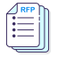
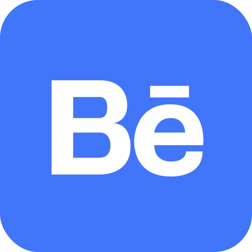
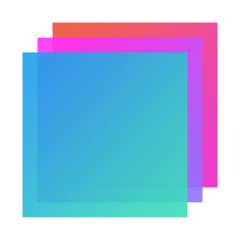

Don't forget to hit the :star: if you like this repo.

# Software Engineering (WBL)

## Course Synopsis
This course is designed to give students an introduction to an engineering approach in the development of high-quality software systems. It will discuss the important software engineering concepts in the various types of the common software process models. The students will also learn the concepts and techniques used in each software development phase including requirements engineering, software design and software testing. This course will also expose the students to utilizing object-oriented method (e.g., UML) and tools in analyzing and designing the software. At the end of this course, students are expected to be able to appreciate most of the common software engineering concepts and techniques as well as producing various software artifacts and deliverables.

## Course Learning Outcomes
1. Apply the fundamental of software engineering, software process, requirements engineering to solve software engineering case studies.
2. Build suitable software architecture, object-oriented design model and develop test cases in software engineering case studies.
3. Construct software requirements model, software architecture, object-oriented design model and test cases with state-of-the-art methods and tools for a real-world software engineering problem.
4. Ability to establish good rapport, interact with others, work effectively in a team and comprehend the interchangeable role of leaders and followers with team members.

## 🔥 Important things
1. [Lecture Notes](https://drive.google.com/drive/folders/1fFqVSa7WdQ2Uet0UdvbQcALUVcqme6gw?usp=sharing)
2. Student Information
    - 🧑‍💻 [Section 01](./materials/student-01.md) 
    - 👨‍💻[Section 02](./materials/student-02.md)
3. [Task 1: Additional Notes](./materials/Task1.md)
4. [Lab exercise](./lab/)
5. [Project 1: Student Portfolio Showcase (HTML)](./project/1-portfolio/readme.md)
6. [Project 2: Student Portfolio Showcase (Bootstrap)](./project/2-bootstrap/readme.md)
7. [Student Portfolio Showcase](https://drshahizan.github.io/) 
8. [Book](./materials/book.md)
9. [Software Requirements Document (SRD): Academic Course Registration System](./materials/SRD-sample.md) 
10. [Class exercise: Module 4](./materials/module4)
11. [Carry marks](./images/SE_CM.pdf)

## Weekly Schedule

| No | Module | Description | 01 | 02 |
| :-----: | ------ | ------ | :-----: | :-----: |
| 1 | [1: Introduction to Software Engineering](/materials/module1/readme.md)  | Software definition, software engineering as a layered technology, types of software, inherent difficulties in software engineering, SE quality focus, Documentation Standard.||  |
| 2 | [Proposal](/proposal) | A proposal in software engineering is a document that outlines a proposed solution to a problem or need related to software development. It typically includes an overview of the problem, the proposed solution, the benefits and risks of the proposed solution, the resources required to implement the solution, and a plan for implementing and testing the solution. | | |
| 2 | 2: Software Process Model | Plan Driven or Agile Process Model, general software process model waterfall, incremental, reuse oriented, software process model which cope with change spiral model and Rational Unified Process ||  |
| 3 | 3: Agile Software Development | Agile methods, Agile development techniques, Agile project management, scaling Agile methods ||  |
| 4 | [4: Requirements Engineering](/materials/module4/readme.md) | Types of requirements, functional and non-functional requirements, requirements specification, requirements engineering processes ||  |
| 5 | [UML and tools](/materials/uml) | A UML (Unified Modeling Language) diagram is a visual representation of a system or process that uses standardized symbols and notations to depict the structure, behavior, and relationships between different components of the system. It provides a clear and concise way to communicate and document the design and architecture of a software system, enabling stakeholders to understand and analyze the system's various aspects.  | | |
| 6 | [5 : Requirements Analysis and modelling ME](/materials/module5/) | Use case modelling and specification, domain modelling, activity diagram, sequence diagram, state chart/state machine diagram ||  |
| 7 | [Figma](./materials/figma.md) | Learn Figma |
| 8 | [KRISA](./materials/krisa.md) | Metodologi KRISA meliputi 6 fasa utama yang perlu difahami, diguna pakai dan dilaksanakan oleh agensi. Setiap fasa menerangkan aktiviti, teknik dan pendekatan, serta dokumentasi serahan. |
| 9 | [6: Architectural Design](/materials/module6/) | Architectural design and detailed design, Architectural design decision, architectural view, component diagram in relation to architectural view, architectural pattern: Model-View-Controller (MVC), layered, repository, client server and pipe filter ||  |
| 10 | 7: Object-Oriented Detailed Design | Relationships among analysis, design and implementation, object-oriented design using UML, object-oriented design principles, elaborating UML diagrams from analysis.||  |
| 11 | [🔥UML](./exercise) | The UML exercise is designed to familiarize students with Unified Modeling Language (UML), a standardized visual modeling language used in software engineering. Through this exercise, students gain hands-on experience in creating UML diagrams, such as class diagrams, sequence diagrams, and use case diagrams. By applying UML, students can effectively analyze, design, and communicate software system structures and behaviors. |
| 12 | 8: Software verification, validation and testing | Introduction to verification and validation, verification and validation planning, software inspections. System testing, Component testing, Test case design, Test Case Design using Black-box and white box ||  |
| 13 | | Software Engineering project – Test case design. Produce testing document that includes all the required test cases |
| 14 | | Project demonstration and hand over. |

## Project

| No | Module | Description | File |
| :-----: | ------ | ------ | :-----: | 
| 1 | Project 1 | Student Portfolio Showcase (HTML) |  | 
| 2 | Project 2 | Student Portfolio Showcase (Bootstrap)|  | 
| 3 | Proposal | Guideline for Software Engineering Proposal |  | 
| 4 | System Documentation | System Requirements Specification (SRS), System Design Document (SDD), and System Testing Document (STD). |  | 

## Submission
| No | Topic |  File |
| :-----: |  ------ | :-----: | 
| 1 | Proposal |   | 
| 2 | System Requirements Specification (SRS)|  | 
| 3 | System Design Descriptions (SDD) |  | 
| 4 | System Test Descriptions (STD)|  | 
| 5 | Project|  | 

## Tools
Diagrams are visual representations of information or data that help convey complex concepts, processes or systems in a clear and concise manner. Flowcharts are diagrams that use shapes and arrows to illustrate the steps in a process or algorithm [**[More info...]**](./materials/tools.md).

| No | Tools |  File |
| :-----: |  ------ | :-----: | 
| 1 | Figma |   | 
| 2 | Draw.io|  | 
| 3 | Github Pages|  | 
| 4 | Behance|  | 
| 5 | Visual Studio Code|  | 
| 6 | Bootstrap Studio|  | 
| 7 | Carbon|  | 

## Contribution 🛠️
Please create an [Issue](https://github.com/drshahizan/software-engineering/issues) for any improvements, suggestions or errors in the content.

You can also contact me using [Linkedin](https://www.linkedin.com/in/drshahizan/) for any other queries or feedback.

