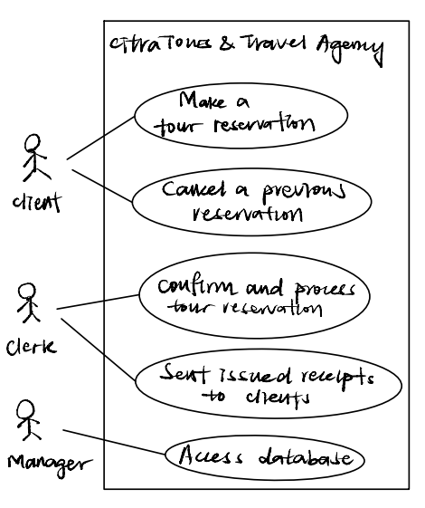
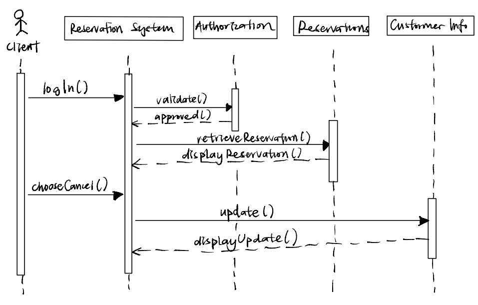
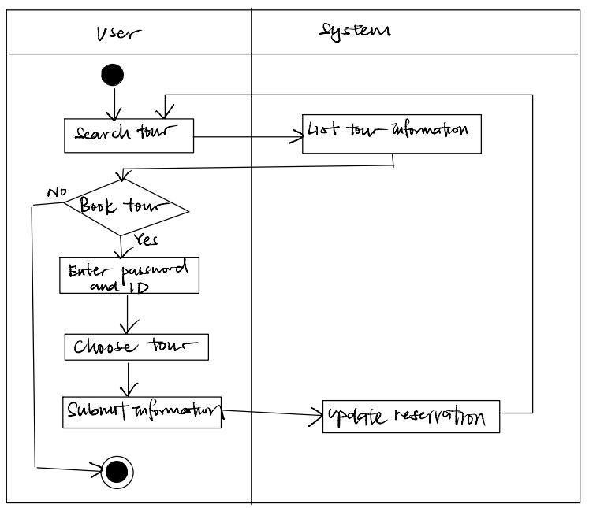

## Set: 1

**Name: NG SHU YU**

**Matrix No: A22EC0228**

**Section: 01**

## Answer
1. Incremental Development Model should be used to develope the proposed online tour reservation system for Citra’s travel agency. This is because the specification, development, and validation stage are interleaved. During the early increment, the stakeholder prior requirement can be identified and the later increment will depend on stakeholders. This can ensure the development team get immediate feedback from customer in each increment to meet their needs. Besides, incremental development model also help in reduce cost for accomodating change and ensure rapid delivery of the developed system.

2.  Functional requirement:
    - The registered users shall be able to access the online system to make a tour reservation.
    - The registered users shall be able to view information about the tours available.
    - The clerk shall also be able to confirm and process the requested tour reservations made by the clients.

    Non-functional requirement:
    - The agency shall be able to use the online system after 3 hours of training.
    - The clerk shall be able to sent back 5 issued receipts to the clients through email in 1 minute.

3. 
| Column | Description |
|-----------------------------|----------------------------------|
| **Pre-conditions:**         |- The client has access to the internet and a compatible web browser. |
|        |-  The client has registered an account with Citra Tours & Travel Agency. |
|        |- The client has logged into the online reservation system using their unique credentials. |
|        |- The tours and related information are already available in the system. |
| **Normal Event(s):**        |- The system presents the client with a dashboard displaying available tours. |
|                             |- The client browses through the list of available tours and selects a desired tour. |
|                             |- The system provides detailed information about the selected tour. |
|                             |- The client decides to proceed with the reservation and clicks on the "Reserve" button. |
|                             |- The system prompts the client to enter necessary details. |
|                             |- The client fills in the required information and confirms the reservation. |
|                             |- The system sends the receipt to the client's registered email address. |
|                             |- The client receives the email and reviews the reservation details. |
| **Abnormal Event(s):**      |- If the client enters invalid or incomplete information during the reservation process, the system displays an error message and prompts the client to correct the errors. |
|                             |-  If the selected tour is no longer available for the specified dates or the desired number of travelers, the system notifies the client and suggests alternative tours. |
|                             |- In case of a system error or technical issue during the reservation process, the client is presented with an error message and instructed to try again later. |
| **Post-conditions:**        |- The client successfully completes the tour reservation process. |
|                             |- The system updates the database with the client's reservation details. |

4. 
</a>

5. - Client
   - Clerk
   - Manager
   - Tour 
   - Reservation

6. 
</a>

7. 
</a>

