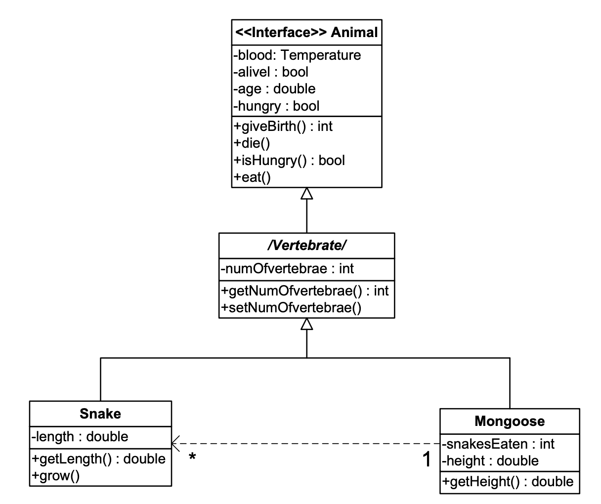

<a href="https://github.com/drshahizan/software-engineering/stargazers"></a>
<a href="https://github.com/drshahizan/software-engineering/network/members"></a>
<a href="https://github.com/drshahizan/software-engineering/pulls"></a>
<a href="https://github.com/drshahizan/software-engineering"></a>
<a href="https://github.com/drshahizan/software-engineering/graphs/contributors"></a>


Don't forget to hit the :star: if you like this repo.

## Instructions
- Please use the [answer template](temp_struc.md).
- Please answer the following case study question to assess your knowledge in UML. You are required to submit your answer file in the submission folder. Within the [`submission/sec01`](../submission/sec01) or [`submission/sec02`](../submission/sec02) folder, create a folder with your GitHub ID. Name the file as `cd1.md`.

### Folder structure

```
🗂️submission
├─ 🗂️sec01
├── 📄readme.md
├── 📁drshahizan
│   ├── 📄mcq1.md
│   ├── ...
│   └── 📄mcq5.md
├── 📁your github id
├─ 🗂️sec02
├── 📄readme.md
├── 📁drshahizan
│   ├── 📄mcq1.md
│   ├── ...
│   └── 📄mcq5.md
└── 📁your github id
```
# Case Study 1: MSO Hospital Management System

<p align="center">

</p>

## Question
Based on the Hospital Management System case study, create a **use case description** for the MSO Hospital Management System.


## Contribution 🛠️
Please create an [Issue](https://github.com/drshahizan/software-engineering/issues) for any improvements, suggestions or errors in the content.

You can also contact me using [Linkedin](https://www.linkedin.com/in/drshahizan/) for any other queries or feedback.

[](https://visitorbadge.io/status?path=https%3A%2F%2Fgithub.com%2Fdrshahizan)

