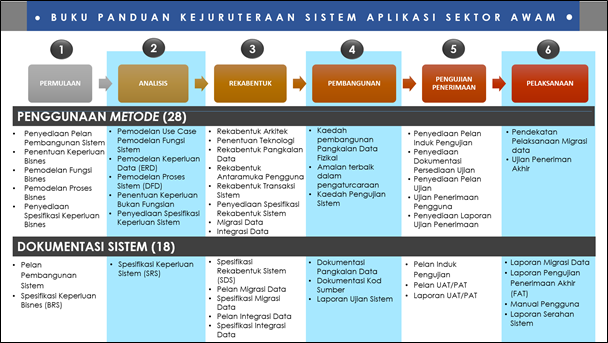

Don't forget to hit the :star: if you like this repo.

# Garis Panduan Pembangunan Aplikasi (KRISA)
Buku ini ditulis dengan mengambil kira amalan terbaik teknik dan kaedah yang digunakan dalam melaksanakan aktiviti-aktiviti pembangunan sistem aplikasi. Buku ini menyediakan panduan dalam proses pembangunan sistem aplikasi dengan memberi fokus kepada bagaimana melaksanakan aktiviti-aktiviti tersebut dan apakah serahan yang perlu dihasilkan pada setiap fasa kitar hayat pembangunan sistem. Proses pembangunan sistem aplikasi yang diperkenalkan dalam buku ini dikenali sebagai Buku Kejuruteraan Sistem Aplikasi Sektor Awam (KRISA).

Metodologi KRISA meliputi 6 fasa utama yang perlu difahami, diguna pakai dan dilaksanakan oleh agensi. Setiap fasa menerangkan aktiviti, teknik dan pendekatan, serta dokumentasi serahan. Rajah 1 Rangka Kerja Panduan Kejuruteraaan Sistem Aplikasi Sektor Awam dan Jadual 1 menyenaraikan fasa, aktiviti dan dokumen serahan.

Beberapa pertimbangan utama perlu diambil kira bagi menjamin kejayaan pelaksanaan projek pembangunan sistem aplikasi, di samping memastikan sistem aplikasi yang dibangunkan adalah berkualiti dan memenuhi keperluan pengguna. Pertimbangan- pertimbangan tersebut adalah:

- Tadbir Urus Pengurusan Projek ICT
- Penglibatan Pemegang Taruh
- Pengurusan Kawalan Pindaan
- Jaminan Kualiti Perisian (SQA)
- Faktor Keselamatan ICT
- Kepentingan Pengukuran Saiz Sistem

## Bab dalam Buku
| Bab | Tajuk | Pautan |
|:----:|----------------------------|:------:|
| 1 | Pengenalan kepada Metodologi Kejuruteraan Sistem Aplikasi ||
| 2 | Fasa Permulaan Projek ||
| 3 | Fasa Analisis ||
| 4 | Fasa Rekabentuk ||
| 5 | Pembangunan ||
| 6 | Fasa Ujian Penerimaan ||
| 7 | Fasa Pelaksanaan ||
| 8 | Pengiraan Saiz Sistem Aplikasi ||

## Senarai Templat Dokumen KRISA

| Bil. | Tajuk Dokumen | Link (PDF) | Link (Word) |
|------|------------------------------|:-------------------------:|:-------------------------:|
| 1.   | D01 Dokumen Pelan Pembangunan Sistem (PPS) | [PDF](/images/pdfdocument/template_pembangunan_sistem/D01_DOKUMEN_PELAN_PEMBANGUNAN_SISTEM_PPS.pdf) | [Word](/images/BC_KRISA_FasaRekabentuk/day3/D01_DOKUMEN_PELAN_PEMBANGUNAN_SISTEM_PPS.docx) |
| 2.   | D02 Dokumen Spesifikasi Keperluan Bisnes BRS | [PDF](/images/pdfdocument/template_pembangunan_sistem/D02_DOKUMEN_SPESIFIKASI_KEPERLUAN_BISNES_BRS.pdf) | [Word](/images/BC_KRISA_FasaRekabentuk/day3/D02_DOKUMEN_SPESIFIKASI_KEPERLUAN_BISNES_BRS.docx) |
| 3.   | D03 Dokumen Spesifikasi Keperluan Sistem SRS | [PDF](/images/pdfdocument/template_pembangunan_sistem/D03_DOKUMEN_SPESIFIKASI_KEPERLUAN_SISTEM_SRS.pdf) | [Word](/images/BC_KRISA_FasaRekabentuk/day3/D03_DOKUMEN_SPESIFIKASI_KEPERLUAN_SISTEM_SRS.docx) |
| 4.   | D04 Dokumen Spesifikasi Rekabentuk Sistem SDS | [PDF](/images/pdfdocument/template_pembangunan_sistem/D04_DOKUMEN_SPESIFIKASI_REKABENTUK_SISTEM_SDS.pdf) | [Word](/images/BC_KRISA_FasaRekabentuk/day3/D04_DOKUMEN_SPESIFIKASI_REKABENTUK_SISTEM_SDS.docx) |
| 5.   | D05 Dokumen Pelan Migrasi Data | [PDF](/images/pdfdocument/template_pembangunan_sistem/D05_DOKUMEN_PELAN_MIGRASI_DATA.pdf) | [Word](/images/BC_KRISA_FasaRekabentuk/day3/D05_DOKUMEN_PELAN_MIGRASI_DATA.docx) |
| 6.   | D06 Dokumen Spesifikasi Migrasi Data | [PDF](/images/pdfdocument/template_pembangunan_sistem/D06_DOKUMEN_SPESIFIKASI_MIGRASI_DATA.pdf) | [Word](/images/BC_KRISA_FasaRekabentuk/day3/D06_DOKUMEN_SPESIFIKASI_MIGRASI_DATA.docx) |
| 7.   | D07 Dokumen Pelan Integrasi Sistem           | [PDF](/images/pdfdocument/template_pembangunan_sistem/D07_DOKUMEN_PELAN_INTEGRASI_SISTEM.pdf) | [Word](/images/BC_KRISA_FasaRekabentuk/day3/D07_DOKUMEN_PELAN_INTEGRASI_SISTEM.docx) |
| 8.   | D08 Dokumen Spesifikasi Integrasi Sistem      | [PDF](/images/pdfdocument/template_pembangunan_sistem/D08_DOKUMEN_SPESIFIKASI_INTEGRASI_SISTEM.pdf) | [Word](/images/BC_KRISA_FasaRekabentuk/day3/D08_DOKUMEN_SPESIFIKASI_INTEGRASI_SISTEM.docx) |
| 9.   | D09 Dokumentasi Pangkalan Data               | [PDF](/images/pdfdocument/template_pembangunan_sistem/D09_DOKUMENTASI_PANGKALAN_DATA.pdf) | [Word](/images/BC_KRISA_FasaRekabentuk/day3/D09_DOKUMENTASI_PANGKALAN_DATA.docx) |
| 10.  | D10 Dokumentasi Kod Sumber                    | [PDF](/images/pdfdocument/template_pembangunan_sistem/D10_DOKUMENTASI_KOD_SUMBER.pdf) | [Word](/images/BC_KRISA_FasaRekabentuk/day3/D10_DOKUMENTASI_KOD_SUMBER.docx) |
| 11.  | D11 Dokumen Laporan Ujian Sistem              | [PDF](/images/pdfdocument/template_pembangunan_sistem/D11_DOKUMEN_LAPORAN_UJIAN_SISTEM.pdf) | [Word](/images/BC_KRISA_FasaRekabentuk/day3/D11_DOKUMEN_LAPORAN_UJIAN_SISTEM.docx) |
| 12.  | D12 Dokumen Pelan Induk Pengujian | [PDF](/images/pdfdocument/template_pembangunan_sistem/D12_DOKUMEN_PELAN_INDUK_PENGUJIAN.pdf) | [Word](/images/BC_KRISA_FasaRekabentuk/day3/D12_DOKUMEN_PELAN_INDUK_PENGUJIAN.docx) |
| 13.  | D13 Dokumen Pelan Ujian Penerimaan UAT-PAT | [PDF](/images/pdfdocument/template_pembangunan_sistem/D13_DOKUMEN_PELAN_UJIAN_PENERIMAAN_UAT-PAT.pdf) | [Word](/images/BC_KRISA_FasaRekabentuk/day3/D13_DOKUMEN_PELAN_UJIAN_PENERIMAAN_UAT-PAT.docx) |
| 14.  | D14 Dokumen Laporan Ujian Penerimaan UAT PAT  | [PDF](/images/pdfdocument/template_pembangunan_sistem/D14_DOKUMEN_LAPORAN_UJIAN_PENERIMAAN_UAT_PAT.pdf) | [Word](/images/BC_KRISA_FasaRekabentuk/day3/D14_DOKUMEN_LAPORAN_UJIAN_PENERIMAAN_UAT_PAT.docx) |
| 15.  | D15 Dokumen Laporan Migrasi Data | [PDF](/images/pdfdocument/template_pembangunan_sistem/D15_DOKUMEN_LAPORAN_MIGRASI_DATA.pdf) | [Word](/images/BC_KRISA_FasaRekabentuk/day3/D15_DOKUMEN_LAPORAN_MIGRASI_DATA.docx)                                                 |
| 16.  | D16 Dokumen Laporan Penamatan Ujian | [PDF](/images/pdfdocument/template_pembangunan_sistem/D16_DOKUMEN_LAPORAN_PENAMATAN_UJIAN.pdf) | [Word](/images/BC_KRISA_FasaRekabentuk/day3/D16_DOKUMEN_LAPORAN_PENAMATAN_UJIAN.docx) |
| 17.  | D17 Dokumen Manual Pengguna Sistem | [PDF](/images/pdfdocument/template_pembangunan_sistem/D17_DOKUMEN_MANUAL_PENGGUNA_SISTEM.pdf) | [Word](/images/BC_KRISA_FasaRekabentuk/day3/D17_DOKUMEN_MANUAL_PENGGUNA_SISTEM.docx) |
| 18.  | D18 Dokumen Laporan Serahan Sistem | [PDF](/images/pdfdocument/template_pembangunan_sistem/D18_DOKUMEN_LAPORAN_SERAHAN_SISTEM.pdf) | [Word](/images/BC_KRISA_FasaRekabentuk/day3/D18_DOKUMEN_LAPORAN_SERAHAN_SISTEM.docx) |

## Senarai Contoh Penyelesaian Dokumen KRISA

| Bil. | Tajuk Dokumen                               | Link                                  |
|-----:|--------------------------------------------|---------------------------------------|
|  1.  | D01 Dokumen Pelan Pembangunan Sistem (PPS)  | [Link](/images/pdfdocument/krisa/ContohPenyelesaian/D01-PELAN_PEMBANGUNAN_SISTEM.pdf) |
|  2.  | D02 Dokumen Spesifikasi Keperluan Bisnes BRS| [Link](/images/pdfdocument/krisa/ContohPenyelesaian/D02-SPESIFIKASI_KEPERLUAN_BISNES.pdf) |
|  3.  | D03 Dokumen Spesifikasi Keperluan Sistem SRS | [Link](/images/pdfdocument/krisa/ContohPenyelesaian/D03-SPESIFIKASI_KEPERLUAN_SISTEM.pdf) |
|  4.  | D04 Dokumen Spesifikasi Rekabentuk Sistem SDS| -                                     |
|  5.  | D05 Dokumen Pelan Migrasi Data              | [Link](/images/pdfdocument/krisa/ContohPenyelesaian/D05_DOKUMEN_PELAN_MIGRASI_DATA.pdf) |
|  6.  | D06 Dokumen Spesifikasi Migrasi Data         | [Link](/images/pdfdocument/krisa/ContohPenyelesaian/D06_DOKUMEN_SPESIFIKASI_MIGRASI_DATA.pdf) |
|  7.  | D07 Dokumen Pelan Integrasi Sistem           | [Link](/images/pdfdocument/krisa/ContohPenyelesaian/D07_DOKUMEN_PELAN_INTEGRASI_SISTEM.pdf) |
|  8.  | D08 Dokumen Spesifikasi Integrasi Sistem     | [Link](/images/pdfdocument/krisa/ContohPenyelesaian/D08_DOKUMEN_SPESIFIKASI_INTEGRASI_SISTEM.pdf) |
|  9.  | D09 Dokumentasi Pangkalan Data               | -                                     |
| 10.  | D10 Dokumentasi Kod Sumber                   | -                                     |
| 11.  | D11 Dokumen Laporan Ujian Sistem             | -                                     |
| 12.  | D12 Dokumen Pelan Induk Pengujian            | -                                     |
| 13.  | D13 Dokumen Pelan Ujian Penerimaan UAT-PAT   | -                                     |
| 14.  | D14 Dokumen Laporan Ujian Penerimaan UAT PAT | -                                     |
| 15.  | D15 Dokumen Laporan Migrasi Data             | -                                     |
| 16.  | D16 Dokumen Laporan Penamatan Ujian          | -                                     |
| 17.  | D17 Dokumen Manual Pengguna Sistem           | -                                     |
| 18.  | D18 Dokumen Laporan Serahan Sistem           | -                                     |

## Contribution 🛠️
Please create an [Issue](https://github.com/drshahizan/software-engineering/issues) for any improvements, suggestions or errors in the content.

You can also contact me using [Linkedin](https://www.linkedin.com/in/drshahizan/) for any other queries or feedback.

