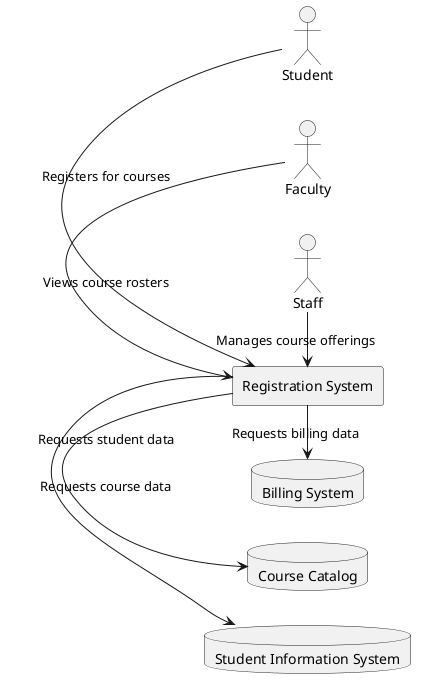

Don't forget to hit the :star: if you like this repo.

### Table of Contents

- [Requirements Modeling Concept](p1-intro.md)
- [Use Case Diagram](p2-use-case.md)
- [Structural Models](p3-struc-model.md)

# Part 1: Requirements Modeling Concept

## Requirements modeling
Requirements modeling is a crucial activity in software engineering that involves the identification, analysis, specification, and validation of the requirements of a software system. It is a systematic approach to capture the needs and expectations of stakeholders and translate them into a form that can be used to design, develop, and test a software product.

### Requirements modeling process
The requirements modeling process typically involves the following steps:

1. Requirements Elicitation: The process of gathering information from stakeholders about their needs, expectations, and goals. This can be done through interviews, surveys, focus groups, and other methods.

2. Requirements Analysis: The process of examining and understanding the gathered requirements, identifying any inconsistencies or conflicts, and prioritizing them based on their importance and feasibility.

3. Requirements Specification: The process of documenting the requirements in a clear and unambiguous form, using techniques such as use cases, user stories, and formal specifications.

4. Requirements Validation: The process of verifying that the specified requirements are complete, correct, and consistent, and that they meet the needs of stakeholders.

### Tools for requirements modeling

There are several techniques and tools that can be used for requirements modeling, including:

- Use Case Modeling: A technique that captures the functional requirements of a system in the form of user scenarios and interactions.

- Entity-Relationship Modeling: A technique that captures the data requirements of a system in the form of entities and their relationships.

- State-Transition Modeling: A technique that captures the behavior of a system in the form of states and transitions.

- Formal Specification Languages: A technique that uses mathematical notation to specify requirements precisely and unambiguously.

Requirements modeling is critical to the success of a software project as it helps ensure that the software system meets the needs of its users and stakeholders. It also helps to prevent costly rework by identifying issues early in the development cycle.

## System modeling in software engineering
System modeling in software engineering refers to the process of creating abstract representations of a software system that help stakeholders understand its behavior, structure, and interactions. The university academic course registration system is an example of a software system that can benefit from system modeling.

System modeling for the university academic course registration system involves several stages, including:

1. Requirements analysis: During this stage, the requirements of the registration system are analyzed and documented. This may include identifying the functional and non-functional requirements, constraints, assumptions, and dependencies.

2. Design: During this stage, the high-level design of the registration system is created, including the architecture, components, interfaces, and interactions. System modeling techniques such as block diagrams, data flow diagrams, and sequence diagrams may be used to represent the design.

3. Implementation: During this stage, the design is implemented in code, and the registration system is tested to ensure that it meets the requirements.

4. Maintenance: After the registration system is deployed, it requires ongoing maintenance and updates to address bugs, security issues, and changes in requirements.

In the case of the university academic course registration system, the system modeling would involve understanding the registration process from the perspective of different stakeholders, including students, faculty, and staff. The modeling would need to consider how students search for courses, how they register for courses, how the system handles conflicts, how grades are recorded, and how instructors manage their courses.

The system modeling for the university academic course registration system might include the following components:

1. Use Case Diagrams: These diagrams would show the different actors (e.g. students, faculty, staff) and their interactions with the registration system.

2. Data Flow Diagrams: These diagrams would show how data flows through the registration system, including how courses are added to the system, how students search for courses, and how conflicts are resolved.

3. Sequence Diagrams: These diagrams would show how different interactions between the user and the registration system occur in a step-by-step manner.

4. Class Diagrams: These diagrams would show the different classes and objects involved in the registration system and how they interact with each other.

Overall, system modeling is an essential activity in software engineering that can help ensure that software systems meet the needs of stakeholders and are developed efficiently and effectively. In the case of the university academic course registration system, system modeling can help ensure that the new system meets the needs of students, faculty, and staff, and that it is easy to use and maintain over time.

## Existing and Planned System Models

In software engineering, system modeling involves the creation of abstract representations of a software system. There are two types of system models: existing and planned.

An existing system model represents a software system that is currently in use. This type of model is created to document the behavior, structure, and interactions of the existing system. It can be used to identify potential issues and areas for improvement, as well as to help stakeholders understand the current system.

A planned system model represents a software system that is in the design or development phase. This type of model is created to document the requirements, design decisions, and trade-offs of the planned system. It can be used to communicate the system design to stakeholders and to ensure that the system meets the requirements.

Let's consider a case study of a university academic course registration system to better understand how existing and planned system models are used in software engineering.

### Existing System Model:
An existing system model of the university academic course registration system would document how the current system works, including its behavior, structure, and interactions. It would include information on how students currently register for courses, how the system handles conflicts, how grades are recorded, and how instructors manage their courses. This model can be used to identify any pain points or issues with the current system and to inform the design of a new system.

### Planned System Model:
A planned system model of the university academic course registration system would document the requirements and design decisions for a new registration system. This model would include information on the user requirements, system architecture, data models, and interface design. For example, the planned system model might include information on how the new system will handle course prerequisites, how it will prevent conflicts, how it will integrate with the university's student information system, and how it will provide feedback to students during the registration process.

Overall, system modeling is a critical aspect of software engineering, and both existing and planned system models are essential for developing effective software systems. In the case of a university academic course registration system, these models can help ensure that the new system meets the needs of students, faculty, and staff, and that it is easy to use and maintain over time.

## System Perspectives
System perspectives in software engineering refer to different ways of looking at a software system. Each perspective focuses on a particular aspect of the system and provides a unique viewpoint for understanding the system. The university academic course registration system can be modeled using different perspectives to gain a better understanding of how the system works and how it interacts with its environment.

1. External Perspective: This perspective models the context or environment of the system. It focuses on the system's relationship with external entities such as users, other systems, and the physical environment. For the university academic course registration system, the external perspective would consider the external entities that interact with the system, such as students, faculty, and staff, and how the system interfaces with other systems such as the student information system and the course catalog.

2. Interaction Perspective: This perspective models the interactions between a system and its environment or between the components of a system. It focuses on the messages or signals exchanged between the system and its environment or components. For the university academic course registration system, the interaction perspective would consider how users interact with the system and how the system responds to user requests.

3. Structural Perspective: This perspective models the organization of a system or the structure of the data that is processed by the system. It focuses on the components of the system, their relationships, and how they are organized. For the university academic course registration system, the structural perspective would consider the different components of the system, such as the user interface, the database, and the business logic, and how they are organized.

4. Behavioral Perspective: This perspective models the dynamic behavior of the system and how it responds to events. It focuses on the processes or algorithms that are used by the system to respond to events or input. For the university academic course registration system, the behavioral perspective would consider how the system handles different scenarios, such as course conflicts or registration errors, and how it responds to user input.

By modeling the university academic course registration system from these different perspectives, software engineers can gain a better understanding of how the system works and how it interacts with its environment. This can help to identify areas for improvement and ensure that the system meets the needs of its stakeholders.

## Context Model
Context models in software engineering are used to depict the operational context of a system. They provide a high-level overview of the system's environment and its relationships with external entities. The context model for the university academic course registration system would help to illustrate what lies outside the system boundaries and how the system interacts with its environment.

The context model for the university academic course registration system might include the following elements:

1. Users: The users of the registration system, including students, faculty, and staff, would be depicted in the context model. The model would show how they interact with the system and what information they need to provide to the system.

2. Other systems: The context model would also show any other systems that the registration system interfaces with, such as the student information system, the course catalog, or the billing system. The model would illustrate how data is exchanged between these systems and the registration system.

3. Physical environment: The context model would also show the physical environment in which the registration system operates. This might include the computer hardware, network infrastructure, and any other physical resources that are required to operate the system.

4. Policies and regulations: The context model would also consider any policies or regulations that govern the use of the registration system. This might include policies around course availability, registration deadlines, and student privacy.

By creating a context model for the university academic course registration system, software engineers can gain a better understanding of the system's environment and its interactions with external entities. This can help to identify potential issues and ensure that the system meets the needs of its stakeholders. The context model can also be used as a communication tool to help stakeholders understand the system's environment and how it operates.

A context model for the university academic course registration system, represented using PlantUML (PUML) code:

In this PUML code, we have actors representing the different user roles that interact with the system (student, faculty, staff), as well as the different systems that the registration system interfaces with (student information system, course catalog, and billing system). The registration system itself is represented as a rectangle.

The arrows represent the interactions between the different elements of the context model. For example, students register for courses by interacting with the registration system, while the registration system requests data from the student information system, course catalog, and billing system. Faculty members view course rosters, and staff members manage course offerings.

By representing the context model using PUML code, software engineers can easily share and communicate the model with other stakeholders. This can help to ensure that everyone involved in the project has a common understanding of the system's environment and its interactions with external entities.

## Contribution 🛠️
Please create an [Issue](https://github.com/drshahizan/software-engineering/issues) for any improvements, suggestions or errors in the content.

You can also contact me using [Linkedin](https://www.linkedin.com/in/drshahizan/) for any other queries or feedback.

