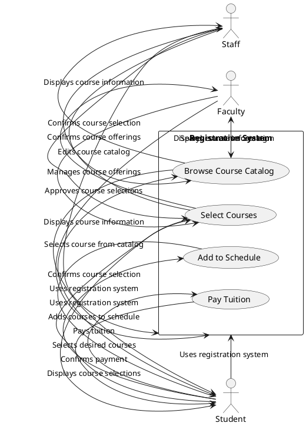
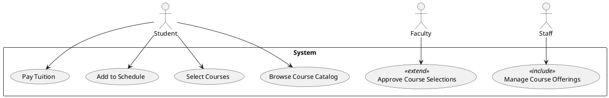
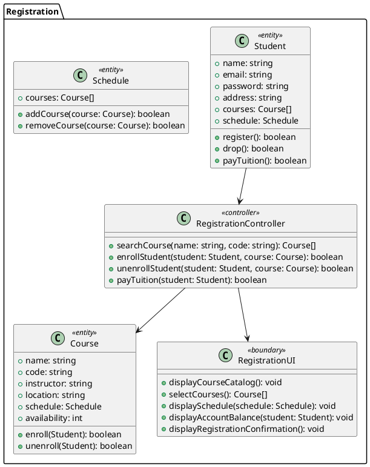
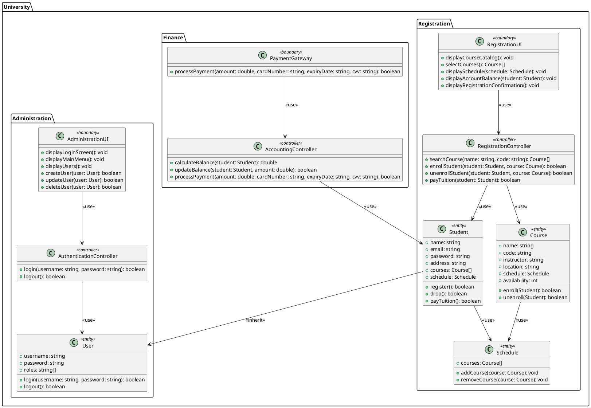
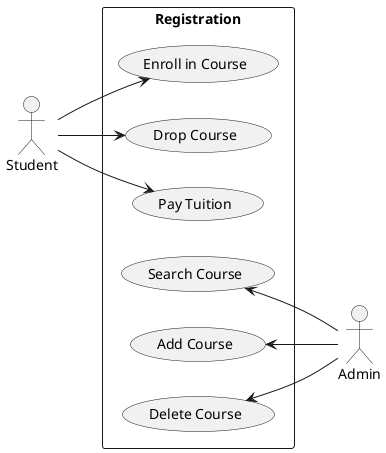
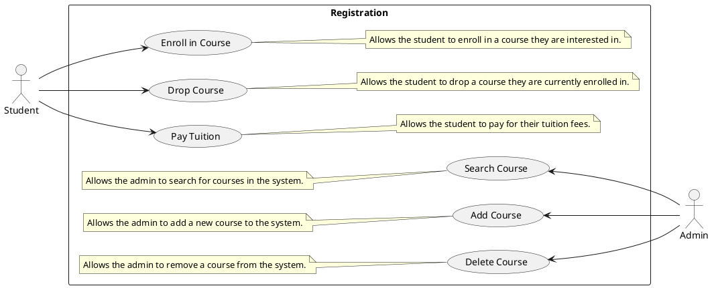

<a href="https://github.com/drshahizan/software-engineering/stargazers"></a>
<a href="https://github.com/drshahizan/software-engineering/network/members"></a>
<a href="https://github.com/drshahizan/software-engineering/pulls"></a>
<a href="https://github.com/drshahizan/software-engineering/issues"></a>
<a href="https://github.com/drshahizan/software-engineering/graphs/contributors"></a>


Don't forget to hit the :star: if you like this repo.

### Table of Contents

- [Requirements Engineering Introduction](p1-intro.md)
- [Functional Requirements](p2-functional.md)
- [Requirements Specification](p3-soft-requirement.md)
- [Form Based Specifications](p4-form.md)
- [Advance Requirements Engineering](p5-req-eng.md)
- [An interview with a stakeholder](p6-interview.md)

# Part 2: 

## Interaction Model

An interaction model is a type of Use Case diagram in software engineering that shows how different actors or users interact with the system to achieve certain goals or objectives. In the context of the university academic course registration system, the interaction model would depict the various steps involved in the registration process from the perspective of the different user roles, such as students, faculty, and staff.

An interaction model for the university academic course registration system:



In this PUML code, we have actors representing the different user roles (student, faculty, staff), and a rectangle representing the registration system. Inside the rectangle, we have several use cases that represent the different steps involved in the registration process, such as browsing the course catalog, selecting courses, adding them to the schedule, and paying tuition.

The arrows represent the interactions between the different elements of the interaction model. For example, a student selects a course from the catalog, and the system displays the course information. The student then selects their desired courses, and the system confirms the course selection. The student adds the courses to their schedule, and the system confirms the selection. Finally, the student pays their tuition, and the system confirms the payment.

By creating an interaction model for the university academic course registration system, software engineers can gain a better understanding of the different steps involved in the registration process from the perspective of the different user roles. This can help to identify potential issues and ensure that the system meets the needs of its stakeholders. The interaction model can also be used as a communication tool to help stakeholders understand how the system operates and how it is used to achieve specific goals.

## Use case modeling
Use case modeling is a technique used in software engineering to represent the different ways that users interact with a system. It is a way of identifying the different actions or steps that a user takes to accomplish a specific goal or task. In the context of the university academic course registration system, use case modeling would be used to represent the various interactions that students, faculty, and staff have with the registration system.

Examples of use cases for the university academic course registration system:

1. Browse Course Catalog: This use case allows a student or faculty member to browse the course catalog to view available courses.

2. Select Courses: This use case allows a student to select the courses they wish to enroll in and add them to their schedule.

3. Add to Schedule: This use case allows a student to add the selected courses to their schedule for the upcoming semester.

4. Pay Tuition: This use case allows a student to pay their tuition fees for the semester.

5. Approve Course Selections: This use case allows a faculty member to review and approve the course selections made by a student.

6. Manage Course Offerings: This use case allows a staff member to manage the course offerings for the upcoming semester, such as adding or removing courses.

Each use case would be described in more detail, including the specific steps involved in accomplishing the task and the actors or users involved. Use case diagrams would be created to visualize the interactions between the actors and the system.

> A use case diagram for the university academic course registration system might include actors such as students, faculty, and staff, with each use case represented as a separate box. Arrows would connect the actors to the use cases they are involved in, illustrating the interactions between the different elements of the system.

By creating a use case model for the university academic course registration system, software engineers can better understand the needs of the different user roles and ensure that the system meets those needs. It also helps to identify potential issues and design solutions to those issues.

An example of a use case diagram for the university academic course registration system in PlantUML code:

```
@startuml
actor Student
actor Faculty
actor Staff

rectangle System {
  usecase "Browse Course Catalog"
  usecase "Select Courses"
  usecase "Add to Schedule"
  usecase "Pay Tuition"
  usecase "Approve Course Selections" as Approve
  usecase "Manage Course Offerings" as Manage
  
  Student --> "Browse Course Catalog"
  Student --> "Select Courses"
  Student --> "Add to Schedule"
  Student --> "Pay Tuition"
  Faculty --> Approve
  Staff --> Manage
}
@enduml
```
<p align="center">

</p>

This code defines three actors: Student, Faculty, and Staff, and a rectangle representing the System with six use cases, including "Browse Course Catalog," "Select Courses," and "Add to Schedule." Arrows connect the actors to the relevant use cases, illustrating the interactions between them. The "Approve Course Selections" use case is renamed to "Approve" using the "as" keyword, and the "Manage Course Offerings" use case is similarly renamed to "Manage."

## Stereotypes in UML
Stereotypes in UML are a way of customizing the standard UML notation to suit the needs of a specific system or domain. They are used to add additional meaning to UML elements, such as use cases, classes, and packages. In the context of the university academic course registration system, we can use stereotypes to represent specific relationships and roles within the system.

1. `<<include>>` and `<<extend>>` in use case relationship:<br>
These are two common stereotypes used in use case diagrams. <<include>> represents a use case that is always included in the behavior of another use case, while <<extend>> represents a use case that may or may not be included in the behavior of another use case, depending on certain conditions.

    > For example, in the university academic course registration system, the "Pay Tuition" use case may include the "View Account Balance" use case using the `<<include>>` stereotype. Meanwhile, the "Select Courses" use case may extend to the "Check Course Availability" use case using the `<<extend>>` stereotype, where the "Check Course Availability" use case will only be executed if the selected course is already full.

2. `<<entity>>`, `<<controller>>`, `<<boundary>>` in class diagram as class stereotypes:<br>
These are stereotypes used to represent the different types of classes in a class diagram. `<<entity>>` represents a persistent data object, `<<controller>>` represents a class that is responsible for coordinating the activities of other classes, and `<<boundary>>` represents a class that interfaces with the external environment.

    > For example, in the university academic course registration system, we can use `<<entity>>` to represent the "Student" and "Course" classes, `<<controller>>` to represent the "RegistrationController" class, which coordinates the registration process, and `<<boundary>>` to represent the "RegistrationUI" class, which interacts with the user to gather registration information.

3. `<<package>>` and `<<subsystem>>` in package diagram:<br>
These are stereotypes used in package diagrams to group related elements together. `<<package>>` represents a group of related classes, use cases, or other elements, while `<<subsystem>>` represents a higher-level grouping of related packages.

    > For example, in the university academic course registration system, we can use `<<package>>` to group related classes together, such as the "Student" and "Course" classes, and use `<<subsystem>>` to group related packages together, such as the "Registration" package and the "Course Catalog" package.

Here's an example of PlantUML code that uses stereotypes to model the university academic course registration system:

Use Case Diagram:


<p align="center">

</p>

### Class Diagram:



<p align="center">

</p>

### Package Diagram:


<p align="center">

</p>

## Use Case Diagram: Notation
A use case diagram in UML is a graphical representation of the functional requirements of a system. It shows the actors (users or external systems) interacting with the system and the various use cases (functional requirements) that the system must satisfy.

The notation for a use case diagram includes the following:

1. Actors are represented by stick figures.
2. Use cases are represented by ovals with the name of the use case inside.
3. Relationships between actors and use cases are represented by lines. There are two types of relationships:
   a. Association: a straight line connecting an actor to a use case.
   b. Include/Extend: a dashed line with an arrowhead connecting a use case to another use case, indicating that one use case includes or extends another use case.

Here is an example of a use case diagram for the university academic course registration system:



In this diagram, there are two actors: `Student` and `Admin`. The `Student` actor can perform three use cases: `Enroll in Course`, `Drop Course`, and `Pay Tuition`. The `Admin` actor can perform three use cases: `Search Course`, `Add Course`, and `Delete Course`. The use cases are represented by ovals and the actors are represented by stick figures. The association between actors and use cases is represented by a straight line, and the association between use cases is represented by a dashed line with an arrowhead. The `Registration` rectangle is used to group related use cases.

### Example

<p align="center">

</p>

## Contribution 🛠️
Please create an [Issue](https://github.com/drshahizan/software-engineering/issues) for any improvements, suggestions or errors in the content.

You can also contact me using [Linkedin](https://www.linkedin.com/in/drshahizan/) for any other queries or feedback.


