

Don't forget to hit the :star: if you like this repo.

### Table of Contents

- [Requirements Modeling Concept](p1-intro.md)
- [Use Case Diagram](p2-use-case.md)
- [Structural Models](p3-struc-model.md)

# Part 2: Use Case Diagram

UML (Unified Modeling Language) is a visual modeling language used to represent software systems. UML diagrams provide a standardized way to express various aspects of a system's design, behavior, and structure. There are several types of UML diagrams, each with its own specific purpose.

For a university academic course registration system, we can use various types of UML diagrams to represent its different aspects. 

## 1. Use case diagram
A use case diagram can be used to represent the interactions between the university academic course registration system and its actors. The actors in this case may include students, faculty, and administrators. The use cases may include registering for a course, dropping a course, checking course availability, and generating reports.

## 2. Activity diagram
An activity diagram can be used to represent the activities involved in the course registration process. This may include activities like selecting courses, checking course prerequisites, selecting class timings, adding courses to the cart, and submitting the registration form.

## 3. Sequence diagram
A sequence diagram can be used to represent the interactions between actors and the system components during the course registration process. This may include interactions between students and the course catalog system, between students and the registration system, and between the registration system and the database.

## 4. Class diagram
A class diagram can be used to represent the object classes in the system and their relationships. The object classes in this case may include students, courses, faculty, departments, and the registration system. The relationships may include associations between students and courses, between faculty and courses, and between departments and courses.

## 5. State diagram
A state diagram can be used to represent the different states of an object in the system and the transitions between these states. For example, a state diagram can be used to represent the different states of a course, such as open, closed, waitlisted, or cancelled. It can also represent the states of a student's course registration, such as registered, dropped, or waitlisted.

Overall, UML diagrams can be used to represent the different aspects of a university academic course registration system and provide a standardized and visual way to communicate its design and behavior to stakeholders.

## Interaction Model

An interaction model is a type of Use Case diagram in software engineering that shows how different actors or users interact with the system to achieve certain goals or objectives. In the context of the university academic course registration system, the interaction model would depict the various steps involved in the registration process from the perspective of the different user roles, such as students, faculty, and staff.

An interaction model for the university academic course registration system:

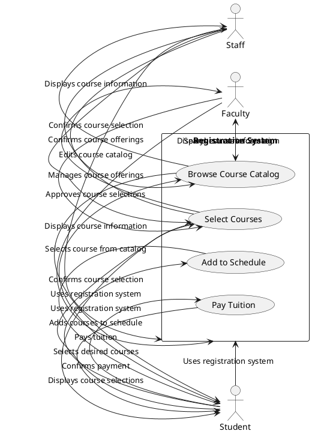

In this PUML code, we have actors representing the different user roles (student, faculty, staff), and a rectangle representing the registration system. Inside the rectangle, we have several use cases that represent the different steps involved in the registration process, such as browsing the course catalog, selecting courses, adding them to the schedule, and paying tuition.

The arrows represent the interactions between the different elements of the interaction model. For example, a student selects a course from the catalog, and the system displays the course information. The student then selects their desired courses, and the system confirms the course selection. The student adds the courses to their schedule, and the system confirms the selection. Finally, the student pays their tuition, and the system confirms the payment.

By creating an interaction model for the university academic course registration system, software engineers can gain a better understanding of the different steps involved in the registration process from the perspective of the different user roles. This can help to identify potential issues and ensure that the system meets the needs of its stakeholders. The interaction model can also be used as a communication tool to help stakeholders understand how the system operates and how it is used to achieve specific goals.

## Use case modeling
Use case modeling is a technique used in software engineering to represent the different ways that users interact with a system. It is a way of identifying the different actions or steps that a user takes to accomplish a specific goal or task. In the context of the university academic course registration system, use case modeling would be used to represent the various interactions that students, faculty, and staff have with the registration system.

Examples of use cases for the university academic course registration system:

1. Browse Course Catalog: This use case allows a student or faculty member to browse the course catalog to view available courses.

2. Select Courses: This use case allows a student to select the courses they wish to enroll in and add them to their schedule.

3. Add to Schedule: This use case allows a student to add the selected courses to their schedule for the upcoming semester.

4. Pay Tuition: This use case allows a student to pay their tuition fees for the semester.

5. Approve Course Selections: This use case allows a faculty member to review and approve the course selections made by a student.

6. Manage Course Offerings: This use case allows a staff member to manage the course offerings for the upcoming semester, such as adding or removing courses.

Each use case would be described in more detail, including the specific steps involved in accomplishing the task and the actors or users involved. Use case diagrams would be created to visualize the interactions between the actors and the system.

> A use case diagram for the university academic course registration system might include actors such as students, faculty, and staff, with each use case represented as a separate box. Arrows would connect the actors to the use cases they are involved in, illustrating the interactions between the different elements of the system.

By creating a use case model for the university academic course registration system, software engineers can better understand the needs of the different user roles and ensure that the system meets those needs. It also helps to identify potential issues and design solutions to those issues.

An example of a use case diagram for the university academic course registration system in PlantUML code:

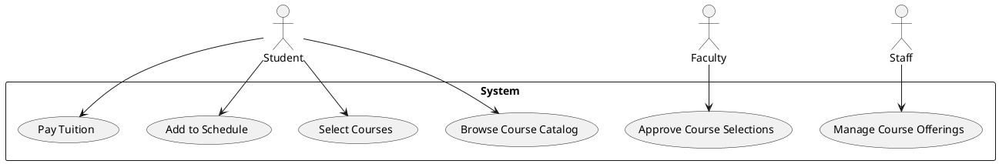

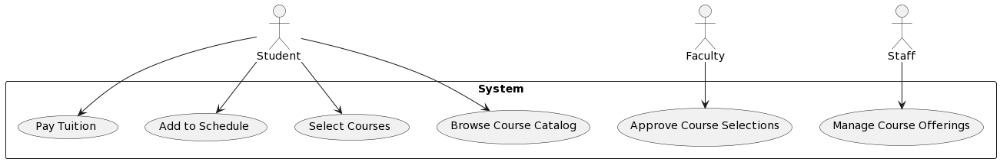

This code defines three actors: Student, Faculty, and Staff, and a rectangle representing the System with six use cases, including "Browse Course Catalog," "Select Courses," and "Add to Schedule." Arrows connect the actors to the relevant use cases, illustrating the interactions between them. The "Approve Course Selections" use case is renamed to "Approve" using the "as" keyword, and the "Manage Course Offerings" use case is similarly renamed to "Manage."

## Stereotypes in UML
Stereotypes in UML are a way of customizing the standard UML notation to suit the needs of a specific system or domain. They are used to add additional meaning to UML elements, such as use cases, classes, and packages. In the context of the university academic course registration system, we can use stereotypes to represent specific relationships and roles within the system.

1. `<<include>>` and `<<extend>>` in use case relationship: 
These are two common stereotypes used in use case diagrams. <<include>> represents a use case that is always included in the behavior of another use case, while <<extend>> represents a use case that may or may not be included in the behavior of another use case, depending on certain conditions.

    > For example, in the university academic course registration system, the "Pay Tuition" use case may include the "View Account Balance" use case using the `<<include>>` stereotype. Meanwhile, the "Select Courses" use case may extend to the "Check Course Availability" use case using the `<<extend>>` stereotype, where the "Check Course Availability" use case will only be executed if the selected course is already full.

2. `<<entity>>`, `<<controller>>`, `<<boundary>>` in class diagram as class stereotypes: 
These are stereotypes used to represent the different types of classes in a class diagram. `<<entity>>` represents a persistent data object, `<<controller>>` represents a class that is responsible for coordinating the activities of other classes, and `<<boundary>>` represents a class that interfaces with the external environment.

    > For example, in the university academic course registration system, we can use `<<entity>>` to represent the "Student" and "Course" classes, `<<controller>>` to represent the "RegistrationController" class, which coordinates the registration process, and `<<boundary>>` to represent the "RegistrationUI" class, which interacts with the user to gather registration information.

3. `<<package>>` and `<<subsystem>>` in package diagram: 
These are stereotypes used in package diagrams to group related elements together. `<<package>>` represents a group of related classes, use cases, or other elements, while `<<subsystem>>` represents a higher-level grouping of related packages.

    > For example, in the university academic course registration system, we can use `<<package>>` to group related classes together, such as the "Student" and "Course" classes, and use `<<subsystem>>` to group related packages together, such as the "Registration" package and the "Course Catalog" package.

Here's an example of PlantUML code that uses stereotypes to model the university academic course registration system:

Use Case Diagram:

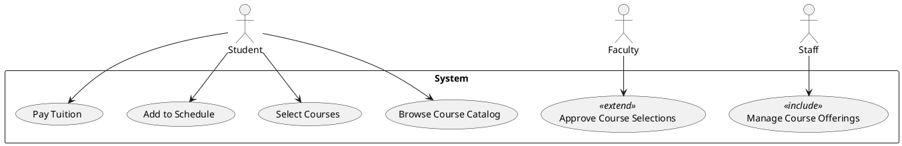

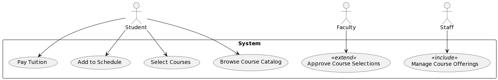

### Class Diagram:

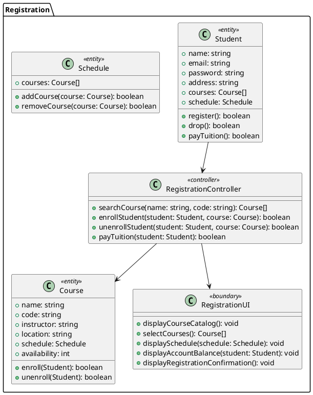

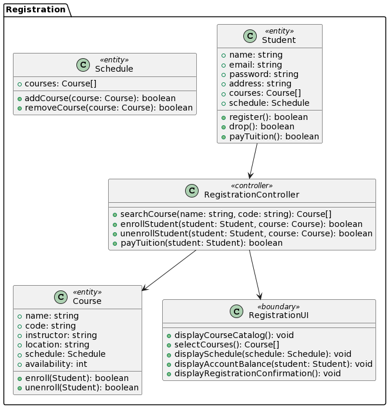

### Package Diagram:

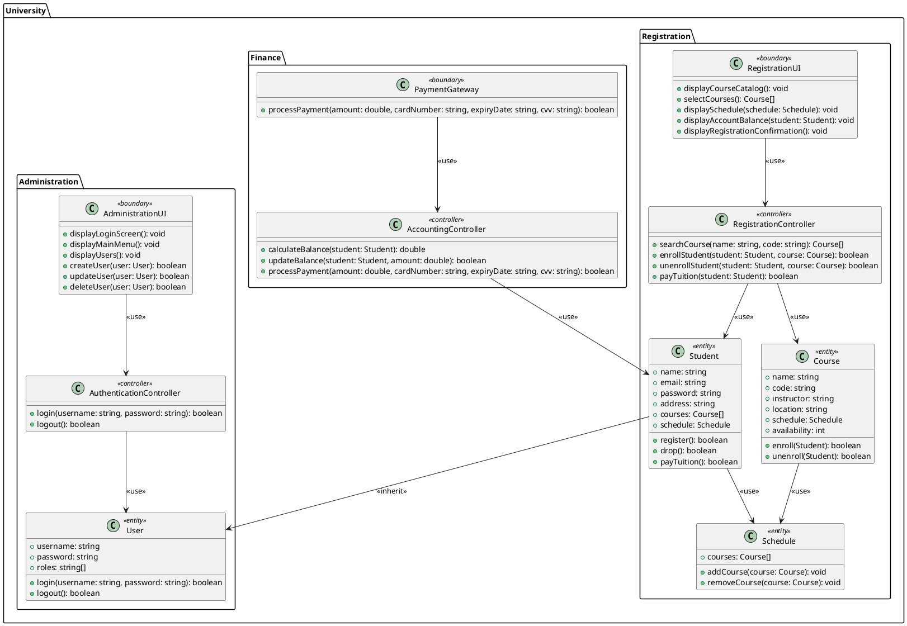

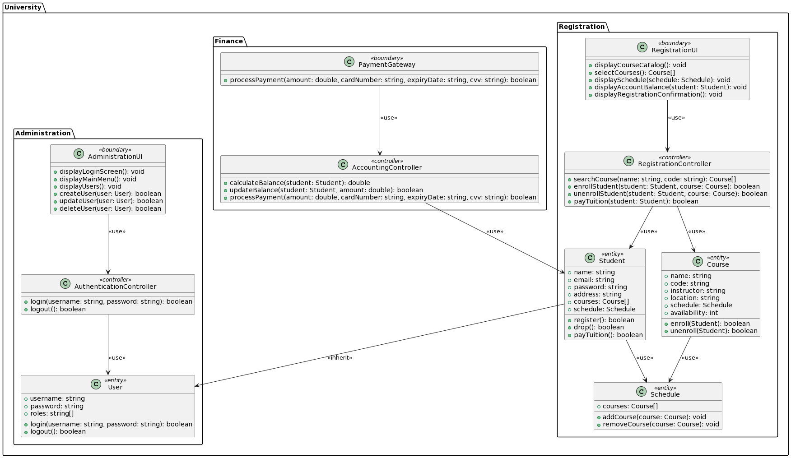

## Use Case Diagram: Notation
A use case diagram in UML is a graphical representation of the functional requirements of a system. It shows the actors (users or external systems) interacting with the system and the various use cases (functional requirements) that the system must satisfy.

The notation for a use case diagram includes the following:

1. Actors are represented by stick figures.
2. Use cases are represented by ovals with the name of the use case inside.
3. Relationships between actors and use cases are represented by lines. There are two types of relationships:
   a. Association: a straight line connecting an actor to a use case.
   b. Include/Extend: a dashed line with an arrowhead connecting a use case to another use case, indicating that one use case includes or extends another use case.

Here is an example of a use case diagram for the university academic course registration system:

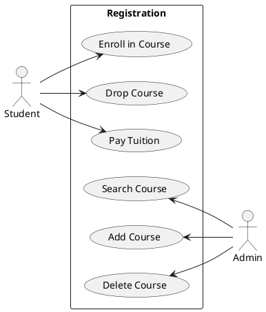

In this diagram, there are two actors: `Student` and `Admin`. The `Student` actor can perform three use cases: `Enroll in Course`, `Drop Course`, and `Pay Tuition`. The `Admin` actor can perform three use cases: `Search Course`, `Add Course`, and `Delete Course`. The use cases are represented by ovals and the actors are represented by stick figures. The association between actors and use cases is represented by a straight line, and the association between use cases is represented by a dashed line with an arrowhead. The `Registration` rectangle is used to group related use cases.

### Example
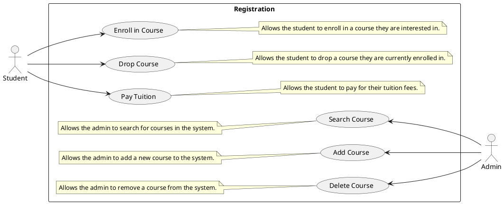

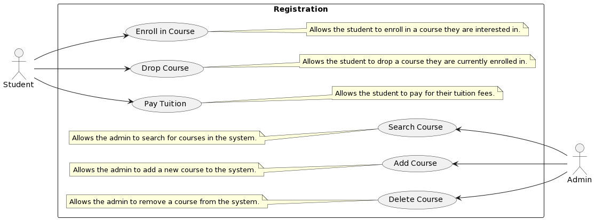

## Use Case Description
A use case diagram is a visual representation of the system's functionality and the actors that interact with it. It describes the interactions between the system and its actors, as well as the use cases that the actors can initiate. In the context of the university academic course registration system, the following use cases can be identified:

### Example 1

| Use Case ID | UC001 |
| --- | --- |
| Use Case Name | Enroll in Course |
| Actor(s) | Student |
| Preconditions | - The student is registered in the system. - The student has selected a course to enroll in. - The course has available slots. |
| Flow of Events | 1. Student selects the course to enroll in. 2. System verifies that the course has available slots. 3. System adds the student to the course roster. 4. System updates the student's schedule with the new course. 5. System confirms successful enrollment to the student. |
| Postconditions | - The student is enrolled in the course. - The course roster is updated. - The student's schedule is updated. - The student receives confirmation of successful enrollment. |

This table represents a use case scenario for the "Enroll in Course" feature in a system. A use case describes a specific interaction between an actor (in this case, a student) and a system to achieve a goal.

- The table has several columns, including the Use Case ID, Use Case Name, Actor(s), Preconditions, Flow of Events, and Postconditions.

- The Use Case ID is a unique identifier for the scenario, in this case, UC001.

- The Use Case Name is a brief description of the scenario, which is "Enroll in Course" in this case.

- The Actor(s) column identifies the user or users who interact with the system to perform the use case. In this scenario, the actor is a student.

- The Preconditions column lists the conditions that must be met before the use case can be executed. In this scenario, the student must be registered in the system, have selected a course to enroll in, and the course must have available slots.

- The Flow of Events column describes the sequence of actions that occur during the use case. In this scenario, the student selects the course to enroll in, the system verifies available slots, adds the student to the course roster, updates the student's schedule, and confirms successful enrollment to the student.

- The Postconditions column lists the outcomes that occur after the use case has been executed. In this scenario, the student is enrolled in the course, the course roster and student's schedule are updated, and the student receives confirmation of successful enrollment.

### Example 2

| Use Case ID | UC002                                                |
|-------------|------------------------------------------------------|
| Use Case    | Drop Course                                          |
| Actors      | Student                                              |
| Preconditions | The student is registered in at least one course. |
| Flow of Events | 1. The student selects the course to drop.          |
|               | 2. The system verifies the student's enrollment in the course. |
|               | 3. The system removes the course from the student's schedule. |
|               | 4. The system notifies the student of the successful course drop. |
| Postconditions | The selected course is dropped from the student's schedule. |
|                | The student is notified of the successful course drop. | 

> UC-02 (Drop Course) is a use case in the university academic course registration system that enables a student to drop a course from their schedule. The student is the actor for this use case, and the precondition is that the student is already registered in at least one course. The flow of events involves the student selecting the course to drop, the system verifying the enrollment, removing the course from the schedule, and notifying the student of the successful course drop. The postconditions are that the selected course is dropped from the student's schedule, and the student is notified of the successful course drop.

## Branching within a Flow and Alternative Flow
Branching within a flow occurs when there are multiple paths that can be taken in a use case based on certain conditions or decisions. This means that the flow of events may split into different directions depending on specific criteria.

For example, in a university academic course registration system, a student may select a course they wish to register for and then have to choose the type of credit they want to receive for that course. Depending on the type of credit they select, the flow of events may branch into different directions. If they choose a credit type that requires approval from an academic advisor, the flow of events will include a separate path where the advisor must review and approve the credit type selection before the registration process can continue.

Alternative flow occurs when there is a deviation from the main flow of events due to a specific issue or error. This means that if something goes wrong during the use case, an alternative path will be taken to handle the issue and ensure the use case can still be completed successfully.

For example, in the university academic course registration system, if a student encounters an error or issue during the registration process, an alternative flow may occur where they can contact the university's help desk for assistance. The help desk may request additional information from the student or escalate the issue to technical support if necessary, allowing the student to complete the registration process successfully.

| Use Case | UC003 |
| --- | --- |
| Actors | Student, Academic Advisor |
| Preconditions | - The student is logged into the university academic course registration system - The student has already searched for courses and found one they are interested in - The student has selected the course they want to register for |
| Flow of Events | 1. The system presents the student with a page displaying the course information and options for selecting the type of credit they wish to receive for the course. 2. The student selects the desired type of credit (e.g. graded, pass/fail, audit). 3. If the selected credit type requires additional approval from an academic advisor (e.g. pass/fail), the system displays a message indicating that the advisor will need to approve the credit type selection. 4. The student confirms their credit type selection and submits their course registration request to the system. 5. The system checks for any prerequisite courses required for the selected course and notifies the student if any are missing. 6. If prerequisites are missing, the student can choose to go back to the course search and select a different course, or they can request that an academic advisor help them resolve the missing prerequisites. 7. Once all prerequisites are satisfied and any required approvals are granted, the system confirms the student's course registration and updates their academic record. |
| Postconditions | - The student is registered for the selected course with the chosen type of credit - The student's academic record is updated with the course registration information |
| Alternative Flow | If the student encounters an error or issue during the course registration process, they can choose to contact the university's help desk for assistance. The help desk may request additional information from the student or escalate the issue to technical support if necessary. |
| Postconditions | - The student's issue or error is resolved, allowing them to complete the course registration process. |
| Alternative Flow | 3a. If the selected credit type requires approval from an academic advisor, the system sends a notification to the student indicating that the advisor must review and approve their credit type selection. 3b. The academic advisor receives the notification and logs into the system to view the student's course registration request. 3c. The advisor reviews the student's credit type selection and either approves or denies the request. 3d. If the request is denied, the advisor must provide a reason for the denial. 3e. The system notifies the student of the advisor's decision and reason for denial (if applicable). 3f. If the request is approved, the system proceeds with the course registration process as described in the main flow. |
| Postconditions | - If the advisor approves the credit type selection, the student is registered for the course with the chosen type of credit - If the advisor denies the credit type selection, the student is not registered for the course and must either choose a different credit type or select a different course altogether. |

## Repetition within a Flow: For/While
In UML (Unified Modeling Language), repetition within a flow using For/While loops can be represented using a loop node. A loop node is a type of activity node that allows a set of actions to be repeated while a particular condition is true.

The use case of repetition within a flow using For/While loops in the context of a university academic course registration system:

---
Use Case: University Academic Course Registration System

ID: UC-004

Actors: Student

Preconditions:
- The student is logged into the university academic course registration system
- The student has already searched for courses and found one they are interested in

Flow of Events:

Step | Action
--- | ---
1 | The student selects the "Register for Courses" option in the system.
2 | The system presents the student with a list of courses they can register for, based on their academic program and availability.
3 | The student selects the course they want to register for and confirms their choice.
4 | The system verifies that the student has met the prerequisites for the course and can register for it.
5 | If the student meets the prerequisites, the system adds the course to their registration list and prompts the student to select another course to register for.
6 | If the student does not meet the prerequisites, the system displays an error message and prompts the student to select another course that they are eligible to take.
7 | The student repeats steps 3-6 until they have registered for all the courses they want to take.

Postconditions:
- The student has successfully registered for the courses they want to take.

In this use case, repetition within a flow is used to allow the student to register for multiple courses one at a time. The For/While loop is used to repeat the process of selecting and registering for a course until the student has registered for all the courses they want to take. 

This process can save time for the student by allowing them to select and register for multiple courses in a single session without having to go through the registration process for each course separately. Additionally, the system can verify that the student has met the prerequisites for each course before allowing them to register, ensuring that they are only registering for courses that they are eligible to take.

## `<<include>>` Relationship 
In UML (Unified Modeling Language), the <<include>> relationship is a type of relationship that represents the inclusion of one use case in another use case. This relationship indicates that the behavior described in one use case is always included in the behavior described in another use case.

In the context of a university academic course registration system, an example of the `<<include>>` relationship could be between the "View Course Schedule" use case and the "Register for Course" use case. The "View Course Schedule" use case would include the steps required for the student to view the course schedule before they can proceed with the "Register for Course" use case.

## `<<extend>>` Relationship 
In UML, the `<<extend>>` relationship is used to model optional or alternative behaviors that can occur during the execution of a use case. It indicates that a use case can be extended by another use case, but the extended use case is not required for the base use case to be completed successfully. The `<<extend>>` relationship is represented as a dashed arrow with the `<<extend>>` stereotype.

For example, in the university academic course registration system, the "Register for Course" use case may be extended by the "Request Course Overload" use case. This use case allows students to request permission to enroll in more courses than the maximum allowed limit. The "Request Course Overload" use case would only be executed if the student has already registered for the maximum number of courses and still wants to enroll in more.

## Contribution 🛠️
Please create an [Issue](https://github.com/drshahizan/software-engineering/issues) for any improvements, suggestions or errors in the content.

You can also contact me using [Linkedin](https://www.linkedin.com/in/drshahizan/) for any other queries or feedback.

