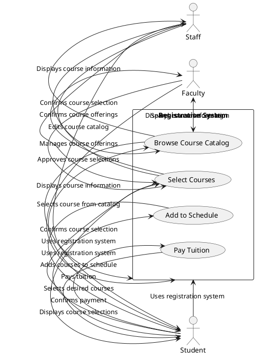

Don't forget to hit the :star: if you like this repo.

### Table of Contents

- [Requirements Engineering Introduction](p1-intro.md)
- [Functional Requirements](p2-functional.md)
- [Requirements Specification](p3-soft-requirement.md)
- [Form Based Specifications](p4-form.md)
- [Advance Requirements Engineering](p5-req-eng.md)
- [An interview with a stakeholder](p6-interview.md)

# Part 2: 

##Interaction Model

An interaction model is a type of Use Case diagram in software engineering that shows how different actors or users interact with the system to achieve certain goals or objectives. In the context of the university academic course registration system, the interaction model would depict the various steps involved in the registration process from the perspective of the different user roles, such as students, faculty, and staff.

An interaction model for the university academic course registration system:

In this PUML code, we have actors representing the different user roles (student, faculty, staff), and a rectangle representing the registration system. Inside the rectangle, we have several use cases that represent the different steps involved in the registration process, such as browsing the course catalog, selecting courses, adding them to the schedule, and paying tuition.

The arrows represent the interactions between the different elements of the interaction model. For example, a student selects a course from the catalog, and the system displays the course information. The student then selects their desired courses, and the system confirms the course selection. The student adds the courses to their schedule, and the system confirms the selection. Finally, the student pays their tuition, and the system confirms the payment.

By creating an interaction model for the university academic course registration system, software engineers can gain a better understanding of the different steps involved in the registration process from the perspective of the different user roles. This can help to identify potential issues and ensure that the system meets the needs of its stakeholders. The interaction model can also be used as a communication tool to help stakeholders understand how the system operates and how it is used to achieve specific goals.

## Contribution 🛠️
Please create an [Issue](https://github.com/drshahizan/software-engineering/issues) for any improvements, suggestions or errors in the content.

You can also contact me using [Linkedin](https://www.linkedin.com/in/drshahizan/) for any other queries or feedback.

