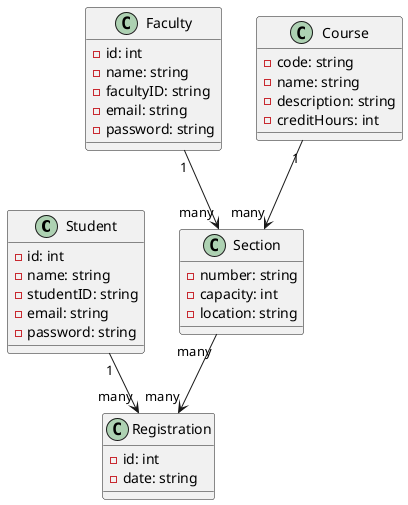

Don't forget to hit the :star: if you like this repo.

### Table of Contents

- [Requirements Modeling Concept](p1-intro.md)
- [Use Case Diagram](p2-use-case.md)
- [Structural Models](p3-struc-model.md)

# Part 3: Structural Models

In software engineering, structural models are used to represent the internal structure of a software system. These models are typically created during the design phase of software development and help developers to understand the relationships between different components of the system.

There are several types of structural models used in software engineering, including:

1. Class diagrams: A class diagram is a type of structural model that shows the classes, interfaces, and their relationships in a software system. It helps developers to understand the structure of the system and the interactions between different objects.

2. Object diagrams: An object diagram is a type of structural model that shows the objects and their relationships in a particular instance of a software system. It helps developers to understand the interactions between objects at runtime.

3. Component diagrams: A component diagram is a type of structural model that shows the components of a software system and the dependencies between them. It helps developers to understand how the different components of the system work together to achieve the system's functionality.

4. Deployment diagrams: A deployment diagram is a type of structural model that shows the physical deployment of a software system, including the hardware and software components, and their relationships. It helps developers to understand how the system will be deployed and configured in the production environment.

5. Package diagrams: A package diagram is a type of structural model that shows the organization of the software system into packages and the dependencies between them. It helps developers to understand how the different packages of the system are related and how they work together to achieve the system's functionality.

Overall, structural models are important in software engineering as they help developers to understand the structure of a software system and how the different components of the system work together to achieve the system's functionality.

## Class diagrams
Class diagrams are one of the most commonly used structural models in software engineering. They are used to represent the static structure of a software system by showing the classes, interfaces, and their relationships. Class diagrams help developers to understand the structure of the system and the interactions between different objects.

A class diagram consists of the following elements:

1. Classes: A class is a blueprint for creating objects in a software system. It defines the properties and methods that are common to all objects of that class. In a class diagram, classes are represented by rectangles with the name of the class written inside the rectangle.

2. Attributes: Attributes are the properties of a class that define the characteristics of an object. They are represented in a class diagram as a list of properties below the name of the class.

3. Methods: Methods are the functions that a class can perform. They are represented in a class diagram as a list of functions below the attributes of the class.

4. Relationships: Relationships define the associations between classes in a software system. There are several types of relationships in class diagrams, including inheritance, composition, and aggregation.

    - Inheritance: Inheritance is a relationship between a superclass and a subclass. It allows the subclass to inherit the properties and methods of the superclass. In a class diagram, inheritance is represented by a solid line with an arrowhead pointing to the superclass.

    - Composition: Composition is a relationship between two classes where one class is composed of the other. In a class diagram, composition is represented by a filled diamond at the end of a solid line that connects the two classes.

    - Aggregation: Aggregation is a relationship between two classes where one class is part of the other class. In a class diagram, aggregation is represented by an unfilled diamond at the end of a solid line that connects the two classes.

5. Multiplicity: Multiplicity is used to specify how many objects can be associated with a particular class in a relationship. It is represented in a class diagram using numbers or symbols.

Class diagrams are a powerful tool for visualizing the structure of a software system. They help developers to understand the relationships between classes, the properties and methods of each class, and how objects interact with each other. By using class diagrams, developers can design software systems that are easy to understand, maintain, and extend.

### Example
An example of a class diagram for a university academic course registration system:

  

In this example, we have identified several key classes and relationships within the system. Let's take a closer look at each of them:

1. **Student:** The Student class represents a student who is registered in the system. It has attributes such as name, student ID, email, and password.

2. **Faculty:** The Faculty class represents the instructors who teach courses in the system. It has attributes such as name, faculty ID, email, and password.

3. **Course:** The Course class represents a course offered by the university. It has attributes such as course code, name, description, and credit hours.

4. **Section:** The Section class represents a section of a course, which is typically taught by a single instructor during a specific time period. It has attributes such as section number, capacity, and location.

5. **Registration:** The Registration class represents the act of a student registering for a specific section of a course. It has attributes such as registration ID and registration date.

6. **Relationships:**

    - The Student class has a one-to-many relationship with the Registration class, indicating that a student can register for multiple courses.

    - The Faculty class has a one-to-many relationship with the Section class, indicating that a faculty member can teach multiple sections of courses.

    - The Course class has a one-to-many relationship with the Section class, indicating that a course can have multiple sections.

    - The Section class has a many-to-many relationship with the Registration class, indicating that multiple students can register for the same section of a course.

Overall, this class diagram provides a clear overview of the key classes and relationships within a university academic course registration system. It can serve as a useful tool for software developers to design, implement, and maintain such a system.

### Code PUML

In this PUML code, we define the classes and their attributes using the `class` keyword followed by the class name and a list of attributes preceded by a `-` symbol. We then define the relationships between the classes using the `-->` symbol, and indicate the multiplicity of the relationships using the numbers on each end of the arrow.

Note that this is just an example of how to represent a university academic course registration system using PUML. The actual implementation may vary depending on the specific requirements of the system.

## Contribution 🛠️
Please create an [Issue](https://github.com/drshahizan/software-engineering/issues) for any improvements, suggestions or errors in the content.

You can also contact me using [Linkedin](https://www.linkedin.com/in/drshahizan/) for any other queries or feedback.

