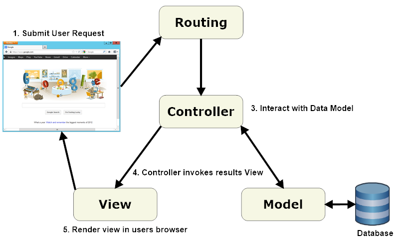

Don't forget to hit the :star: if you like this repo.

### Table of Contents

- [MVC](p1.md)
- [Case Study](p2.md)
- [Folder Structure](p3.md)
- [Diagrams](p4.md)

# MVC (Model-View-Controller) Architecture in PHP

MVC is a software architectural pattern commonly used in PHP web development. It divides the application into three interconnected components: the Model, View, and Controller. This pattern improves code organization, maintainability, and scalability of PHP applications.

## Model
- The Model represents the application's data and business logic.
- It handles data storage, retrieval, validation, and manipulation.
- Interacts with the database or other data sources for data operations.
- Encapsulates rules and operations related to data management.

## View
- The View presents the data to the user in a user-friendly format.
- Defines the visual representation and layout of the application's user interface.
- Receives data from the Controller and renders it for user interaction.
- Can be a web page, template file, or any other output format.

## Controller
- The Controller manages user interactions and acts as the intermediary between the Model and View.
- Receives user requests and determines the appropriate action.
- Interacts with the Model for data operations.
- Selects the appropriate View to render based on the user's request.
- Contains the application's logic for handling actions and events.

In the MVC pattern:
1. User triggers a request.
2. Controller receives the request and decides the action.
3. Controller interacts with the Model for data operations.
4. Controller selects the View to render.
5. View receives data from the Controller and presents it.
6. View is sent back to the user for display.

Benefits of using MVC in PHP:
- Separation of concerns for better code organization.
- Code reusability and modularity.
- Improved testability with individual component testing.
- Scalability and ease of maintenance.
- Enhanced collaboration among developers.

MVC provides a structured approach to PHP application development, separating data, logic, and presentation concerns. It offers code organization, maintainability, and flexibility, making it a popular choice for building PHP web applications.

## Contribution 🛠️
Please create an [Issue](https://github.com/drshahizan/software-engineering/issues) for any improvements, suggestions or errors in the content.

You can also contact me using [Linkedin](https://www.linkedin.com/in/drshahizan/) for any other queries or feedback.

