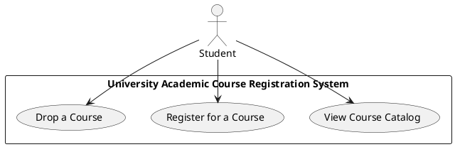

Don't forget to hit the :star: if you like this repo.

# Actor
In UML (Unified Modeling Language), an actor is an entity or component that interacts with the system being modeled. Actors can be people, organizations, external systems, or even other software components. Actors are often depicted as stick figures in UML diagrams.

In use case diagrams, actors are used to represent the external entities that interact with the system being modeled. Use cases describe the different functions or features of the system, and actors describe the different roles that interact with those functions or features.

For example, in a university academic course registration system, a student would be an actor. The student interacts with the system by registering for courses, viewing course catalogs, and dropping courses. In this case, the student actor would be connected to the use cases for these functions.

Actors are important in UML because they help to identify and define the boundaries of the system being modeled. By identifying the actors and their interactions with the system, the model can better capture the requirements and behavior of the system.

## Case study

### 1. Create an actor using Draw.io

| No. | Item | Description |
| --- | --- | --- |
| 1 | Open Draw.io | Open Draw.io in your browser |
| 2 | Select "UML" | From the left-hand panel, select "UML" |
| 3 | Drag and Drop "Actor" | From the "UML Use Case" library, drag and drop "Actor" onto the drawing area |
| 4 | Rename the Actor | Double-click on the actor and type in the new name, e.g. "Student" |
| 5 | Resize the Actor | Click on the actor to select it, then click and drag the handles to resize it |
| 6 | Customize the Actor | Right-click on the actor and select "Edit Style" to customize the color, font, and other properties of the actor |

In this case, we're creating an actor for a university academic course registration system. Once you've followed these steps, you'll have a UML actor element representing the `Student` actor in your diagram.

### 2. PlantUML: Create a UML diagram with an actor

In this example, we use the `actor` keyword to define the `Student` actor. We then create a rectangle that represents the `University Academic Course Registration System` and add three use cases to it: `View Course Catalog`, `Register for a Course`, and `Drop a Course`. Finally, we connect the `Student` actor to each of the use cases using the `-->` arrow.

## Contribution 🛠️
Please create an [Issue](https://github.com/drshahizan/software-engineering/issues) for any improvements, suggestions or errors in the content.

You can also contact me using [Linkedin](https://www.linkedin.com/in/drshahizan/) for any other queries or feedback.

