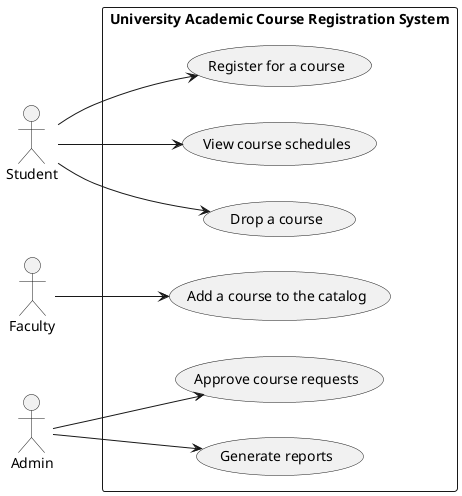

Don't forget to hit the :star: if you like this repo.

# Use Case Diagrams
Use case diagrams are a type of diagram used in software development to describe the behavior of a system from the point of view of its users or actors. These diagrams are often used to identify the functional requirements of a system, and can help to ensure that all user needs are met.

Draw.io is a web-based diagramming tool that allows users to create a wide variety of diagrams, including use case diagrams. With draw.io, users can easily create and customize use case diagrams using a drag-and-drop interface and a variety of pre-built shapes.

In a use case diagram created using draw.io, the primary actors or users of the system are represented using the "Use Case" shape. Additional actors can be added to the diagram as needed, and can be connected to the use cases using lines.

Each use case is represented by an oval shape, which can be labeled with a brief description of the task or function it performs. The relationships between the use cases and the actors are shown using lines, which can be labeled with a description of the interaction.

Other elements that can be added to a use case diagram using draw.io include text labels, color coding, and icons or images to help organize and clarify the diagram. Once the diagram is complete, it can be exported as an image or saved to a user's computer or cloud storage.

## Create a use case diagram using draw.io

To create a use case diagram using draw.io, you can follow these steps:

1. Open draw.io in your web browser and select "Use Case Diagram" from the list of available templates.

2. Drag and drop the "Use Case" shape onto the canvas to represent the primary actors or users of the system.

3. Next, add the "Actor" shape to represent the actions of the primary actors. 

4. Draw lines from the "Actor" shape to the "Use Case" shape to show the interaction between the actors and the use cases. 

5. Add additional use cases and actors as needed, and connect them with lines to show their relationships.

6. You can also add text labels, color coding, and other elements to help organize and clarify the diagram.

7. Once you have completed the diagram, you can export it as an image or save it to your computer or cloud storage.

> Keep in mind that use case diagrams are only one type of diagram used in software development, and should be accompanied by other diagrams such as class diagrams, activity diagrams, and sequence diagrams to fully describe the system.

## Case study: Academic course registration system
How you could create use case diagrams for a university academic course registration system:

1. Start by identifying the primary actors or users of the system. In this case, the primary actors might include:

    - Students
    - Faculty members
    - Administrative staff

2. Next, create a use case diagram that shows the interactions between the actors and the system. Here are a few examples of use cases that might be included in the diagram:

    - Register for a course: This use case would allow students to register for a course, selecting the course they want to take and entering any necessary information such as their student ID number and course preferences.
    - Add a course to the catalog: This use case would allow faculty members to add a new course to the course catalog, including information about the course such as the course name, description, and prerequisites.
    - Approve course requests: This use case would allow administrative staff to approve course requests made by students, ensuring that the student meets any necessary prerequisites and that the course is available.

3. Connect the actors to the appropriate use cases using lines. For example, you might connect the "Student" actor to the "Register for a course" use case, and the "Faculty member" actor to the "Add a course to the catalog" use case.

4. Add any additional use cases and actors as needed. For example, you might include use cases for viewing course schedules, dropping courses, and generating reports.

5. Use color coding or other visual cues to help distinguish between different types of actors or use cases, and include any necessary labels or annotations to provide additional information about the system.

Outline the use cases for a university academic course registration system:

| Use Case | Description | Actors |
| --- | --- | --- |
| Register for a course | Allows students to register for a course, selecting the course they want to take and entering any necessary information such as their student ID number and course preferences. | Students |
| Add a course to the catalog | Allows faculty members to add a new course to the course catalog, including information about the course such as the course name, description, and prerequisites. | Faculty members |
| Approve course requests | Allows administrative staff to approve course requests made by students, ensuring that the student meets any necessary prerequisites and that the course is available. | Administrative staff |
| View course schedules | Allows students to view their course schedule for a given semester or academic year. | Students |
| Drop a course | Allows students to drop a course that they have already registered for, either before or during the course. | Students |
| Generate reports | Allows administrative staff to generate reports related to course registration, such as enrollment numbers, course demand, and student performance. | Administrative staff |

  > In addition to the use cases listed above, you may also want to include additional information such as preconditions, postconditions, and exceptions for each use case. This information can help to provide more detail about the requirements of the system and ensure that all possible scenarios are accounted for.

Remember that use case diagrams are just one part of the Software Requirements Specification (SRS) process. You may also want to include other types of diagrams or documentation, such as data flow diagrams, entity-relationship diagrams, and user interface mockups, to fully describe the requirements of the system.

## Report example: Software Requirements Specification (SRS)

### Introduction:

Software Requirements Specification (SRS) is a key document that outlines the functional and non-functional requirements of a software system. Use case diagrams are a common tool used to describe the behavior of a system from the perspective of its users or actors. This report will outline the use case diagram for a university academic course registration system, which will be used as a case study for the IEEE Software Requirements Specification (SRS) document.

### Use Case Diagram for University Academic Course Registration System:

The primary actors in the university academic course registration system are students, faculty members, and administrative staff. The use case diagram for this system is shown below:

As shown in the diagram, the primary use cases for this system include:

- Register for a course: This use case allows students to register for a course, selecting the course they want to take and entering any necessary information such as their student ID number and course preferences.

- Add a course to the catalog: This use case allows faculty members to add a new course to the course catalog, including information about the course such as the course name, description, and prerequisites.

- Approve course requests: This use case allows administrative staff to approve course requests made by students, ensuring that the student meets any necessary prerequisites and that the course is available.

- View course schedules: This use case allows students to view their course schedule for a given semester or academic year.

- Drop a course: This use case allows students to drop a course that they have already registered for, either before or during the course.

- Generate reports: This use case allows administrative staff to generate reports related to course registration, such as enrollment numbers, course demand, and student performance.

Additional use cases may be added as needed to fully describe the requirements of the system.

### Use Case Description:

Each use case in the use case diagram should be accompanied by a description that provides additional detail about the requirements of the system. Here is an example of a use case description for the "Register for a course" use case:

### Use Case: Register for a course

Description: This use case allows students to register for a course, selecting the course they want to take and entering any necessary information such as their student ID number and course preferences. The system should ensure that the student meets any necessary prerequisites for the course, and that the course is available during the selected semester. Once the student has successfully registered for the course, the system should update the student's course schedule accordingly.

### Preconditions:
- The student must be logged into the system.
- The student must have a valid student ID number.
- The course must be available for registration during the selected semester.

### Postconditions:
- The student's course schedule should be updated to reflect the newly registered course.

### Exceptions:
- If the student does not meet the necessary prerequisites for the course, the system should display an error message and prevent the student from registering for the course.
- If the course is not available during the selected semester, the system should display an error message and prevent the student from registering for the course.

### Conclusion:

Use case diagrams are an important tool for describing the behavior of a software system from the perspective of its users or actors. The use case diagram for a university academic course registration system provides a clear overview of the primary use cases for the system, and can be used as a starting point for developing the IEEE Software Requirements Specification (SRS) document. By providing detailed use case descriptions for each use case, the SRS document can ensure that all functional and non-functional requirements of the system are fully defined and documented.

## Additional Notes
- [Drawing a UML Diagram in the VS Code](https://towardsdatascience.com/drawing-a-uml-diagram-in-the-vs-code-53c2e67deffe)
- [How to generate UML diagrams from your existing code](https://medium.com/nerd-for-tech/how-to-generate-uml-diagrams-from-your-existing-code-814d27bd1537)
- [PlantUML for the impatient](https://plantuml.com/starting)
- [PlantUML is in an online server](http://www.plantuml.com/plantuml/uml/SyfFKj2rKt3CoKnELR1Io4ZDoSa70000)

## Contribution 🛠️
Please create an [Issue](https://github.com/drshahizan/software-engineering/issues) for any improvements, suggestions or errors in the content.

You can also contact me using [Linkedin](https://www.linkedin.com/in/drshahizan/) for any other queries or feedback.

