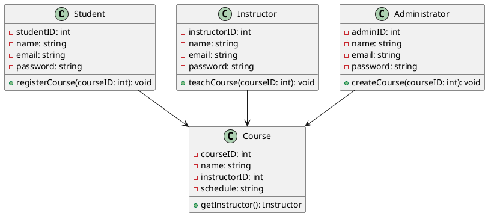

Don't forget to hit the :star: if you like this repo.

# Class Diagrams

A class diagram in UML (Unified Modeling Language) is a type of static structure diagram that represents the structure of a system by showing the classes of objects, their attributes and methods, and the relationships among the classes.

In a class diagram, classes are represented as rectangles with the class name written in the top section. The attributes of the class are listed in the middle section, while the methods of the class are listed in the bottom section. Attributes represent the properties or characteristics of the class, such as the name, age, or address of a person, and methods represent the behaviors or actions that the class can perform, such as walking, talking, or eating.

Relationships between classes are represented by lines that connect the classes, with arrows indicating the direction of the relationship. There are several types of relationships that can be represented in a class diagram, including:

| Relationship | Description |
|--------------|-------------|
| Association | Represents a relationship between two classes where one class uses an instance of the other class. |
| Aggregation | Represents a relationship between two classes where one class is a part of the other class. |
| Composition | Represents a relationship between two classes where one class is composed of the other class. |
| Inheritance | Represents a relationship between two classes where one class is a subclass of the other class, inheriting its attributes and methods. |
| Dependency | Represents a relationship between two classes where one class depends on the other class. |

Class diagrams are useful for analyzing and designing complex systems, as they provide a visual representation of the system's structure and relationships. They are often used in software development to model the classes and relationships in an object-oriented program.

## Create a class diagram using draw.io

1. Open draw.io in your web browser.
2. Click on "File" in the top left corner and select "New" to create a new diagram.
3. In the left-hand menu, select "UML" and then "Class Diagram".
4. Drag and drop the necessary classes onto the canvas from the UML Class Diagram toolbox on the left-hand side of the screen.
5. Rename the classes to represent the various elements in your university academic course registration system, such as Student, Instructor, Course, and Administrator.
6. Add attributes to each class by clicking on the class, then clicking on the "Edit" button in the Properties panel on the right-hand side of the screen. In the pop-up window, you can add attributes such as name, ID, and email for each class.
7. Add methods to each class by clicking on the class, then clicking on the "Edit" button in the Properties panel on the right-hand side of the screen. In the pop-up window, you can add methods such as registerCourse, teachCourse, and createCourse for each class.
8. Connect the classes using appropriate relationships such as association, inheritance, aggregation, or composition. You can find these relationships in the "Connectors" section of the toolbox.
9. Add multiplicities to the relationships by clicking on the relationship line, then clicking on the "Edit" button in the Properties panel on the right-hand side of the screen. In the pop-up window, you can add the multiplicities to the source and target ends of the relationship, such as "1..*" for a one-to-many relationship.
10. Save your class diagram and export it as a PNG, PDF, or other file format as needed.

> Remember, the class diagram is just one part of the overall system design process. You'll also need to create other diagrams, such as use case diagrams, activity diagrams, and sequence diagrams, to fully describe the behavior of the system.

## Case study
Sure, here's an example report on the class diagram for a university academic course registration system, based on the Software Requirements Specifications (SRS) document:

### Introduction
The purpose of this report is to document the class diagram for the university academic course registration system. The class diagram is an important tool for designing the system's object-oriented structure, which will help ensure that the system meets the requirements of the SRS document.

### Classes
The class diagram for the university academic course registration system includes four primary classes: Student, Instructor, Administrator, and Course. Each of these classes has a number of attributes and methods, which are described below:

| Class Name | Description | Attributes | Methods |
|------------|-------------|------------|---------|
| Student    | Represents a student who is registering for courses. | studentID: int name: string email: string password: string | registerCourse(courseID: int) |
| Instructor | Represents an instructor who is teaching courses. | instructorID: int name: string email: string password: string | teachCourse(courseID: int) |
| Administrator | Represents an administrator who is responsible for creating and managing courses. | adminID: int name: string email: string password: string | createCourse(courseID: int) |
| Course     | Represents a course that is being offered. | courseID: int name: string instructorID: int schedule: string | getInstructor() | 

In this table, each row represents a class in the system. The "Class Name" column provides the name of the class, while the "Description" column briefly describes what the class represents. The "Attributes" column lists the attributes of each class, including their data types, while the "Methods" column lists the methods of each class and their parameters.

### Relationships
The class diagram also includes several relationships between the classes, which help to define the interactions between the system's components. The primary relationships in the university academic course registration system include:

1. Student - Course: This relationship represents the fact that a student can register for multiple courses, and each course can have multiple students. The relationship is a many-to-many relationship.

2. Instructor - Course: This relationship represents the fact that an instructor can teach multiple courses, and each course can have only one instructor. The relationship is a one-to-many relationship.

3. Administrator - Course: This relationship represents the fact that an administrator can create multiple courses, and each course can have only one administrator. The relationship is a one-to-many relationship.

### PUML File.
An example of a class diagram written in PlantUML (puml) code for a university academic course registration system:

In this example, we have four classes: Student, Instructor, Administrator, and Course. Each class has attributes (indicated by the "-" symbol) and methods (indicated by the "+" symbol). We've also included some basic relationships between the classes using the arrow notation.

> Note that this is just a simple example, and a full class diagram for a university academic course registration system would likely include more classes and relationships.

### Conclusion
The class diagram for the university academic course registration system provides a clear picture of the system's object-oriented structure, including the classes, attributes, and methods that make up the system's components. By carefully designing the class diagram, we can ensure that the system meets the requirements of the SRS document and provides a robust, user-friendly solution for academic course registration.

## Contribution 🛠️
Please create an [Issue](https://github.com/drshahizan/software-engineering/issues) for any improvements, suggestions or errors in the content.

You can also contact me using [Linkedin](https://www.linkedin.com/in/drshahizan/) for any other queries or feedback.

