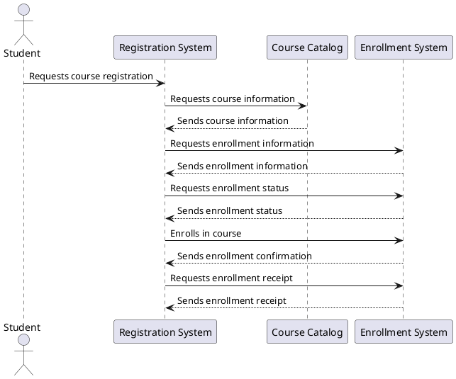

Don't forget to hit the :star: if you like this repo.

# Sequence Diagram

Sequence diagrams are a type of interaction diagram used in software design to represent the flow of messages between objects or components within a system. They are often used to visualize the dynamic behavior of a system by showing the interactions between objects over time.

Sequence diagrams consist of vertical lines that represent the lifelines of the objects or components involved in the interaction. Horizontal arrows or message lines indicate the flow of messages between the lifelines, with the arrows indicating the direction of the communication. The messages are labeled with the name of the method being called and any parameters that are passed.

Sequence diagrams can also include other elements such as actors, which represent external entities that interact with the system, and notes, which provide additional information about the sequence of events or the purpose of a particular message.

Overall, sequence diagrams provide a clear and concise way to represent the flow of communication and interactions between objects or components within a system. They are widely used in software development to help understand the behavior of complex systems and to aid in the design and implementation of software solutions.

## Create a sequence diagram using Draw.io
Follow these steps:

1. Open Draw.io in your web browser.

2. Click on the "Create New Diagram" button, then select "Sequence Diagram" from the list of available templates.

3. Drag and drop the lifeline shapes onto the canvas to represent the objects or components involved in the interaction.

4. Use the "Message" shape to indicate the flow of messages between the lifelines. You can drag the message shape onto the canvas, then click on it to add text and adjust its properties.

5. Use the "Actor" shape to represent external entities that interact with the system. Drag the actor shape onto the canvas and add text to label it.

6. Use the "Note" shape to add additional information or annotations to the diagram. Drag the note shape onto the canvas and add text to label it.

7. Use the "Connector" shape to connect message shapes to the lifelines or other shapes in the diagram.

8. Use the formatting tools to customize the appearance of the diagram, including changing the font, color, and shape styles.

9. Once you're finished creating the diagram, you can save it to your computer or export it as an image or PDF.

With these steps, you can easily create a sequence diagram using Draw.io.

## Case study
Here's a report about sequence diagrams in the context of a university academic course registration system.

### Introduction

A sequence diagram is a type of interaction diagram that shows the interactions between objects in a system over time. It depicts the sequence of messages exchanged between objects and the lifeline of each object involved in the interaction. Sequence diagrams are often used in software development to model the behavior of a system, particularly in the design phase.

In this report, we will discuss the use of sequence diagrams in the context of a university academic course registration system. The purpose of the system is to allow students to register for courses and manage their course schedules.

### Sequence Diagrams for University Academic Course Registration System

The university academic course registration system can be modeled using a sequence diagram. The diagram shows the interactions between the different objects in the system, including the student, the registration system, the course catalog, and the enrollment system.

The sequence diagram for the university academic course registration system can be divided into several steps. First, the student requests course registration from the registration system. The registration system then requests course information from the course catalog. The course catalog sends the course information back to the registration system, which then requests enrollment information and status from the enrollment system. The enrollment system sends the enrollment information and status back to the registration system, which then enrolls the student in the course. The enrollment system sends an enrollment confirmation and receipt back to the registration system, which then forwards them to the student.

Each of these steps can be represented by a message in the sequence diagram. The lifeline of each object involved in the interaction is also depicted in the diagram, along with any activation bars to show when the object is active.

### Benefits of Sequence Diagrams

Using sequence diagrams in the design of the university academic course registration system provides several benefits. First, it allows developers to visualize the interactions between different objects in the system and identify any potential issues or errors. It also helps in identifying any missing requirements or functionalities. Moreover, it provides a clear and concise representation of the system's behavior that can be easily understood by stakeholders.

### Sequence diagram: For clarity, list the interactions in a table

| Object 1         | Message        | Object 2         |
|------------------|----------------|------------------|
| Student           | Requests course registration | Registration system |
| Registration system | Requests course information | Course catalog |
| Course catalog    | Sends course information | Registration system |
| Registration system | Requests enrollment information and status | Enrollment system |
| Enrollment system | Sends enrollment information and status | Registration system |
| Registration system | Enrolls student in course | Enrollment system |
| Enrollment system | Sends enrollment confirmation and receipt | Registration system |
| Registration system | Forwards confirmation and receipt to student | Student |

The student interacts with the registration system to register for a course. The sequence diagram shows the interactions between the student, the registration system, the course catalog, and the enrollment system. The student requests course registration from the registration system, which requests course information from the course catalog. The course catalog sends the course information back to the registration system, which then requests enrollment information and status from the enrollment system. The enrollment system sends the enrollment information and status back to the registration system, which then enrolls the student in the course. The enrollment system sends an enrollment confirmation and receipt back to the registration system, which then forwards them to the student.

## PlantUML code

This diagram shows the interaction between a student, the registration system, the course catalog, and the enrollment system. The student requests course registration from the registration system, which in turn requests course information from the course catalog. The course catalog sends the course information back to the registration system, which then requests enrollment information and status from the enrollment system. The enrollment system sends the enrollment information and status back to the registration system, which then enrolls the student in the course. The enrollment system sends an enrollment confirmation and receipt back to the registration system, which then forwards them to the student.

> You can modify this code to suit your specific requirements for the academic course registration system.

### Conclusion

In conclusion, sequence diagrams are a useful tool for modeling the behavior of a university academic course registration system. They allow developers to visualize the interactions between different objects in the system and identify any potential issues or errors. They also provide a clear and concise representation of the system's behavior that can be easily understood by stakeholders. By using sequence diagrams in the design phase, developers can ensure that the system meets the requirements and specifications of the stakeholders.

## Contribution 🛠️
Please create an [Issue](https://github.com/drshahizan/software-engineering/issues) for any improvements, suggestions or errors in the content.

You can also contact me using [Linkedin](https://www.linkedin.com/in/drshahizan/) for any other queries or feedback.

