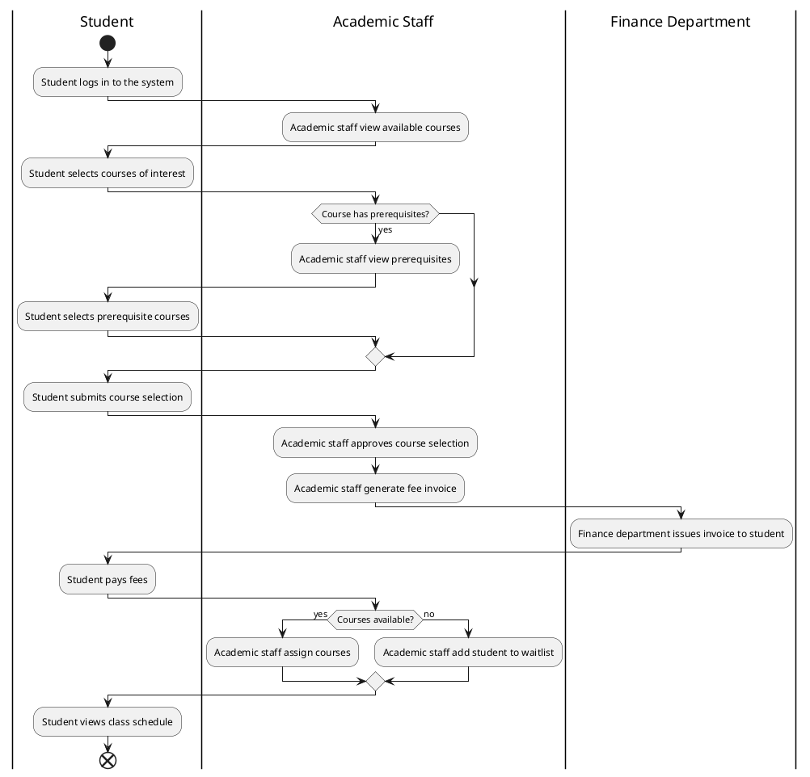

Don't forget to hit the :star: if you like this repo.

# Activity Diagram

An activity diagram is a type of behavior diagram in UML (Unified Modeling Language) that models the flow of control or flow of activities in a system. It visually represents a series of actions or activities that occur in a system or process, and the flow of control between them. 

Activity diagrams are commonly used in software development and business process modeling to visualize the steps involved in a system's behavior. They are often used to model complex workflows, use cases, or business processes, and can be used to illustrate both simple and complex scenarios. 

The key elements of an activity diagram include activities, control flows, objects, swimlanes, and decision points. Activities represent the specific actions or tasks that take place in the system, while control flows depict the order in which these activities are carried out. Objects can represent actors, resources, or entities involved in the system, while swimlanes organize activities according to different roles or responsibilities. 

Decision points, also known as gateways, are used to model branching and merging of activities. They allow for the modeling of complex decision-making processes and can depict conditions that determine the flow of control in the system. 

Overall, activity diagrams are an effective tool for visualizing and communicating the behavior of a system or process. They are useful for understanding complex workflows and for identifying potential bottlenecks or inefficiencies in a system.

## Create an Activity Diagram using draw.io
Here's a step-by-step guide on how to create an Activity Diagram using draw.io and add activities, decisions, and loops to model the flow of activities in a system or process:

1. Open draw.io in your web browser and create a new diagram.
2. Select the "UML" library from the left-hand panel.
3. Drag and drop the "Activity" shape onto the canvas to create the initial activity node.
4. To add more activity nodes, drag and drop the "Activity" shape onto the canvas and connect them with control flow arrows. You can do this by clicking on the activity shape and dragging the arrow to the next activity shape. You can also add a label to each activity by double-clicking on the shape and entering the text.
5. To add a decision point, drag and drop the "Diamond" shape from the "UML" library onto the canvas. Connect the decision point to the activity nodes using control flow arrows. Double-click on the decision point and enter the text to describe the decision that needs to be made.
6. To add a loop, drag and drop the "Loop" shape from the "UML" library onto the canvas. Connect the loop to the activity nodes using control flow arrows. Double-click on the loop and enter the text to describe the condition that needs to be met for the loop to continue.
7. To add swimlanes to the activity diagram, click on the "Swimlane" shape from the "Flowchart" library and drag it onto the canvas. You can add multiple swimlanes to the diagram and assign different activities to each swimlane.
8. Customize your activity diagram using the formatting options available in the toolbar. You can change the color, font, and size of your shapes and lines to make your diagram more visually appealing.
9. Save your diagram by clicking on "File" in the top menu and selecting "Save" or "Save As".

Once you have created your Activity Diagram using draw.io, you can export it as an image or PDF file, or share it with others by generating a shareable link.

## Case study
Sure, here's a sample report on how an Activity Diagram can be used in the Software Requirements Specifications (SRS) for a university academic course registration system.

### Introduction

The purpose of this report is to describe how an Activity Diagram can be used to represent the process of university academic course registration system in the SRS. The Activity Diagram is a graphical representation that can be used to model the flow of activities in a system or process. It provides a visual representation of the steps involved in the process and the interaction between different parties involved in the system. The Activity Diagram can be used to identify potential issues and bottlenecks in the process, which can help in designing a more efficient system.

### Overview of the University Academic Course Registration System

The University Academic Course Registration System is designed to facilitate the course registration process for students, academic staff, and the finance department. The system allows students to view available courses, select courses of interest, and submit their course selection. Academic staff can approve the course selection and assign courses to the students. The finance department generates fee invoices and issues them to the students. The students can pay the fees and view their class schedule.

### Activity Diagram for the University Academic Course Registration System

The Activity Diagram for the University Academic Course Registration System is shown below:

| Swimlane | Activity | Description |
|---------|----------|-------------|
| Student | Log in to the system | The student logs into the system using their username and password |
| Academic Staff | View available courses | The academic staff views the list of available courses for the semester |
| Student | Select courses of interest | The student selects the courses they are interested in taking |
| Academic Staff | Check course prerequisites | The academic staff checks if the selected courses have any prerequisites |
| Academic Staff | View prerequisites | If a course has prerequisites, the academic staff views the list of prerequisites |
| Student | Select prerequisite courses | The student selects the prerequisite courses needed for the selected course |
| Student | Submit course selection | The student submits their course selection |
| Academic Staff | Approve course selection | The academic staff approves the course selection |
| Academic Staff | Generate fee invoice | The academic staff generates a fee invoice for the selected courses |
| Finance Department | Issue invoice to student | The finance department issues the fee invoice to the student |
| Student | Pay fees | The student pays the fees for the selected courses |
| Academic Staff | Assign courses | The academic staff assigns the courses to the student |
| Academic Staff | Add student to waitlist | If a course is not available, the academic staff adds the student to the waitlist |
| Student | View class schedule | The student views their class schedule for the semester |

This table breaks down the activities involved in the university academic course registration system into swimlanes representing the different parties involved in the process. The activities are then described in detail within each swimlane. This approach allows for a clear and concise representation of the process that can be easily translated into an Activity Diagram.

### PUML code

The Activity Diagram starts with the student logging into the system and viewing available courses. The student selects courses of interest and submits their course selection. If a course has prerequisites, the academic staff views the prerequisites and the student selects prerequisite courses. The academic staff approves the course selection and generates a fee invoice, which is issued to the student by the finance department. The student pays the fees and the academic staff assigns courses. If courses are not available, the academic staff adds the student to the waitlist. The student can then view their class schedule.

### Conclusion

The Activity Diagram is a useful tool for representing the process of the university academic course registration system in the SRS. It provides a visual representation of the steps involved in the process and the interaction between different parties involved in the system. The Activity Diagram can be used to identify potential issues and bottlenecks in the process, which can help in designing a more efficient system.

## Contribution 🛠️
Please create an [Issue](https://github.com/drshahizan/software-engineering/issues) for any improvements, suggestions or errors in the content.

You can also contact me using [Linkedin](https://www.linkedin.com/in/drshahizan/) for any other queries or feedback.

