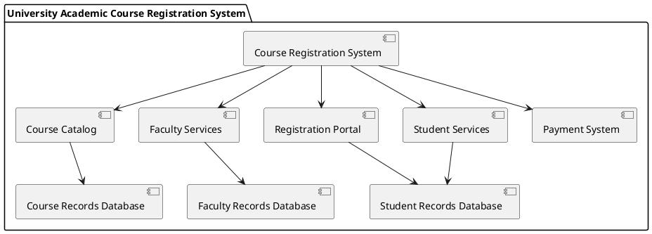

Don't forget to hit the :star: if you like this repo.

# Component Diagram

In Unified Modeling Language (UML), a component diagram is used to represent the system's components, their relationships, dependencies, and interfaces. It is a structural diagram that provides a high-level view of the system's architecture and its interactions.

The components in a UML component diagram are software modules or physical parts of a system, which can be deployed, executed, and exchanged independently. Each component is represented as a rectangle with its name inside. Components are connected by lines representing dependencies or interfaces.

The dependency relationship in a component diagram is shown using an arrow pointing from the dependent component to the independent component. This indicates that one component relies on another component for its functionality. The interface relationship is represented using a small circle on the component's boundary. The circle can have a name and is connected by a line to a provided interface or required interface on another component.

A provided interface represents the services offered by the component to the outside world, while a required interface represents the services required by the component from other components. Interfaces are represented as small rectangles on a component's boundary with the interface name inside.

In a UML component diagram, each component can also have its own internal structure. This structure is shown using a composite structure diagram or a class diagram. The composite structure diagram represents the component's internal structure, which includes its attributes, ports, and connectors. The class diagram represents the classes inside the component and their relationships.

In summary, a component diagram in UML is a graphical representation of the system's architecture, which highlights the system's components, their relationships, dependencies, and interfaces. It is useful in understanding the overall structure of the system and its interactions.

## Create Component Diagram using draw.io?
To create a component diagram using draw.io, follow these steps:

1. Open draw.io in your web browser.
2. Click on the "New Diagram" button.
3. Select "Component Diagram" from the list of templates.
4. A blank component diagram will appear on your screen.
5. To add a component, drag and drop the "Component" shape from the left-hand panel onto the diagram.
6. Double-click on the component shape to edit its name and other properties.
7. To add an interface, drag and drop the "Interface" shape onto the component shape.
8. Double-click on the interface shape to edit its name and other properties.
9. To show a dependency relationship between two components, select the "Dependency" shape from the left-hand panel and drag it from one component to another.
10. To show an interface relationship, select the "Provided Interface" or "Required Interface" shape from the left-hand panel and drag it from one component to another.
11. To group components, select the "Container" shape from the left-hand panel and drag it around the components you want to group.
12. Double-click on the container shape to edit its name and other properties.

You can also add other shapes and elements to your component diagram, such as notes, text boxes, and arrows, by selecting them from the left-hand panel and dragging them onto the diagram.

To show the physical components of a system, you can use icons or images instead of the "Component" shape. To do this, select the "Image" shape from the left-hand panel and drag it onto the diagram. Then, click on the "Image" shape to upload the icon or image you want to use.

To show how the components are connected, you can add "Port" shapes to the components and connect them using "Connector" shapes. To do this, select the "Port" shape from the left-hand panel and drag it onto the component. Then, connect the ports using the "Connector" shape.

Once you have finished creating your component diagram, you can save it in a variety of formats, such as PNG, PDF, or SVG.

Note that component diagrams are typically used to show the software architecture of a system, while deployment diagrams are used to show the physical deployment of the software components onto hardware. To create a deployment diagram in draw.io, follow similar steps but select "Deployment Diagram" from the list of templates instead of "Component Diagram."

## Case study

### Introduction:
The University Academic Course Registration System is an online platform that allows students to register for courses, view their schedules, and manage their academic records. This system is designed to improve the efficiency and accuracy of the registration process, reduce administrative overhead, and provide a better experience for students, faculty, and staff. One important aspect of designing the system is creating a Component Diagram that clearly represents the different components of the system and how they interact with each other.

### Component Diagram:
The Component Diagram is a type of UML diagram that represents the different components of a system and their relationships. In the context of the University Academic Course Registration System, the Component Diagram would show the different components of the system and how they interact with each other to enable the registration process.

### The main components of the system

Sure, here's an example of a Component Diagram for a university academic course registration system represented as a table:

| Component | Description | Responsibilities | Dependencies |
| --- | --- | --- | --- |
| Course Registration System | The main entry point for users to access the system | User authentication, session management, routing user requests to appropriate components | Course Catalog, Registration Portal, Faculty Services, Student Services, Payment System |
| Course Catalog | Provides a comprehensive list of all the courses offered by the university | Enables students to search for courses based on different criteria such as course code, course title, or instructor name | Course Records Database |
| Registration Portal | Enables students to register for courses, view their schedules, and manage their academic records | Authenticates users, manages sessions | Student Records Database |
| Faculty Services | Provides faculty members with tools to manage their courses, view student records, and communicate with students | Authenticates users, manages sessions | Faculty Records Database |
| Student Services | Provides students with tools to manage their courses, view their grades, and communicate with faculty members | Authenticates users, manages sessions | Student Records Database |
| Payment System | Enables students to pay their tuition fees online | Authenticates users, manages sessions | - |
| Student Records Database | Stores and retrieves student records | - | - |
| Course Records Database | Stores and retrieves course records | - | - |
| Faculty Records Database | Stores and retrieves faculty records | - | - |

The Component Diagram consists of six main components: Course Registration System, Course Catalog, Registration Portal, Faculty Services, Student Services, and Payment System. These components are responsible for different aspects of the university academic course registration system and have different dependencies on each other. 

Additionally, there are three databases that store and retrieve data for the system: Student Records Database, Course Records Database, and Faculty Records Database. These databases are not dependent on any of the other components but are used by them to retrieve or store information. 

This table representation of the Component Diagram provides a clear and concise way to understand the different components of the system and how they interact with each other. It can be used to ensure that the system is designed with the right level of granularity and that the different components are properly defined and connected.

### PUML code
An example puml code for a component diagram of a university academic course registration system:

In this diagram, we have the following components:

- Course Registration System (CRS)
- Course Catalog (CC)
- Registration Portal (RP)
- Faculty Services (FS)
- Student Services (SS)
- Payment System (PS)

We also have three databases:

- Student Records Database (SRDB)
- Course Records Database (CRDB)
- Faculty Records Database (FRDB)

The arrows indicate the relationships between the components and databases. For example, the CRS component depends on the CC, RP, FS, SS, and PS components, and the RP component accesses the SRDB database. 

Of course, this is just an example and you would need to tailor it to your specific requirements for the university academic course registration system.

### Conclusion:
The Component Diagram is a powerful tool for representing the different components of the University Academic Course Registration System and how they interact with each other. It enables us to design a system that is modular, scalable, and maintainable. By using the Component Diagram, we can ensure that the system is designed with the right level of granularity and that the different components are properly defined and connected. This, in turn, will lead to a better user experience, reduced administrative overhead, and improved efficiency of the registration process.

## Contribution 🛠️
Please create an [Issue](https://github.com/drshahizan/software-engineering/issues) for any improvements, suggestions or errors in the content.

You can also contact me using [Linkedin](https://www.linkedin.com/in/drshahizan/) for any other queries or feedback.

