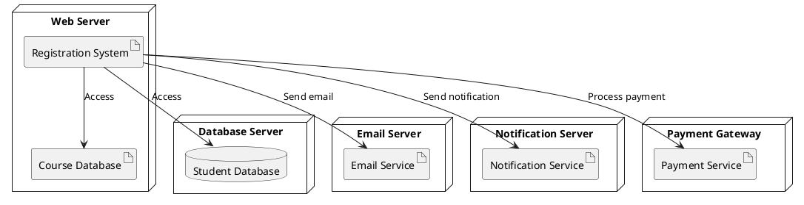

Don't forget to hit the :star: if you like this repo.

# Deployment Diagram
A deployment diagram in UML (Unified Modeling Language) is a type of diagram that shows the physical deployment of software components and hardware nodes in a system. It depicts the topology of the hardware and software components that make up a system and how they are connected to each other.

The main purpose of a deployment diagram is to show how a system is deployed on hardware nodes and how software components and artifacts are distributed across those nodes. This diagram is typically used by software architects and developers to plan the deployment of a system and ensure that it is scalable, reliable, and efficient.

A deployment diagram consists of several elements, including nodes, artifacts, and relationships. Nodes represent hardware components, such as servers, routers, or printers, while artifacts represent software components, such as executable files, libraries, or databases. Relationships between nodes and artifacts represent the deployment of the software components on the hardware nodes.

Deployment diagrams also allow for the visualization of the different types of connections and protocols used between hardware nodes and software components. These connections may include LAN or WAN connections, TCP/IP, HTTP, or FTP protocols.

Overall, deployment diagrams are an important tool for understanding the physical architecture of a system and planning its deployment. They help to ensure that a system is designed in a way that is efficient, scalable, and reliable, and can assist in identifying potential issues before deployment.

## Create a deployment diagram in Draw.io
Sure, here's a step-by-step guide on how to create a deployment diagram using Draw.io:

1. Open Draw.io in your browser and create a new diagram.

2. From the left-hand panel, select the "Deployment" category under "Software" and drag a "Deployment Node" onto the canvas.

3. Double-click on the deployment node to add a label, such as "Web Server."

4. Drag a "Database" artifact onto the canvas and position it next to the web server node.

5. Double-click on the database artifact to add a label, such as "Course Database."

6. Drag another "Database" artifact onto the canvas and position it next to the first database artifact.

7. Double-click on the second database artifact to add a label, such as "Student Database."

8. From the "Network" category under "General," drag a "Switch" shape onto the canvas and position it between the web server node and the two database artifacts.

9. Drag a "Cloud" shape onto the canvas and position it above the web server node to represent the Internet.

10. Drag a "Payment Gateway" artifact onto the canvas and position it on the other side of the switch shape.

11. Connect the web server node to the switch shape using a "Dependency" connector.

12. Connect the switch shape to the two database artifacts using "Dependency" connectors.

13. Connect the web server node to the cloud using a "Dependency" connector.

14. Connect the payment gateway artifact to the switch shape using a "Dependency" connector.

15. Add labels to the connectors to show the type of connection, such as "HTTP" or "TCP/IP."

16. Use the formatting tools to adjust the size and color of the nodes and connectors to make the diagram more readable.

17. Save your diagram and export it in your preferred format.

By following these steps, you can create a deployment diagram in Draw.io that shows how a system is deployed in a physical environment. You can customize the diagram by adding more nodes, artifacts, and connectors to represent additional components and dependencies in the system.

Sure, here's an example report on the deployment diagram for a university academic course registration system.

## Deployment Diagram for University Academic Course Registration System

### Introduction

The deployment diagram for the University Academic Course Registration System provides a high-level view of the physical architecture of the system. The deployment diagram shows the hardware and software components of the system, and how they interact with each other. This report will discuss the different components of the deployment diagram, their roles in the system, and the interactions between them.

### System Components

The system components of the deployment diagram are divided into nodes, which represent the physical hardware, and artifacts, which represent the software components. The nodes in the system include the web server, the database server, the email server, the notification server, and the payment gateway. The artifacts in the system include the registration system, the course database, the student database, the email service, the notification service, and the payment service.

The registration system is the central software component of the system, responsible for managing the course registration process. The course database contains all the information about the courses offered by the university, including course names, descriptions, prerequisites, and schedules. The student database contains information about the students, including their names, email addresses, and registration status.

The email service is responsible for sending emails to the students and the university staff regarding registration confirmation, schedule changes, and other important information. The notification service is responsible for sending notifications to the students and the university staff regarding any updates or changes to the course offerings or registration process. The payment service is responsible for processing the registration fees paid by the students.

### System Interactions

The deployment diagram shows the interactions between the different components of the system. The registration system interacts with the course database and the student database to retrieve and update course and student information. The registration system also interacts with the email service and the notification service to send notifications and updates to the students and the university staff.

The registration system also interacts with the payment service to process the registration fees paid by the students. The payment service interacts with the payment gateway to securely process the payments and update the registration status of the students.

an example of a table listing the components of a deployment diagram:

| Node/Artifact | Description |
| --- | --- |
| Web Server | The server hosting the registration system and the course database |
| Course Database | Contains all the information about the courses offered by the university |
| Student Database | Contains information about the students, including their names, email addresses, and registration status |
| Email Server | The server hosting the email service |
| Email Service | Responsible for sending emails to the students and the university staff regarding registration confirmation, schedule changes, and other important information |
| Notification Server | The server hosting the notification service |
| Notification Service | Responsible for sending notifications to the students and the university staff regarding any updates or changes to the course offerings or registration process |
| Payment Gateway | The service used to securely process the payments |
| Payment Service | Responsible for processing the registration fees paid by the students |
| Registration System | The central software component of the system, responsible for managing the course registration process |

The table shows the different nodes and artifacts that make up the deployment diagram for the university academic course registration system. Each component is described briefly, highlighting its role and responsibilities in the system. This table can serve as a quick reference guide for developers and system administrators who need to understand the different components of the system and their interactions.

### PlantUML code
PlantUML code for a deployment diagram for a university academic course registration system:

In this example, we have a web server that hosts the registration system and the course database. The system interacts with a student database, an email service, a notification service, and a payment service, each hosted on their own server. The interactions between the components are shown using arrows with labels indicating the type of interaction.

You can modify this code to fit your specific requirements for the academic course registration system in your SRS.

### Conclusion

The deployment diagram for the University Academic Course Registration System provides a clear and concise view of the physical architecture of the system. It shows the different hardware and software components of the system, and how they interact with each other. The deployment diagram can be used by the developers and system administrators to understand the system architecture, plan the deployment of the system, and ensure the system's smooth operation.

## Contribution 🛠️
Please create an [Issue](https://github.com/drshahizan/software-engineering/issues) for any improvements, suggestions or errors in the content.

You can also contact me using [Linkedin](https://www.linkedin.com/in/drshahizan/) for any other queries or feedback.

