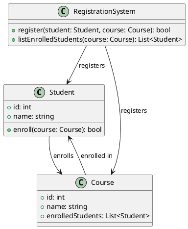
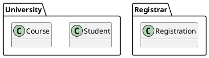
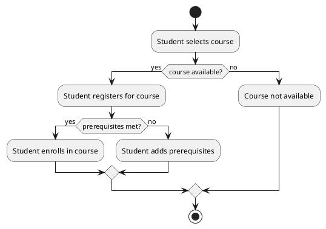
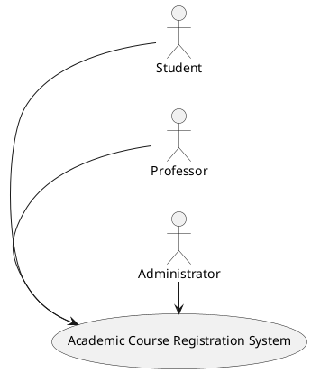

<a href="https://github.com/drshahizan/software-engineering/stargazers"></a>
<a href="https://github.com/drshahizan/software-engineering/network/members"></a>
<a href="https://github.com/drshahizan/software-engineering/pulls"></a>
<a href="https://github.com/drshahizan/software-engineering"></a>
<a href="https://github.com/drshahizan/software-engineering/graphs/contributors"></a>
[](https://visitorbadge.io/status?path=https%3A%2F%2Fgithub.com%2Fdrshahizan%2Fsoftware-engineering)


Don't forget to hit the :star: if you like this repo.

# PlanUML
PlantUML is an open-source tool that allows users to create UML (Unified Modeling Language) diagrams quickly and easily. It uses a simple and intuitive syntax to generate diagrams in a variety of formats, including PNG, SVG, and PDF.

One of the key features of PlantUML is its ability to generate diagrams from plain text. This means that users can write their diagrams using a simple syntax, without needing to learn a complex GUI. For example, to create a class diagram, a user can simply write out the class and its attributes and methods using a specific syntax, and PlantUML will generate the diagram automatically.

PlantUML supports a wide variety of diagram types, including class diagrams, use case diagrams, sequence diagrams, activity diagrams, and more. It also allows users to customize their diagrams by specifying colors, fonts, and other visual properties.

Overall, PlantUML is a powerful and flexible tool for creating UML diagrams, and is widely used by developers, designers, and other professionals in a variety of industries.

## Step-by-step instructions for using PlantUML 

| Step | Description |
| ---- | ----------- |
| 1. | Install PlantUML on your computer. You can do this by visiting the PlantUML website and following the installation instructions for your operating system.|
| 2. | Learn the syntax for creating use case diagrams in PlantUML. The syntax for use case diagrams in PlantUML is relatively simple and easy to learn, but it will take some practice to get used to it.|
| 3. | Define the actors that will interact with the system. In the case of a university academic course registration system, the actors might include students, professors, and administrators. |
| 4. | Identify the use cases that the system will support (e.g. registering for courses, dropping courses, viewing course schedules, generating transcripts). |
| 5. | Use the PlantUML syntax to draw the use case diagram, including creating the use case and actor elements and connecting them with lines to indicate the relationships between them. |
| 6. | Refine the diagram by adding details such as annotations, descriptions, and constraints, and customizing the appearance of the diagram by changing colors, fonts, and other visual properties. |
| 7. | Share the diagram with others and collaborate on further refinement or development by exporting it to a variety of formats, including PNG, SVG, and PDF. |

## Install PlantUML in Microsoft Visual Studio Code

1. Open Visual Studio Code and click on the "Extensions" icon on the left-hand side of the window.
2. Search for "PlantUML" in the search bar at the top of the window.
3. Click on the "Install" button next to the "PlantUML" extension.
4. Once the installation is complete, click on the "Reload" button to activate the extension.
5. You may also need to install Graphviz, which is a prerequisite for PlantUML. To do this, visit the Graphviz website (https://graphviz.org/download/) and download and install the appropriate version for your operating system.
6. After installing Graphviz, you will need to add it to your system's PATH environment variable. To do this on Windows, follow these steps:
   - Open the Start menu and search for "Environment Variables."
   - Click on the "Edit the system environment variables" option.
   - Click on the "Environment Variables" button at the bottom of the window.
   - In the "System Variables" section, scroll down and select the "Path" variable, then click on the "Edit" button.
   - Click on the "New" button and add the path to the Graphviz bin directory (e.g. "C:\Program Files (x86)\Graphviz2.38\bin") to the list of paths.
   - Click "OK" to close all the windows.

You should now be able to use PlantUML within Visual Studio Code to create UML diagrams.

## Graphviz
Graphviz is a graph visualization software that is used by PlantUML to render the UML diagrams that you create. PlantUML generates the source code for the diagrams, but Graphviz is responsible for actually rendering the diagrams as images. Without Graphviz, PlantUML would be unable to display the UML diagrams that you create.

In particular, Graphviz is used by PlantUML to create the layout and positioning of the elements in the diagrams, such as nodes and edges. It uses a set of algorithms to create an optimal layout of the diagram, based on the relationships between the elements. Graphviz supports various layout algorithms, such as hierarchical, radial, and orthogonal, among others.

The size of Graphviz can vary depending on the version and the operating system you are using. Generally, the download size of Graphviz is around 30-40 MB. However, once installed, the size of the Graphviz installation may be larger due to the additional files and libraries that are required to run the software.

For example, the current version of Graphviz (2.49.3) for Windows has a download size of around 43 MB. Once installed, the size of the Graphviz directory on disk is around 200 MB. On Linux systems, the download size of Graphviz may be smaller, typically around 10-20 MB.

Therefore, Graphviz is a necessary component of the PlantUML software and must be installed on your system to use PlantUML effectively.

## Java Runtime Environment (JRE)

PlantUML is a Java-based tool that is used to generate UML diagrams using textual descriptions. The PlantUML engine itself is a Java application, and it requires a Java Runtime Environment (JRE) to be installed on the system in order to run.

When you use the PlantUML extension in Visual Studio Code, the extension uses the PlantUML engine to parse the textual descriptions of UML diagrams and generate images of the diagrams. The JRE is required to execute the PlantUML.jar file, which is the executable file for the PlantUML engine.

Without the JRE installed on your system, the PlantUML engine will not be able to run, and you will not be able to generate UML diagrams using the PlantUML syntax.

The size of the Java Runtime Environment (JRE) varies depending on the version and the platform you are downloading it for.

As of April 2023, the latest version of Java is Java 17. The size of the JRE for Windows is approximately 177 MB for the 64-bit version and 176 MB for the 32-bit version. The size of the JRE for macOS is around 100 MB.

Therefore, the JRE is an essential component of the PlantUML ecosystem, and must be installed on your system in order to use PlantUML effectively in Visual Studio Code or any other environment.

## Install both Graphviz and JRE
Both Graphviz and JRE are required to use PlantUML in Visual Studio Code. 

The PlantUML extension for Visual Studio Code generates UML diagrams using the PlantUML syntax, and then relies on Graphviz to render the diagrams as images. The PlantUML extension also requires JRE to be installed to execute the PlantUML.jar file.

Therefore, to use PlantUML effectively in Visual Studio Code, you will need to install both Graphviz and JRE on your system.

Here are the steps to install both Graphviz and JRE for use with the PlantUML extension in Visual Studio Code:

1. Install JRE on your system by downloading and installing the latest version from the Java download page at [http://www.java.com](https://www.java.com/en/download/manual.jsp).
2. Install Graphviz on your system by downloading and installing the latest version from the Graphviz download page at https://graphviz.org/download/.
3. After both JRE and Graphviz are installed, open Visual Studio Code and install the PlantUML extension.
4. You should now be able to create and render UML diagrams using the PlantUML syntax in Visual Studio Code.

It's important to note that Graphviz and JRE are separate software packages and must be installed separately. Without both of these tools, you will not be able to use PlantUML effectively in Visual Studio Code.

## PlantUML syntax
PlantUML is a textual language that is used to describe UML diagrams. The syntax of PlantUML is designed to be simple and easy to use, and it uses a variety of symbols and keywords to describe different elements of UML diagrams.

Here are some of the key elements of the PlantUML syntax:

1. **Classes and Objects**: To define a class or an object in PlantUML, you can use the `class` or `object` keyword, followed by the name of the class or object in brackets. For example, to define a class named `Person`, you can write:

```puml
class Person
```

2. **Relationships**: To define relationships between classes or objects, you can use a variety of arrows and symbols. For example, to define an inheritance relationship between two classes, you can use the `<|--` symbol. To define an association relationship, you can use the `--` or `->` symbols. For example:



<p align="center">

</p>

This code defines three classes: Student, Course, and RegistrationSystem. Each Student has an id and name attribute, as well as a method to enroll in a Course. Each Course has an id, name, and a list of enrolled Students. The RegistrationSystem has methods to register a Student for a Course and to list the Students enrolled in a Course.

There are also several associations defined between the classes, including:

- A Student enrolls in a Course
- A RegistrationSystem registers a Student and a Course
- A Course has Students enrolled in it

These associations are represented in the diagram by arrows between the classes with labels indicating the nature of the relationship.

In the code provided, several relationships are defined between the Student, Course, and RegistrationSystem classes using the following notations:

- `-->` indicates a unidirectional association relationship, where one class is related to another class in a specific way. For example, the line `Student --> Course : enrolls` indicates that a Student enrolls in a Course.

- `<--` indicates a unidirectional association relationship in the opposite direction. For example, the line `Course --> Student : enrolled in` indicates that a Course has Students enrolled in it.

- `--` indicates a bidirectional association relationship, where two classes are related to each other in a specific way. For example, the lines `RegistrationSystem --> Student : registers` and `RegistrationSystem --> Course : registers` indicate that a RegistrationSystem can register a Student for a Course.

These notations are used to define the relationships between the classes in a UML class diagram. By using them, you can easily represent the different types of relationships that exist between the classes or objects in your system.

3. **Packages**: To define packages in PlantUML, you can use the `package` keyword, followed by the name of the package in brackets. For example:



<p align="center">

</p>

In the code you provided, there are two packages defined: "University" and "Registrar". The "University" package contains two classes: "Student" and "Course". The "Registrar" package contains one class: "Registration". By organizing the classes into packages, you can group related classes together, which can make the overall structure of your system easier to understand and navigate.

Packages are represented in PlantUML by the `package` keyword, followed by the name of the package and curly braces enclosing the contents of the package. The classes within a package can be defined using the `class` keyword, followed by the name of the class.

In addition to organizing classes, packages can also provide a way to control the visibility and access of classes and their members. By default, classes and their members are public and can be accessed from anywhere in the system. However, by defining packages, you can limit the visibility of classes and their members to only those classes within the same package, using the `package-private` visibility modifier.

Overall, packages are a useful way to organize and structure your PlantUML diagrams and can help to improve the overall readability and maintainability of your system.

4. **Activity Diagrams**: PlantUML also supports activity diagrams, which can be used to describe the flow of activities or processes in a system. To define an activity diagram in PlantUML, you can use the `activity` keyword, followed by the name of the diagram in brackets. For example:



<p align="center">

</p>

This code defines an activity diagram that models the process of a Student registering for a course. The diagram starts with a start node, indicating the beginning of the process. The Student selects a course, which leads to a decision point that checks if the course is available. If the course is available, the Student registers for the course and the diagram moves to another decision point to check if the Student has met the course prerequisites. If the prerequisites are met, the Student enrolls in the course, and the process ends with a stop node. If the prerequisites are not met, the Student adds prerequisites and the process loops back to the start node.

This activity diagram provides a visual representation of the process of a Student registering for a course and helps to ensure that all steps in the process are properly defined and understood.

## Defining Actors
Here's an example PlantUML code for defining actors in a university academic course registration system:



<p align="center">

</p>

In this code, we define three actors - "Student", "Professor", and "Administrator". We use the `actor` keyword to define each actor, followed by the name of the actor. We then define a system, represented by the `(Academic Course Registration System)` notation, which the actors will interact with.

To arrange the actors in a left-to-right direction, we use the `left to right direction` keyword at the beginning of the code. Finally, we use arrows to show the interactions between the actors and the system. The arrows point from the actors to the system, indicating that the actors are interacting with the system.


## Contribution 🛠️
Please create an [Issue](https://github.com/drshahizan/software-engineering/issues) for any improvements, suggestions or errors in the content.

You can also contact me using [Linkedin](https://www.linkedin.com/in/drshahizan/) for any other queries or feedback.


