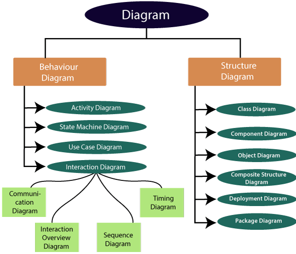

Don't forget to hit the :star: if you like this repo.

# UML Diagram
The UML diagrams are categorized into **structural diagrams**, **behavioral diagrams**, and also interaction **overview diagrams**. The diagrams are hierarchically classified in the following figure:

## 1. Structural Diagrams
Structural diagrams depict a static view or structure of a system. It is widely used in the documentation of software architecture. It embraces class diagrams, composite structure diagrams, component diagrams, deployment diagrams, object diagrams, and package diagrams. It presents an outline for the system. It stresses the elements to be present that are to be modeled.

- **[Class Diagram](https://sparxsystems.com/resources/tutorials/uml2/class-diagram.html)**: Class diagrams are one of the most widely used diagrams. It is the backbone of all the object-oriented software systems. It depicts the static structure of the system. It displays the system's class, attributes, and methods. It is helpful in recognizing the relation between different objects as well as classes.
- **[Composite Structure Diagram](https://sparxsystems.com/resources/tutorials/uml2/composite-diagram.html)**: The composite structure diagrams show parts within the class. It displays the relationship between the parts and their configuration that ascertain the behavior of the class. It makes full use of ports, parts, and connectors to portray the internal structure of a structured classifier. It is similar to class diagrams, just the fact it represents individual parts in a detailed manner when compared with class diagrams.
- **[Object Diagram](https://sparxsystems.com/resources/tutorials/uml2/object-diagram.html)**: It describes the static structure of a system at a particular point in time. It can be used to test the accuracy of class diagrams. It represents distinct instances of classes and the relationship between them at a time.
- **[Component Diagram](https://sparxsystems.com/resources/tutorials/uml2/component-diagram.html)**: It portrays the organization of the physical components within the system. It is used for modeling execution details. It determines whether the desired functional requirements have been considered by the planned development or not, as it depicts the structural relationships between the elements of a software system.
- **[Deployment Diagram](https://sparxsystems.com/resources/tutorials/uml2/deployment-diagram.html)**: It presents the system's software and its hardware by telling what the existing physical components are and what software components are running on them. It produces information about system software. It is incorporated whenever software is used, distributed, or deployed across multiple machines with dissimilar configurations.
- **[Package Diagram](https://sparxsystems.com/resources/tutorials/uml2/package-diagram.html)**: It is used to illustrate how the packages and their elements are organized. It shows the dependencies between distinct packages. It manages UML diagrams by making it easily understandable. It is used for organizing the class and use case diagrams.
- **[Profile Diagram](https://sparxsystems.com/resources/developers/uml_profiles.html)**: Profile diagrams provide a visual way of defining light-weight extensions to the UML specification. UML Profiles are often used to define a group of constructs with domain-specific or platform-specific properties and constraints, which extend the underlying UML elements.
## 2. Behavioral Diagrams
Behavioral diagrams portray a dynamic view of a system or the behavior of a system, which describes the functioning of the system. It includes use case diagrams, state diagrams, and activity diagrams. It defines the interaction within the system.

- **[State Machine Diagram](https://sparxsystems.com/resources/tutorials/uml2/state-diagram.html)**: It is a behavioral diagram. it portrays the system's behavior utilizing finite state transitions. It is also known as the State-charts diagram. It models the dynamic behavior of a class in response to external stimuli.
- **[Activity Diagram](https://sparxsystems.com/resources/tutorials/uml2/activity-diagram.html)**: It models the flow of control from one activity to the other. With the help of an activity diagram, we can model sequential and concurrent activities. It visually depicts the workflow as well as what causes an event to occur.
- **[Use Case Diagram](https://sparxsystems.com/resources/tutorials/uml2/use-case-diagram.html)**: It represents the functionality of a system by utilizing actors and use cases. It encapsulates the functional requirement of a system and its association with actors. It portrays the use case view of a system.

## 3. Interaction Diagrams
Interaction diagrams are a subclass of behavioral diagrams that give emphasis to object interactions and also depicts the flow between various use case elements of a system. In simple words, it shows how objects interact with each other and how the data flows within them. It consists of communication, interaction overview, sequence, and timing diagrams.

- **[Sequence Diagram](https://sparxsystems.com/resources/tutorials/uml2/sequence-diagram.html)**: It shows the interactions between the objects in terms of messages exchanged over time. It delineates in what order and how the object functions are in a system.
- **[Communication Diagrams](https://sparxsystems.com/resources/tutorials/uml2/communication-diagram.html)**: It shows the interchange of sequence messages between the objects. It focuses on objects and their relations. It describes the static and dynamic behavior of a system.
- **[Timing Diagram](https://sparxsystems.com/resources/tutorials/uml2/timing-diagram.html)**: It is a special kind of sequence diagram used to depict the object's behavior over a specific period of time. It governs the change in state and object behavior by showing the time and duration constraints.
- **[Interaction Overview diagram](https://sparxsystems.com/resources/tutorials/uml2/interaction-overview-diagram.html)**: It is a mixture of activity and sequence diagram that depicts a sequence of actions to simplify the complex interactions into simple interactions.

A table listing the UML diagrams commonly used in a Software Requirements Specification (SRS) document, along with a brief description of each diagram:

| Diagram Name | Purpose | Description |
|----------------------|-----------------|----------------------|
| [Use Case Diagram](https://www.javatpoint.com/uml-use-case-diagram)| Illustrates the system's functionalities and user interactions.  | Represents the different actors (users, external systems) and their interactions with the system, focusing on the system's use cases and requirements. |
| [Class Diagram](https://www.javatpoint.com/uml-class-diagram)| Describes the structure and relationships of classes in the system.  | Represents the classes, their attributes, methods, and relationships, providing an overview of the system's data and behavior.|
| [Sequence Diagram](https://www.javatpoint.com/uml-sequence-diagram) | Demonstrates the sequence of interactions between objects or system components.  | Depicts the flow of messages or method calls between objects, showing the order of interactions and the resulting behavior. |
| [Activity Diagram](https://www.javatpoint.com/uml-activity-diagram) | Illustrates the flow of activities or processes within the system.  | Represents the high-level activities, actions, and decision points in a system, providing a visual representation of the system's workflow. |
| [State Machine Diagram](https://www.javatpoint.com/uml-state-machine-diagram) | Represents the different states and transitions of a system or an object.  | Illustrates the behavior of an object or system by showing the states it can be in and the events that trigger state transitions. |
| [Communication Diagram](https://sparxsystems.com/resources/tutorials/uml2/communication-diagram.html) | Demonstrates the interactions and relationships between objects or system components.  | Depicts the objects or components involved in a particular scenario and the messages exchanged between them. |

These are the key UML diagrams that are often utilized in a Software Requirements Specification document to capture and communicate the requirements and behavior of the system.

If you need a quick reference guide for the UML notation, check one of the following great UML cheat sheets (in no particular order, though the last one is my preferred one):

- [Lou Franco UML Cheatsheet](https://loufranco.com/wp-content/uploads/2012/11/cheatsheet.pdf). To the point. Example diagrams are annotated with the name of the modeling elements used in the example. Class, use case, and sequence diagrams covered.
- [UML quick reference card](http://deptinfo.unice.fr/twiki/pub/Linfo/CooL3/refUML.pdf). Another 1-page quick reference, great to be printed and kept close to you.
- [UML Diagrams](http://www.uml-diagrams.org/): Detailed overview of all UML diagrams (including the new features of the latest UML versions). It's more of a reference guide than a cheat sheet, though, since each diagram has its own dedicated page. It is updated to reflect the UML 2.5 version.
- [Embarcadero's Practical UML guide](https://edn.embarcadero.com/article/31863): Complete coverage of all diagrams. It used to have some UML self-tests, but they don't seem to be working anymore.
- [UML Notation summary for class diagrams and sequence diagrams](http://umich.edu/~eecs381/handouts/UMLNotationSummary.pdf). Very simple, but I include it as I like the minimal "semantic" description regarding association cardinalities and the distinction between composition and aggregation.
- [UML reference sheet](https://www.comp.nus.edu.sg/~cs2103/AY1516S2/files/UML%20reference%20sheet.pdf) from the National University of Singapore. It covers all diagrams, some in more detail than others. There are no explanations, so it's more of a notation reminder.
- [Dzone UML getting started guide](https://dzone.com/refcardz/getting-started-uml). All UML2 diagrams are covered, with some basic explanations for the main notation elements.
- [Allen Holub's Quick UML reference](https://holub.com/uml/). Lots of examples to help you understand each notation element, including code examples of how some aspects would be expressed in Java for those with a programming background that may find this "mapping" useful to understand the concepts.

## [UML tools](uml.md)
Draw.io is a web-based diagramming tool that allows users to create various types of diagrams, such as flowcharts, network diagrams, and UML diagrams, using a drag-and-drop interface. It offers a wide range of shapes, icons, and formatting options to help users create professional-looking diagrams quickly and easily. On the other hand, PlantUML is a text-based diagramming tool that uses a simple and intuitive language to create UML diagrams, sequence diagrams, and other types of diagrams. PlantUML is ideal for software developers who prefer to write code to create diagrams, rather than using a visual interface.

## Useful links
- [UML Tutorial](https://www.javatpoint.com/uml)
- [UML - Quick Guide](https://www.tutorialspoint.com/uml/uml_quick_guide.htm)
- [Learn 14 types of UML diagrams in one article](https://www.cybermedian.com/learn-14-types-of-uml-diagrams-in-one-article/)
- [What is Unified Modeling Language (UML)?](https://www.visual-paradigm.com/guide/uml-unified-modeling-language/what-is-uml/)

## Contribution 🛠️
Please create an [Issue](https://github.com/drshahizan/software-engineering/issues) for any improvements, suggestions or errors in the content.

You can also contact me using [Linkedin](https://www.linkedin.com/in/drshahizan/) for any other queries or feedback.

