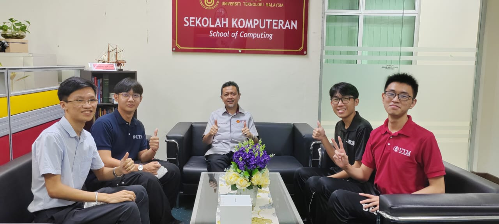

Don't forget to hit the :star: if you like this repo.

# Activity: Group Lastminpotential

## Group Members
<table>
  <tr>
    <th>Name</th>
    <th>Role</th>
  </tr>
  <tr>
    <td>1 Tan Jun Yuan</td>
    <td>Project Manager</td>
  </tr>
  <tr>
    <td>2 Goh Jing Yang</td>
    <td>UI/ UX Designer</td>
  </tr>
    <tr>
    <td>3 Loo Jia Chang</td>
    <td>Main Developer</td>
  </tr>
    <tr>
    <td>4 Chen Pyng Haw</td>
    <td>Documentation Specialist</td>
  </tr>
</table>

## Stakeholder
<table>
  <tr>
    <th>Name</th>
    <th>Stakeholder</th>
    <th>Position</th>
    <th>Responsibility</th>
  </tr>
  <tr>
    <td>PROF. TS. DR. WAN MOHD NASIR WAN NADIR</td>
    <td>Facukty Staff</td>
    <td>Dean</td>
    <td>Provide an overview of the existing system and the expectation of this system</td>
  </tr>
    <tr>
    <td>2</td>
    <td>Lecturer</td>
    <td></td>
    <td></td>
  </tr>
    <tr>
    <td></td>
    <td>Student</td>
    <td></td>
    <td></td>
  </tr>
</table>

## Tasks involved in developing SRC documentation:

| No | Date | Member Name | Role	| Task	| Status	| 
| -----:| ----- | ------ | ------ | ------ | ------ |
| 1 | 20/04/2023| Tan Jun Yuan | Project Manager | Create project plan | Complete |
| 2 | 23/04/2023 | Goh Jing Yang, Loo Jia Chang | UI/ UX Designer, Main Developer | Gather user requirements | Complete |
| 3 | 27/04/2023 | Chen Pyng Haw | Documentation Specialist | Create proposal | Complete |
| 4 | 7/05/2023| Tan Jun Yuan, Goh Jing Yang, Loo Jia Chang, Chen Pyng Haw | Project Manager, UI/UX Designer, Main Developer, Documentation Specialist | Meeting with stakeholder 1 | Complete |
| 5 | 9/05/2023| Tan Jun Yuan, Goh Jing Yang, Loo Jia Chang, Chen Pyng Haw | Project Manager, UI/UX Designer, Main Developer, Documentation Specialist | Meeting with stakeholder 2 | Pending |
| 6 | 12/05/2023| Tan Jun Yuan, Goh Jing Yang, Loo Jia Chang, Chen Pyng Haw | Project Manager, UI/UX Designer, Main Developer, Documentation Specialist | SRD Documentation draf | Pending |

| | | | | | 
| | | | | | 

## Contribution 🛠️
Please create an [Issue](https://github.com/drshahizan/software-engineering/issues) for any improvements, suggestions or errors in the content.

You can also contact me using [Linkedin](https://www.linkedin.com/in/drshahizan/) for any other queries or feedback.

