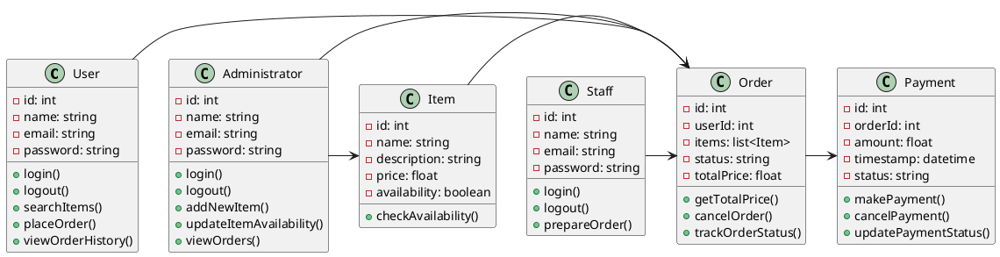

<h1>Class Diagram</h1>

In this diagram, the User class represents a user of the system, who can login, logout, search for items, place orders, and view their order history. 
  The Administrator class represents an administrator of the system, who can login, logout, add new items to the system, update item availability, and view orders.
  The Item class represents a food item that can be ordered, with a name, description, price, and availability status. 
  The Order class represents an order placed by a user, containing a list of items, a status (e.g. pending, cancelled), and a total price. 
  The Payment class represents a payment made for an order, containing the order ID, amount, timestamp, and status.
  The Staff class represents an operational staff member, who can login, logout and prepare orders.

