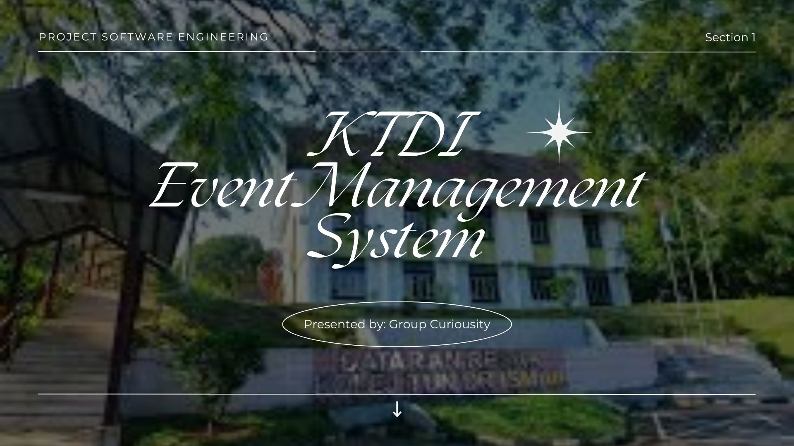
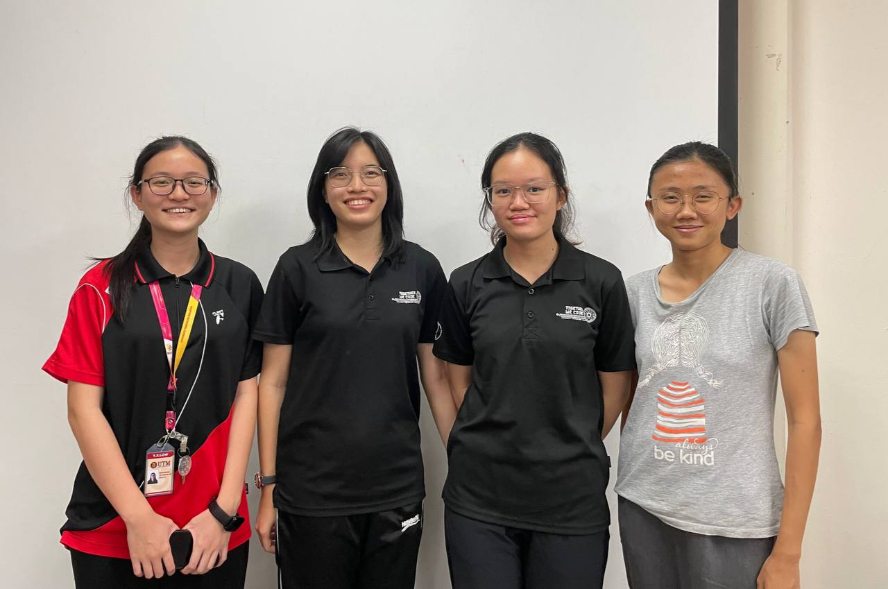
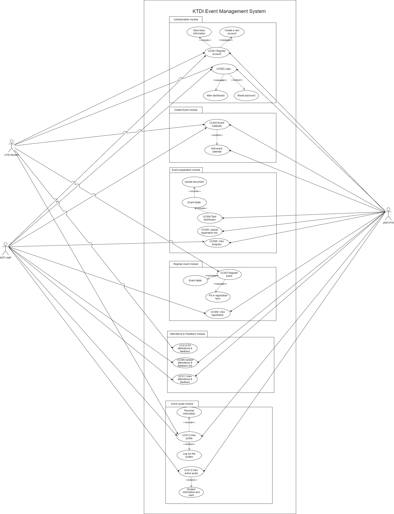
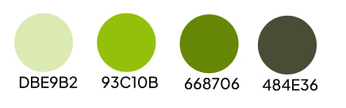
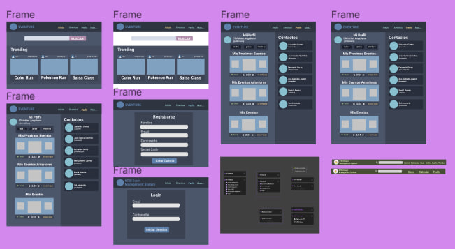
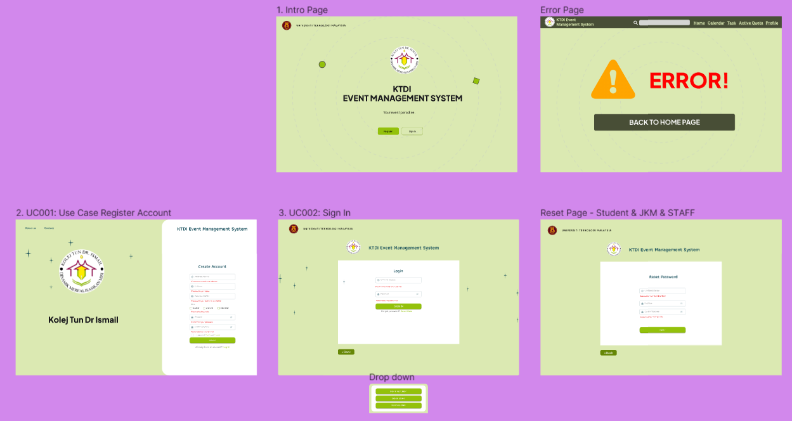
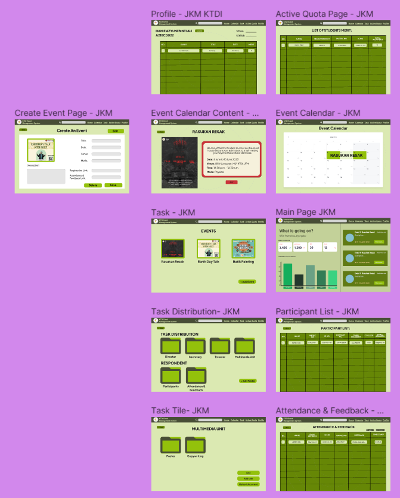
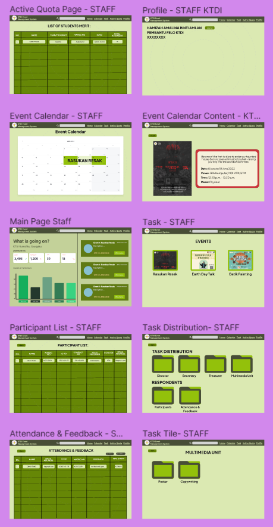

Don't forget to hit the :star: if you like this repo.

# Activity: Group Curiousity

## Group Members

<table>
  <tr>
    <th>Name</th>
    <th>Role</th>
  </tr>
  <tr>
    <td>1. Low Ying Xi</td>
    <td>Project Manager</td>
  </tr>
  <tr>
    <td>2. Camily Tang Jia Lei</td>
    <td>Developer</td>
  </tr>
  <tr>
    <td>3. Ng Shu Yu</td>
    <td>Documentation Specialist</td>
  </tr>
  <tr>
    <td>4. Koh Li Hui</td>
    <td>User Experience Designer</td>
  </tr>
</table>

## Documentation
| No | Name |  File |
| :-----: |  ------ | :-----: | 
| 1 | Proposal |   | 
| 2 | System Requirements Specification (SRS)|  | 
| 3 | System Design Descriptions (SDD) |  | 
| 4 | System Test Descriptions (STD)|  | 
| 5 | Figma |   |  

# KTDI Event Management System
### 💫Table of Contents
* [Table of Contents](#table-of-contents)
* [Introduction](#introduction)
* [Purpose](#1-purpose)
* [Objective](#2-objective)
* [Problem Statement](#3-problem-statement)
* [Potential Impact](#4-potential-impact)
* [Methodology](#methodology)
* [Implementation](#implementation)
* [Timeline process](#1-timeline-process)
* [Requirement collection](#2-requirement-collection)
* [Software components & modules](#3-software-components--modules)
* [Design phase](#4-design-phase)
* [Design system](#5-design-system)
* [Challenges](#6-challenges)
* [Testing and Quality Assurance](#testing-and-quality-assurance)
* [Results and Archievements](#results-and-archievements)
* [Conclusion](#conclusion)

## Introduction
### 1. Purpose
The purpose of our project of building a KTDI Event Management System is aimed to simplify and streamline the processes of event management held by KTDI Student Residential College Committee (JKM) at UTM Johor. The system offers a variety of key features that assist our stakeholders, JKM KTDI, KTDI staff members, as well as the students around UTM Johor, in respective tasks for event preparation and post-activity processes. 

### 2. Objective
1. To develop a KTDI Event Management System that is simple to use, which includes multiple functions like calendar for events in a semester, task delegation, and automated merit point record.
2. To enhance communication and information access by providing a centralised platform for students to view event details and register for activities that they are interested in.
3. To help JKM KTDI to track the number of student registrations for events through the system.
4. To provide comprehensive training and support to users of the system (JKM KTDI, KTDI staff members, UTM students) to ensure successful implementation.

### 3. Problem Statement
1. One of the many problems faced by JKM KTDI is the crashing of event dates, due to manual event preparation processes. 
2. Besides, they will need to conduct multiple meetings to ensure team progression, which can be time-consuming.
3. Furthermore, JKM KTDI is also required to manually compute the merit points of KTDI students, which determines their active quota for priority in booking the hostel for the upcoming semester. 
4. On the contrary, students often encounter difficulties in finding college events due to the overwhelming number of events being shared on social meida platforms like WhatsApp and Telegram.

### 4. Potential Impact
1. Avoid clashing of events via the event calendar and to view upcoming events held in KTDI.
2. Task delegation for JKM KTDI.
3. Tracking of students' registration, attendance and feedback for the events.
4. Automatic update of KTDI merit points.

## Methodology
### Approach and Methodology
We utilised Agile software development process model for our KTDI event management system. The Agile process model is an adaptable and iterative method of developing software that places a focus on teamwork, client satisfaction, and the quick delivery of functional software. This process model emphasises delivering value to the user (JKM) at each iteration and is appropriate for projects with varying requirements and uncertainties.

The agile process model was chosen because it enables frequent feedback and changes to be made to the software while it is being developed. Since this system is being created for a university, it is likely that the requirements will change and be updated as the project moves forwards. The Agile process model is well suited to handle such changes and still deliver a high-quality product on time.

### Software development life cycle model: Agile Process Model
</img>

#### 1. Planning Phase: 
During this stage, the project manager will establish the project's scope, objectives, and goals while taking into account the requirements of the stakeholders. The team will create a product backlog that prioritises the system's features or requirements, and defines milestones, deadlines, and checkpoints. This will ensure that the project stays on track and within the set timeline.

#### 2. Design Phase:
The team will create the system's architecture, data models, user interfaces, and user experience during this phase. In order to obtain feedback from the stakeholders and make sure that the design meets their needs, the user experience designer will also create a mockup or prototype of the system. To ensure that the system design is feasible and meets the project's goals, it will be thoroughly reviewed and documented.

#### 3. Development Phase:
The team will begin coding and integrating the various system components during this phase. The main developer will keep an eye on the process and guarantee that the code complies with the standards and guidelines established by the project. The team will collaborate, and the code will be frequently checked to make sure it performs as expected. Throughout this phase, testing will be done to find any flaws and make sure the code complies with project requirements.

#### 4. Testing Phase:
Unit testing, integration testing, system testing, and user acceptance testing are a few of the tests the system will go through at this stage. To make sure the system follows the requirements and operates as intended, the main developer will test the system. The team will conduct user acceptance testing in conjunction with stakeholders to ensure that the system meets users' needs and expectations.

#### 5. Deployment Phase: 
The main developer will deploy the system to the production environment during this phase, making it accessible to the users (JKM KTDI, KTDI staff members, and students). The system will undergo final testing and validation to make sure it is ready for use. To ensure the system is successfully adopted, users and support personnel will receive training, and any required documentation will be made available.

#### 6. Maintenance Phase
The team will ensure the system's upkeep and maintenance during this phase, including bug fixes, software updates, and any necessary improvements. The objective is to maintain the system's smooth operation and adapt to the users' changing needs. The team will carry out routine assessments to make sure the system keeps up with the project's goals and stakeholder expectations.

### Specific Tools, Technologies, and Frameworks
<table style="border-collapse: collapse;">
      <thead>
        <tr>
          <th>Layer/Aspect</th>
          <th>Tool/Technology</th>
          <th>Description</th>
        </tr>
      </thead>
      <tbody>
        <tr>
          <td rowspan="4">Presentation Layer</td>
          <td>HTML</td>
          <td>Markdown language that used to structure content and create a basic layout, in line with the design of the system's user interface</td>
        </tr>
        <tr>
          <td>CSS</td>
          <td>Style sheet language that used to describe the presentation of HTML documents by styling and formatting the HTML content.</td>
        </tr>
        <tr>
          <td>Bootstrap</td>
          <td>CSS framework that will be utilized to create responsive web pages and enhance the system's user interface by providing a consistent and responsive design across different devices and screen sizes</td>
        </tr>
        <tr>
          <td>Figma</td>
          <td>Cloud-based design tool used for create interface design and prototype user interfaces</td>
        </tr>
        <tr>
          <td rowspan="2">Application Layer</td>
          <td>PHP</td>
          <td>Server-side scripting language that used to handle server-side tasks, such as user authentication and database management, and to create dynamic web pages that display information based on user input or system data.</td>
        </tr>
        <tr>
          <td>Apache</td>
          <td>Open-source web server software that used to host and serve the web pages and PHP scripts that make up the system's user interface and backend functionality</td>
        </tr>
        <tr>
          <td rowspan="2">Overall of the System Development</td>
          <td>Visual Studio Code</td>
          <td>Used as Code Editor</td>
        </tr>
        <tr>
          <td>Github</td>
          <td>Used for version control and collaborative development. Developers involved will use it to store codebase, track changes to code and collaborate with other developers on the project. It will be used for code review and issue tracking to resolve bugs and other issue in the system</td>
        </tr>
      </tbody>
    </table>

## Implementation
### 1. Timeline process
<table style="border-collapse: collapse;">
      <thead>
        <tr>
          <th width="18%">Week</th>
          <th width="82%">Task</th>
        </tr>
      </thead>
      <tbody>
        <tr>
          <td><b>Week 1 - Week 2</b></td>
          <td>
          <ul>
          <li>Project planning</li>
          <li>Gather user requirements for system development</li>
          <li>Create proposal on our system</li>
          </ul>
          </td>
        </tr>
        <tr>
          <td><b>Week 3</b></td>
          <td>
          <ul>
          <li>Contact stakeholders</li>
          <li>Create interview questions</li>
          <li>Meeting with 1st stakeholder, Hanie Azyuni Binti Mazle (JKM KTDI)</li>
          <li>Meeting with 2nd stakeholder, Lim Shi Kai (JKM KTDI)</li>
          </ul>
          </td>
        </tr>
        <tr>
          <td><b>Week 4</b></td>
          <td>
          <ul>
          <li>Meeting with 3rd stakeholder, Nadia Syahadah Binti Saharudin</li>
          <li>Meeting with 4nd stakeholder, LT KOL Prof. Madya Dr. Mohd Noor Azli Bin Haji. Ali Khan (KTDI Administrator)</li>
          <li>Contact with 5th stakeholder, Hamizah Amalina Binti Amlan (Pembantu Felo KTDI)</li>
          <li>Meeting with 2nd stakeholder, Lim Shi Kai (JKM KTDI)</li>
          </ul>
          </td>
        </tr>
        <tr>
          <td><b>Week 5</b></td>
          <td>
          <ul>
          <li>Create SRS Document</li>
          <li>SRS Planning</li>
          <li>User Requirement Analysis</li>
          <li>Identify software functionality</li>
          </ul>
          </td>
        </tr>
        <tr>
          <td><b>Week 6</b></td>
          <td>
          <ul>
          <li>Creates UML Diagram, User Diagram, User Journey Maps and User Stories.</li>
          </ul>
          </td>
        </tr>
        <tr>
          <td><b>Week 7 - Week 8</b></td>
          <td>
          <ul>
          <li>Create SDD Document</li>
          <li>SDD Planning</li>
          <li>Create system architecture design, detailed description of modules, data design, user interfaces design, requirement matrix</li>
          </ul>
          </td>
        </tr>
        <tr>
          <td><b>Week 9 - Week 10</b></td>
          <td>
          <ul>
          <li>Create STD Document</li>
          <li>STD Planning</li>
          <li>Create test cases, test procedures, test results, traceability matrix</li>
          <li>Conduct test approach analysis</li>
          </ul>
          </td>
        </tr>
        <tr>
          <td><b>Week 11</b></td>
          <td>
          <ul>
          <li>Demo presentation</li>
          </ul>
          </td>
        </tr>
      </tbody>
</table>

### 2. Requirement collection
Meeting with stakeholders   

#### Meeting with JKM KTDI (Hanie Azyuni binti Mazle) 
</img> 
At 8 p.m. of 3 May 2023, we had a meeting with Hanie at M01, KTDI to discuss about the requirements, wants, and needs of JKM KTDI in doing their pre, during, and post event preparation.

Problems: 
- Attendance from students is not honestly filled in
- Management of works between members

Solutions:
- Secret code upon filling the attendance and feedback form
- Handling necessary documents for each activity
- Distribution of tasks to members
- Post-event report

#### Meeting with JKM KTDI (Lim Shi Kai)
</img> 
At 9 a.m. of 4 May 2023, we had a meeting with Shi Kai at M01, KTDI to discuss about the requirements, wants, and needs of JKM KTDI in doing their pre, during, and post event preparation.

Problems: 
- Event crashing
- Manual event preparation process
- Scheduling conflict

Solutions:
- Calendar for annual event
- Plan events for the year in advance

#### Meeting with student (Nadia Syahadah Binti Saharudin)
</img> 
At 9 p.m. of 10 May 2023, we had a meeting with Nadia at M25, KTDI to discuss about the requirements, wants, and needs of a student in joining events.

Problems: 
- Messy blasting of event registration form in groups

Solutions:
- Organized registration link in our system

#### Meeting with KTDI Principal (LT KOL Prof. Madya Dr. Mohd Noor Azli Bin Haji. Ali Khan)
</img> 
At 4 p.m. of 11 May 2023, we had a meeting with Prof. Madya Dr. Mohd Noor Azli at the KTDI office to discuss about the requirements, wants, and needs as a KTDI staff member in event preparation as well as the post-event operations.

Problems: 
- Active student quota (manual)

Solutions:
- Calculate active quota (systematic)

#### Meeting with Pembantu Felo (Hamizah Amalina Binti Amlan)
At 14 May 2023, we contacted with Hamizah Amalina via WhatsApp to discuss about the the problem they faced as a KTDI staff member in event preparation as well as the post-event operations.

Problems: 
- Problem to track the progress of the unit in JKM
- Problem in getting information about the event

Solutions:
- Task delegations
- Event calendar for semesters events
- Event descriptions

### 3. Software components & modules
- Provide an overview of the software components or modules developed.

#### Component Diagram:
</img>

#### Use Case Diagram:
</img>

#### Complete Package Diagram:
</img>

- Analysis

### 4. Design phase
#### General Low Fidelity:
</img>

#### Student Low Fidelity:
</img>

#### JKM Low Fidelity:
</img>

#### Staff Low Fidelity:
</img>

### 5. Design system
#### Colour Codes:
</img>

#### Components:
</img>

#### Home Screen:
</img>

#### Flow for Students:
</img>
#### Flow for JKM KTDI:
</img>

#### Flow for KTDI Staff:
</img>

### 6. Challenges
| No | Challenge | Solution |
| --- | --- | --- |
| 1. | Finding of stakeholders | Contact appropriate stakeholders found on the KTDI website and the Gantt chart in college |
| 2. | Rapid requirement changes | Conduct rapid meetings with stakeholders and team members |
| 3. | Busy schedules of the developers | Improve time management |
| 4. | New to Figma | Adapt to Figma through practice and continuous design updates |
| 5. | Project documentation | Maintain accurate and up-to-date documentation throughout the lifecycle by updating GitHub with the necessary documents |

## Testing and Quality Assurance
- Aim: to identify any defects, errors, or issues that may impact its functionality, usability, security, or performance.
- Process: designing and executing test cases, listing the detailed steps on each test case, and comparing the actual results with the expected results.
- Strategy or Technique involved: Black box testing with boundary value analysis (BVA) and equivalence partitioning (EP) techniques.
  </img>

- Discuss the types of testing conducted (e.g., unit testing, integration testing, etc.).
- Highlight any quality assurance processes implemented to ensure the reliability and robustness of the software.

## Results and Archievements
### 1. Project Outcome: Figma Prototype

- Share any quantitative or qualitative data that demonstrates the success of the software solution.
- Discuss any feedback received from stakeholders or users during the evaluation process.

## Conclusion
- Summarize the overall project experience and lessons learned.
- Reflect on the challenges faced and how they were overcome.
- Highlight any future improvements or recommendations for further development.

## Contribution 🛠
Please create an [Issue](https://github.com/drshahizan/software-engineering/issues) for any improvements, suggestions or errors in the content.

You can also contact me using [Linkedin](https://www.linkedin.com/in/drshahizan/) for any other queries or feedback.

