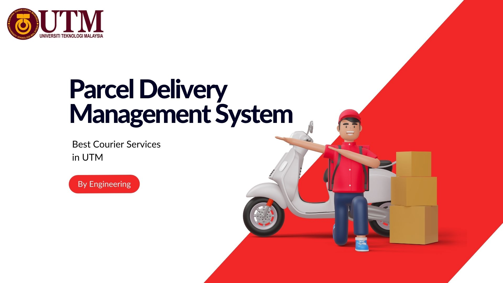
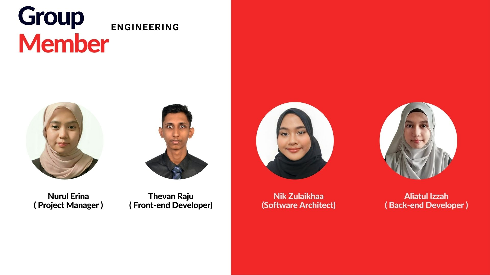
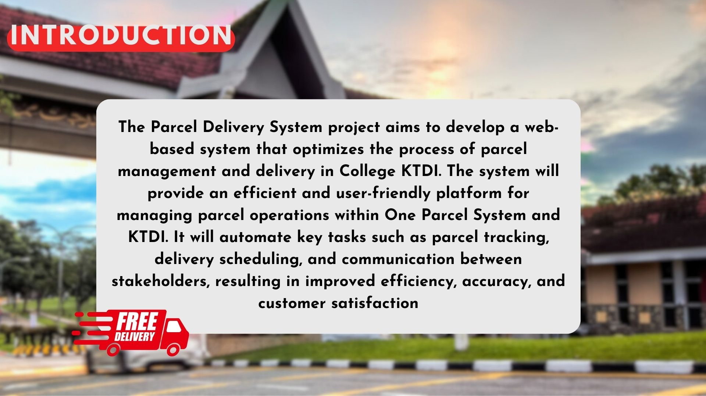
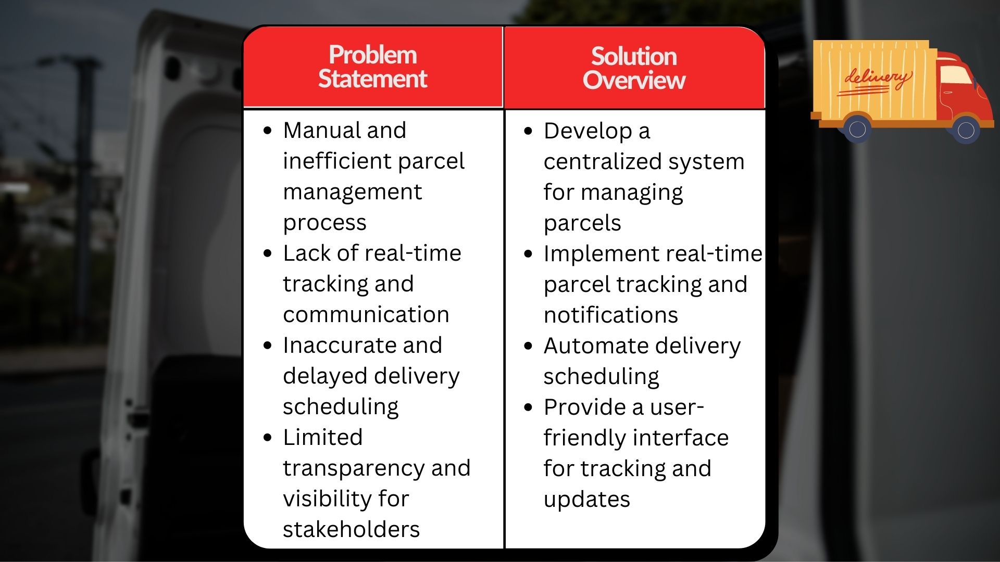
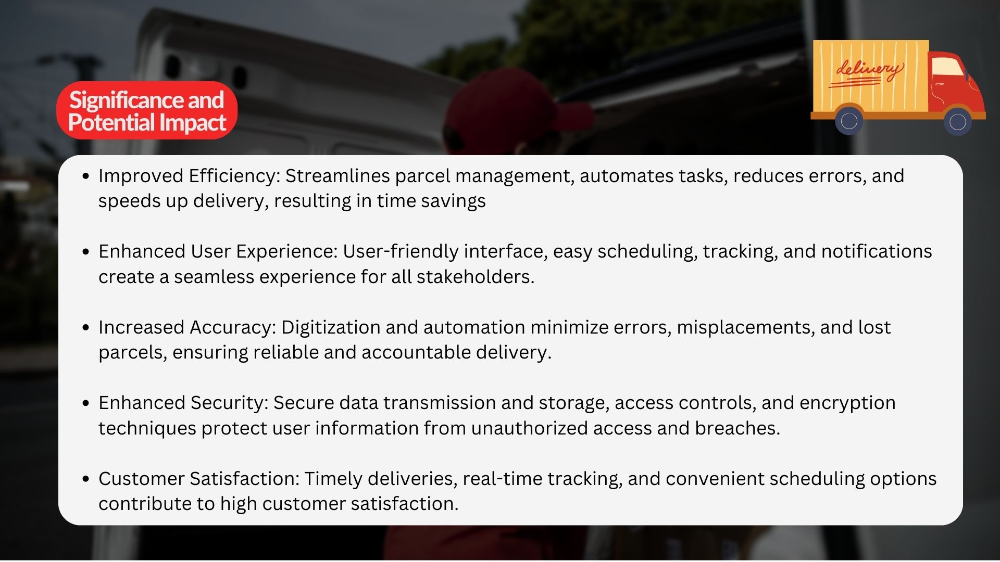
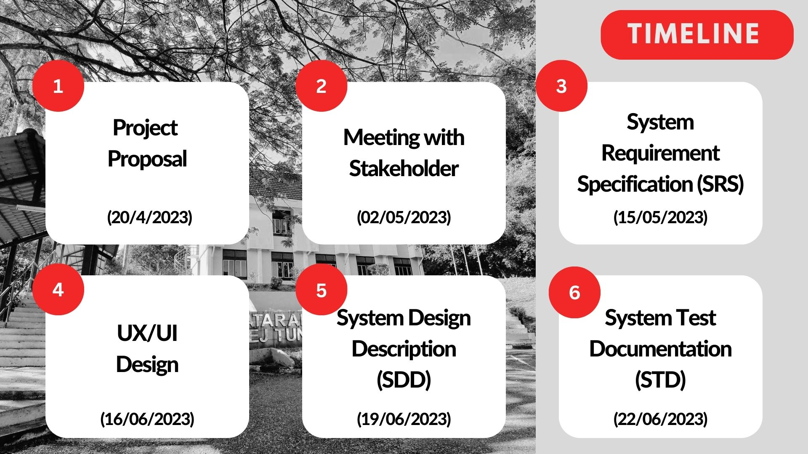

Don't forget to hit the :star: if you like this repo.

# Activity: Group Engineering

## Stakeholder
One Stop Parcel Center 
<table>
  <tr>
    <th>Name</th>
    <th>Stakeholder</th>
    <th>Position</th>
    <th>Responsibility</th>
  </tr>
  <tr>
    <td>Amira Ellyana binti Jasmin</td>
    <td>One Stop Parcel Center</td>
    <td>Management</td>
    <td>Responsible on managing and ensuring that the parcels arrive in good conditions, grouped the parcels in category and labelled for easier finding in their database</td>
  </tr>
    <tr>
    <td>Syazwan bin Saad</td>
    <td>One Stop Parcel Center</td>
    <td>Head of Management</td>
  <td>Responsible on managing the staffs, ensuring smooth operations, and manage the budget as well. Also responsible on making sure that the informations stated at the parcel and the data is well protected and secure</td>
  </tr>
   <tr>
    <td>Johnny Sii How Yong</td>
    <td>KTDI Student</td>
    <td>Deliver guy</td>
    <td> Should handle packages with care, ensuring they are properly secured and protected during transportation,ensure that parcels are delivered to the    correct recipients within the specified time frame, verify the recipient's identity or obtain a signature upon delivery, confirming that the package has reached the intended recipient and should ensure the security and confidentiality of the parcels they handle. 
    </td>
  </tr>
  
  <tr>
    <td>Nur Hazwani Binti Mohammad Sobri</td>
    <td>KTHO Student</td>
    <td>Deliver girl</td>
    <td> Should handle packages with care, ensuring they are properly secured and protected during transportation,ensure that parcels are delivered to the    correct recipients within the specified time frame, verify the recipient's identity or obtain a signature upon delivery, confirming that the package has reached the intended recipient and should ensure the security and confidentiality of the parcels they handle. 
    </td>
  </tr>
  
</table>

## Tasks involved in developing SRC documentation:

| No | Date | Member Name | Role	| Task	| Status	| 
| -----:| ----- | ------ | ------ | ------ | ------ |
| 1| 20/04/2023|Erina,Thevan,Nik,Izzah|Project Manager,Software Architect,Front-end Developer,Back-end Developer|Project planning |Complete|
| 2| 21/04/2023|Erina,Thevan,Nik,Izzah|Project Manager,Software Architect,Front-end Developer,Back-end Developer|Define the problem |Complete|
| 3| 22/04/2023|Erina,Thevan,Nik,Izzah|Project Manager,Software Architect,Front-end Developer,Back-end Developer|Find stakeholder |Complete|
| 4| 24/04/2023|Nik|Software Architect|Gather requirement |Complete|
| 5| 27/04/2023|Erina|Project Manager|Prepare questions |Complete|
| 6| 02/05/2023|Erina,Thevan,Nik,Izzah|Project Manager,Software Architect,Front-end Developer,Back-end Developer|Had meeting with stackholder (OPC) |Complete|
| 7| 03/05/2023|Erina,Thevan,Nik,Izzah|Project Manager,Software Architect,Front-end Developer,Back-end Developer|Update project planning |Complete|
| 8| 03/05/2023|Erina,Thevan,Nik,Izzah|All member| Create proposal with gathered information|Complete|  
| 9| 04/05/2023|Izzah,Thevan|Front-end& Back-end developer| Create usercase diagram with gathered requirement|Complete|   
| 10| 05/05/2023|Erina,Nik|Project Manager,Software architect| Update Proposal |Complete| 
| 11| 06/05/2023|Erina,Nik|Project Manager,Software architect| Contact Stackholder 4 (Johnny) |Complete| 
| 12| 07/05/2023|Erina,Thevan,Nik,Izzah|All members|Create interview questions for stackholder 4 and 5 |Complete|
| 13| 13/05/2023|Erina,Thevan,Nik,Izzah|Project Manager,Software Architect,Front-end Developer,Back-end Developer|Had meeting with stackholder via Google Meet (Johnny) |Complete|
| 14| 14/05/2023|Erina,Thevan,Nik,Izzah|Project Manager,Software Architect,Front-end Developer,Back-end Developer|Follow-up with stackholder |Complete|
| 15| 15/05/2023|Erina,Thevan,Nik,Izzah|Project Manager,Software Architect,Front-end Developer,Back-end Developer|Develop UML Activity Diagram and Sequence Diagram | Complete|
| 16| 22/05/2023|Erina,Thevan,Nik,Izzah|Project Manager,Software Architect,Front-end Developer,Back-end Developer|Update SRS Document| Complete|
| 17| 23/05/2023|Erina,Thevan,Nik,Izzah|Project Manager,Software Architect,Front-end Developer,Back-end Developer|Second meeting with stakeholder (OPC)| Complete|
| 18| 24/05/2023|Erina,Thevan,Nik,Izzah|Project Manager,Software Architect,Front-end Developer,Back-end Developer|Second meeting with stakeholder (Johnny)| Complete|
| 19| 24/05/2023|Erina,Thevan,Nik,Izzah|Project Manager,Software Architect,Front-end Developer,Back-end Developer|Develop draft of low fidelity Wireframes | Complete |
| 20| 25/05/2023|Erina,Thevan,Nik,Izzah|Project Manager,Software Architect,Front-end Developer,Back-end Developer|Develop of low fidelity Wireframes | Complete |
| 21| 26/05/2023|Erina,Thevan,Nik,Izzah|Project Manager,Software Architect,Front-end Developer,Back-end Developer|Discussion of developing high fidelity Wireframes | Complete |
| 22| 26/05/2023|Erina,Thevan,Nik,Izzah|Project Manager,Software Architect,Front-end Developer,Back-end Developer|Meeting with stackholder via Google Meet (Nur Hazwani) | Complete |
| 23| 26/05/2023|Erina,Thevan,Nik,Izzah|Project Manager,Software Architect,Front-end Developer,Back-end Developer|Update SRS Document | Complete |
| 24| 29/05/2023|Erina,Thevan,Nik,Izzah|Project Manager,Software Architect,Front-end Developer,Back-end Developer|Decide the colour code for system design | Complete |
| 25| 04/06/2023|Erina,Thevan,Nik,Izzah|Project Manager,Software Architect,Front-end Developer,Back-end Developer|Develop high fidelity wireframes| Complete |
| 26| 06/06/2023|Erina,Thevan,Nik,Izzah|Project Manager,Software Architect,Front-end Developer,Back-end Developer|Update project proposal| Complete |
| 27| 08/06/2023|Erina,Thevan,Nik,Izzah|Project Manager,Software Architect,Front-end Developer,Back-end Developer|Update SRS Document| Complete |
| 28| 09/06/2023|Erina,Thevan,Nik,Izzah|Project Manager,Software Architect,Front-end Developer,Back-end Developer|Complete SRS Document| Complete |

## 1. Introduction:
The Parcel Delivery System project aims to develop a web-based system that optimizes the process of parcel management and delivery in College KTDI. The system will provide an efficient and user-friendly platform for managing parcel operations within One Parcel System and KTDI. It will automate key tasks such as parcel tracking, delivery scheduling, and communication between stakeholders, resulting in improved efficiency, accuracy, and customer satisfaction.

### Objective

The primary objective of the Parcel Delivery System is to streamline and enhance the entire parcel delivery process. The system aims to achieve the following goals:

1. Simplify Parcel Management: The system will provide a centralized platform for managing parcel operations, including creating new parcels, assigning them to delivery personnel, and tracking their progress.
2. Improve Tracking and Visibility: The system will enable real-time tracking of parcels, allowing both administrators and customers to have full visibility into the delivery process. This will help reduce parcel loss, improve accountability, and provide timely updates to customers.
3. Enhancing security: Implement robust security measures to protect parcel and user data from unauthorized access and cyber threats.
4. Improve user experience: Create an intuitive and engaging interface with clear instructions, informative feedback, and proactive notifications for a seamless and satisfying user experience.

### Problem Statement

The current parcel delivery process within our organization faces several challenges. Manual tracking and delivery of parcels result in errors, delays, and inefficiencies. Lack of real-time tracking and communication hampers the ability to provide accurate and timely updates to customers. Additionally, the absence of an integrated system makes it difficult to manage and monitor the entire delivery process effectively. 

### Solution Overview

The Parcel Delivery System will be a web-based application accessible through desktop and mobile devices. It will feature a user-friendly interface for administrators, delivery personnel, and customers. The system will incorporate functionalities such as parcel creation, real-time tracking, delivery scheduling, notifications, and reporting.

Administrators will have access to a dashboard where they can manage parcel assignments, track deliveries, and generate reports. Delivery personnel will utilize a mobile application to receive assigned parcels, update delivery status, and communicate with administrators and customers. Customers will have a web portal to track their parcels, receive notifications, and provide feedback.

### Significance and Potential Impact

The Parcel Delivery System has the potential to revolutionize our organization's parcel management and delivery operations. By automating and optimizing the process, we can expect significant improvements in efficiency, accuracy, and customer satisfaction. The system will provide real-time visibility, enhance communication, and streamline administrative tasks, resulting in faster and more reliable deliveries. The proposal aims to outline the system's features, benefits, and implementation plan, demonstrating its potential to transform our parcel delivery operations and meet the evolving needs of our organization and customers.

## 2. Methodology:
The approach and methodologies utilized for the development of the Parcel Delivery System are as follows:

1. Agile Development: Adopt an Agile approach to enable iterative and incremental development, allowing for flexibility and adaptability to evolving requirements. This methodology promotes collaboration, frequent feedback, and continuous improvement throughout the project lifecycle.

2. Scrum: Implement the Scrum framework, which consists of time-boxed iterations called sprints, daily stand-up meetings, sprint planning, and sprint reviews. This approach facilitates efficient project management, prioritization of tasks, and regular communication among team members, stakeholders, and users.

3. Software Development Life Cycle (SDLC): Follow an Agile SDLC model that aligns with the iterative and incremental development approach. The SDLC stages include requirements gathering, design, development, testing, deployment, and maintenance. This ensures a systematic and structured approach to the development process, with continuous feedback and improvement at each stage.

4. User-Centered Design: Utilize a user-centered design (UCD) approach to ensure that the system's design and functionality meet the needs and expectations of users. This approach involves conducting user research, creating user personas and scenarios, and testing the system with users to gather feedback and refine the design.

### Tools, Technologies, and Frameworks:

Several tools, technologies, and frameworks will be employed during the development of the Parcel Delivery System. These include:

1. Version Control: Use Git and GitHub for version control, allowing for effective collaboration, code management, and tracking of changes.

2. Integrated Development Environment (IDE): Utilize a suitable IDE such as Visual Studio Code (VS Code) for coding, debugging, and collaboration among the development team.

3. Design and Prototyping: Leverage tools like Figma for creating wireframes, mockups, and interactive prototypes. This aids in visualizing and refining the user interface (UI) and user experience (UX) of the system.

4. Front-end Development: Utilize modern front-end technologies such as HTML, and CSS, along with popular frameworks like Bootstrap, to build a responsive and user-friendly web interface for the Parcel Delivery System.
5. Database Management: Utilize a reliable database management system (DBMS) such as MySQL  to store and retrieve data related to parcels, users, delivery details, and other relevant information.

By leveraging these methodology, tools, technologies, and frameworks, the development team can build a robust, scalable, and secure Parcel Delivery System that meets the needs of KTDI students at UTM. The use of modern technologies and proven methodologies ensures the system's efficiency and reliability, providing a seamless and hassle-free experience for users. Overall, the use of these methodologies and practices ensured that the Parcel Delivery System was developed efficiently, effectively, and with a focus on the needs of users.

## 3. Implementation:

Meeting With Stakeholder:
<table>
  <tr>
    <th>Name</th>
    <th>Stakeholder</th>
    <th>Position</th>
    <th>Responsibility</th>
  </tr>
  <tr>
    <td>Amira Ellyana binti Jasmin</td>
    <td>One Stop Parcel Center</td>
    <td>Management</td>
    <td>Responsible on managing and ensuring that the parcels arrive in good conditions, grouped the parcels in category and labelled for easier finding in their database</td>
  </tr>
    <tr>
    <td>Syazwan bin Saad</td>
    <td>One Stop Parcel Center</td>
    <td>Head of Management</td>
  <td>Responsible on managing the staffs, ensuring smooth operations, and manage the budget as well. Also responsible on making sure that the informations stated at the parcel and the data is well protected and secure</td>
  </tr>
   <tr>
    <td>Johnny Sii How Yong</td>
    <td>KTDI Student</td>
    <td>Deliver guy</td>
    <td> Should handle packages with care, ensuring they are properly secured and protected during transportation,ensure that parcels are delivered to the    correct recipients within the specified time frame, verify the recipient's identity or obtain a signature upon delivery, confirming that the package has reached the intended recipient and should ensure the security and confidentiality of the parcels they handle. 
    </td>
  </tr>
  
  <tr>
    <td>Nur Hazwani Binti Mohammad Sobri</td>
    <td>KTHO Student</td>
    <td>Deliver girl</td>
    <td> Should handle packages with care, ensuring they are properly secured and protected during transportation,ensure that parcels are delivered to the    correct recipients within the specified time frame, verify the recipient's identity or obtain a signature upon delivery, confirming that the package has reached the intended recipient and should ensure the security and confidentiality of the parcels they handle. 
    </td>
  </tr>
  
</table>

Sequence Diagram:

Sticky Note(Project Planning):

Low Fidelity Wireframes:

High Fidelity Wireframes:

Design System and Typography:

## 4. Testing and Quality Assurance:

In the project focused on developing a parcel delivery system for KTDI students at UTM, we employed a comprehensive testing approach that combined manual testing techniques with automated testing tools. The manual testing involved designing test cases based on software requirements and functions, assigning unique test case IDs, and analyzing test steps for equivalence partitioning and boundary value analysis. Equivalence partitioning allowed us to cover a range of input scenarios by selecting representative values from each equivalence class, while boundary value analysis helped us test the boundaries of input ranges. Additionally, we utilized automated testing tools to execute test scripts efficiently, handle repetitive or complex tests, simplify the testing process, improve test coverage, and ensure consistent test execution. Unit testing was also employed to verify the correctness and expected behavior of individual software components, catch bugs early, and ensure code reliability. 

The manual testing approach enabled us to identify potential issues early in the development process, ensuring that they were addressed promptly before they could affect the system's performance. The use of automated testing tools allowed us to execute tests more efficiently and consistently, reducing the likelihood of human error and ensuring that all test cases were executed accurately. To ensure the reliability and robustness of the software, we developed a comprehensive test plan, created well-defined test cases, executed tests, tracked and managed defects, generated test reports, maintained a test environment similar to production, and integrated testing into the software development process through continuous integration and deployment practices.

## 5. Results and Achievements:

We are excited to present the remarkable outcomes and accomplishments of our project focused on developing a parcel delivery system specifically tailored for KTDI students at UTM. Our software solution has significantly improved the efficiency and effectiveness of the parcel delivery process, benefiting students, faculty, and the administration alike. The system's design elements were thoughtfully crafted to reflect the university's identity, fostering a sense of familiarity and making the experience enjoyable for users. The Parcel Delivery System has proven to be a game-changer for KTDI students, providing them with a reliable and convenient solution for their parcel needs. The system's user-friendly interface has simplified the process of booking, tracking, and receiving notifications, ensuring a hassle-free experience for students.

Throughout the evaluation phase, we meticulously collected both quantitative and qualitative data, which vividly demonstrates the efficacy of our system. From a quantitative perspective, a larger number of students have exhibited a heightened willingness to actively engage with the Student Feedback System compared to the previous methods used. This demonstrates the software's ability to streamline the feedback process and encourage enthusiastic participation from the student community. On the qualitative front, stakeholders and users have provided overwhelmingly positive feedback on the design choices and functionalities we incorporated into the system, distinguishing it from the outdated ePPP system. Notably, features such as the ability to review previously submitted feedback, which was considered a crucial functionality, have garnered significant praise for their ability to address the inconveniences associated with the previous system. We are immensely gratified by the success our project has achieved.

During the evaluation phase, we proactively sought feedback from diverse stakeholders, including students, riders, and administrators, in order to ascertain their perspectives and gather invaluable insights. Students expressed their appreciation for the Student Feedback System, commending its user-friendly interface, accessibility across multiple devices, and seamless submission process. They emphasized how the system empowered them to provide detailed and timely feedback, thereby enhancing their overall learning experience. Lecturers found the system to be an invaluable tool for comprehending student perspectives, facilitating improvements in their teaching methodologies, and identifying areas for course refinement. They praised the system's comprehensive analytics and reporting capabilities, which furnished them with actionable insights and facilitated data-driven decision-making. Administrators recognized the Student Feedback System as a potent means of assessing teaching effectiveness and measuring student satisfaction. They applauded its capacity to generate in-depth reports and aggregate feedback, enabling the identification of trends and the implementation of targeted interventions. The feedback received from these stakeholders played a pivotal role in refining and enriching the system, ensuring its alignment with the distinct requirements and expectations of each user group.

Overall, the Parcel Delivery System has been an enormous success, delivering tangible benefits to KTDI students, faculty, and administration. The system's design, functionality, and security features have set a new standard for parcel delivery systems in the university context. We are proud of our achievements and excited about the system's potential to evolve and enhance the student experience further. We will continue to gather feedback from users and stakeholders, identifying areas for improvement and implementing necessary refinements. Additionally, we will also explore opportunities to integrate advanced features and technologies such as  data analytics to further optimize the system's performance and user experience.

## 6. Conclusion:

Throughout the course of this project, our team embarked on the development of a comprehensive parcel delivery system specifically catered to the needs of KTDI students at UTM. This project presented us with a unique opportunity to leverage technology and logistics to enhance the overall student experience by providing a seamless and efficient delivery service for their parcels. We faced numerous obstacles, including changing requirements, tight timelines, and unexpected technical issues. However, we approached each challenge with a positive attitude and a determination to overcome it. Our team's commitment to delivering a quality solution never wavered, and we continued to work tirelessly to ensure that the system was delivered on time and to the highest standard.

Designing a user-friendly interface that accommodates the students and ensuring that it is still understandable enough to be operated by the riders and the administrators, was one of the main challenges we encountered. To address this, we conducted extensive user testing sessions and gathered valuable feedback from different stakeholders. This iterative process allowed us to refine the system's interface and create an intuitive user experience that met the requirements and preferences of all users. We implemented a clean and intuitive design, simplifying the process of parcel booking, tracking, and receiving notifications, thus ensuring a hassle-free experience for KTDI students.

Throughout the development process, data security and privacy remained paramount. We implemented robust measures to protect sensitive information, ensuring that student data and delivery details were handled securely and in compliance with privacy regulations. By integrating encryption protocols and access control mechanisms, we maintained the confidentiality and integrity of the parcel delivery system.

The success of this project relied heavily on effective communication and collaboration within our team. Regular meetings, clear task allocation, and open discussions fostered a cohesive and productive work environment. This enabled us to overcome challenges efficiently and ensure the smooth progression of the project. We learned the value of adaptability and flexibility, as changing requirements and unexpected hurdles emerged during the development cycle. By staying agile and proactive, we were able to address these challenges and deliver a robust and reliable parcel delivery system. The success of the Parcel Delivery System was also influenced by the use of feedback loops throughout the development process. Regular feedback from stakeholders, users, and team members helped us to identify areas for improvement and make necessary adjustments to the system. This feedback helped us to ensure that the system met the needs and expectations of all stakeholders and that it provided a seamless and hassle-free experience for users.

Looking ahead, we envision several areas where the parcel delivery system for KTDI students can be further enhanced. Firstly, incorporating advanced analytics and data visualization tools can provide deeper insights into delivery patterns, efficiency metrics, and user preferences. These insights will enable stakeholders to make data-driven decisions and further optimize the system's performance. Additionally, expanding the system's accessibility to multiple platforms, such as mobile devices, would offer greater convenience and engagement for users, allowing them to track parcels and receive updates on the go. Furthermore, continuous monitoring and evaluation of the system's performance and user satisfaction will provide us with valuable feedback to address any emerging issues promptly and implement necessary refinements. Furthermore, the development of this system highlights the power of technology in streamlining logistics and improving the overall user experience. As technology continues to advance, we can expect to see more innovative solutions that leverage data analytics, automation, and artificial intelligence to optimize logistics and enhance user experiences.

In conclusion, this project has been an invaluable experience for our team, equipping us with technical expertise and valuable insights into the intricacies of developing a tailored parcel delivery system. The system we have developed holds immense potential to streamline the delivery process for KTDI students, providing them with a reliable and efficient solution for their parcel needs. By reflecting on the challenges we faced and the lessons we learned, we remain committed to further refining and expanding the system to meet the evolving needs and expectations of our users. With the implementation of advanced features, continuous monitoring, and a focus on user satisfaction, we are confident in the positive impact this system will have on the overall student experience at KTDI, UTM.

## 7. Prototype:

| No | Name |File | 
| -----:| ----- | :------: | 
|1| Prototype Main Menu | |
|2| Prototype Admin | |
|3| Prototype User | |
|4| Prototype Rider | |

## 8. Documentations:
| No | Name |File | 
| -----:| ----- | :------: | 
|1| Proposal | |
|2| SRS | |
|4| STD | |
## Contribution 🛠️
Please create an [Issue](https://github.com/drshahizan/software-engineering/issues) for any improvements, suggestions or errors in the content.

You can also contact me using [Linkedin](https://www.linkedin.com/in/drshahizan/) for any other queries or feedback.

