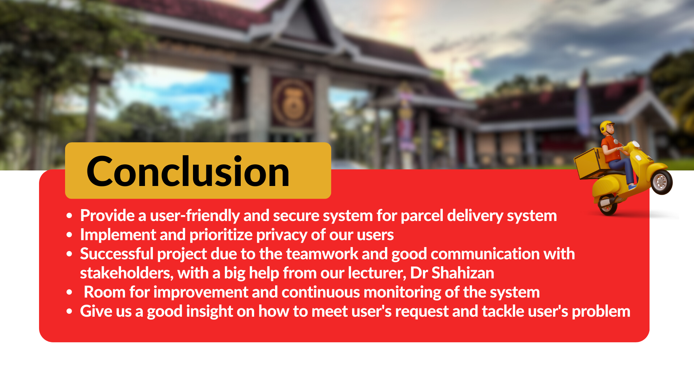
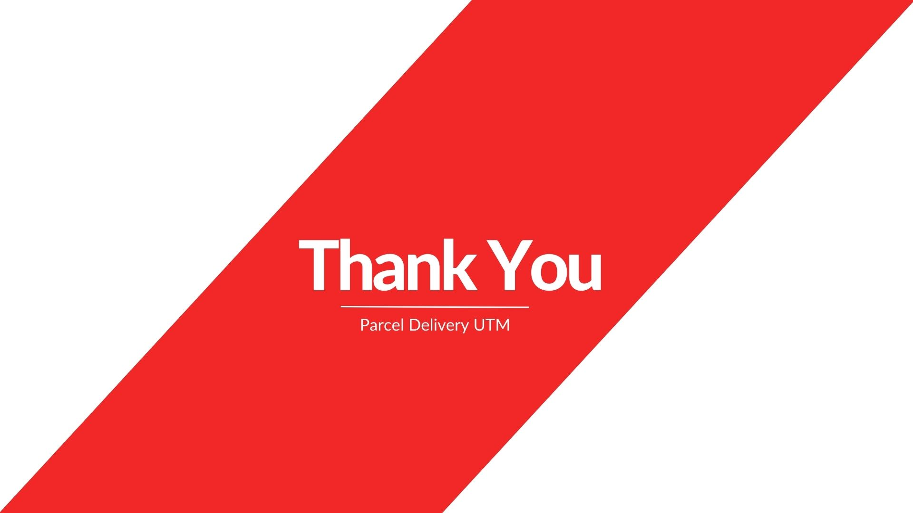

Don't forget to hit the :star: if you like this repo.

# Activity: Group Engineering

## Stakeholder

<table>
  <tr>
    <th>Name</th>
    <th>Stakeholder</th>
    <th>Position</th>
    <th>Responsibility</th>
  </tr>
  <tr>
    <td>Amira Ellyana binti Jasmin</td>
    <td>One Stop Parcel Center</td>
    <td>Management</td>
    <td>Responsible on managing and ensuring that the parcels arrive in good conditions, grouped the parcels in category and labelled for easier finding in their database</td>
  </tr>
    <tr>
    <td>Syazwan bin Saad</td>
    <td>One Stop Parcel Center</td>
    <td>Head of Management</td>
  <td>Responsible on managing the staffs, ensuring smooth operations, and manage the budget as well. Also responsible on making sure that the informations stated at the parcel and the data is well protected and secure</td>
  </tr>
   <tr>
    <td>Johnny Sii How Yong</td>
    <td>KTDI Student</td>
    <td>Deliver guy</td>
    <td> Should handle packages with care, ensuring they are properly secured and protected during transportation,ensure that parcels are delivered to the    correct recipients within the specified time frame, verify the recipient's identity or obtain a signature upon delivery, confirming that the package has reached the intended recipient and should ensure the security and confidentiality of the parcels they handle. 
    </td>
  </tr>
  
  <tr>
    <td>Nur Hazwani Binti Mohammad Sobri</td>
    <td>KTHO Student</td>
    <td>Deliver girl</td>
    <td> Should handle packages with care, ensuring they are properly secured and protected during transportation,ensure that parcels are delivered to the    correct recipients within the specified time frame, verify the recipient's identity or obtain a signature upon delivery, confirming that the package has reached the intended recipient and should ensure the security and confidentiality of the parcels they handle. 
    </td>
  </tr>
  
</table>

## 7. Prototype:

| No | Name |File | 
| -----:| ----- | :------: | 
|1| Prototype Main Menu | |
|2| Prototype Admin | |
|3| Prototype User | |
|4| Prototype Rider | |

## Stakeholder

<table>
  <tr>
    <th>Name</th>
    <th>Stakeholder</th>
    <th>Position</th>
    <th>Responsibility</th>
  </tr>
  <tr>
    <td>Amira Ellyana binti Jasmin</td>
    <td>One Stop Parcel Center</td>
    <td>Management</td>
    <td>Responsible on managing and ensuring that the parcels arrive in good conditions, grouped the parcels in category and labelled for easier finding in their database</td>
  </tr>
    <tr>
    <td>Syazwan bin Saad</td>
    <td>One Stop Parcel Center</td>
    <td>Head of Management</td>
  <td>Responsible on managing the staffs, ensuring smooth operations, and manage the budget as well. Also responsible on making sure that the informations stated at the parcel and the data is well protected and secure</td>

  
  
  
</table>

## 8. Documentations:
| No | Name |File | 
| -----:| ----- | :------: | 
|1| Proposal | |
|2| SRS | |
|3| SDD | |
|4| STD | |

## Contribution 🛠️
Please create an [Issue](https://github.com/drshahizan/software-engineering/issues) for any improvements, suggestions or errors in the content.

You can also contact me using [Linkedin](https://www.linkedin.com/in/drshahizan/) for any other queries or feedback.

