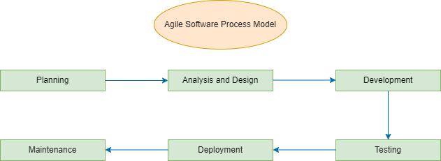
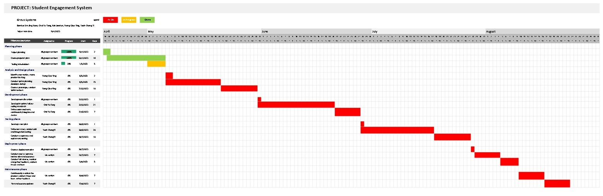
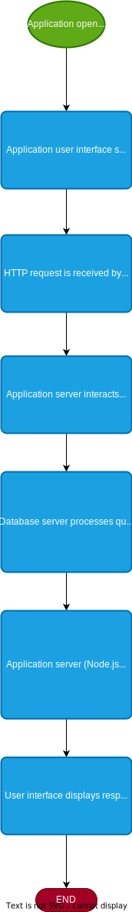
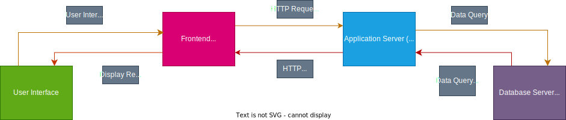

# UTM Faculty of Computing Student Engagement System
### Prepared by: Systema
  <table>
  <tr>
    <th>Bernice Lim Jing Xuan</th>
    <th>Chai Yu Tong</th>
    <th>Kek Jesslyn</th>
    <th>Wong Qiao Ying</th>
    <th>Yeoh Chong Yi</th>
  </tr>
  <tr align="center">
    <td>A22EC0038</td>
    <td>A22EC0145</td>
    <td>A22EC0057</td>
    <td>A22EC0118</td>
    <td>A22EC0295</td>
  </tr>
  <tr>
    <td></td>
    <td></td>
    <td></td>
    <td></td>
    <td></td>
  </tr>
  </table>
  
### Table of Contents
1. [Executive Summary](#1-executive-summary)
2. [Background](#2-background)
3. [Objectives](#3-objectives)
4. [Scope](#4-scope)
5. [Software Process Model](#5-software-process-model)
6. [Budget](#6-budget)
7. [System Architecture](#7-system-architecture)
8. [Risk Assessment](#8-risks-assessment)
9. [Resources](#9-resources)
10. [Technical Specifications](#10-technical-specifications)
11. [Timeline and Deliverables](#11-timeline-and-deliverables)
12. [Conclusion](#1-2conclusion)
 
  
### 1. Executive Summary
This proposal recommends the development of a student engagement website for students in Faculty Computing of University Teknologi Malaysia that includes a suite of features designed to facilitate student engagement and enhance the student experience. A student engagement system software can serve as a hub for students of UTM to access course-specific information, connect with their peers and faculty members, and stay up-to-date with important academic events and deadlines.
  
The key features of the student engagement website include:

- A personalized dashboard that displays a student's academic schedule, assignments, and other relevant information in a user-friendly interface.
- Course-specific forums and discussion boards that allow students to engage with their peers and faculty members in discussions related to specific courses.
- A student directory that enables students to connect with each other based on shared interests or academic programs.
- A notification system that keeps students informed about important academic events and deadlines, such as exam schedules and registration deadlines.
- A virtual events calendar that promotes student engagement in extracurricular activities, clubs, and other events on campus.
- A feedback system that allows students to provide feedback on courses, instructors, and other aspects of their academic experience.

 
The development of the student engagement website will require a team of skilled developers, designers, and project managers who will work together to ensure a seamless user experience. The website will be designed to be accessible to all UTM Faculty Computing's students, regardless of their technological proficiency, and will be optimized for all types of browser.

### 2. Background

The development of a student engagement system software is driven by the need to enhance the overall student experience and improve student engagement within the academic community of Faculty Computing Univerisity Teknologi Malaysia (UTM). With the increasing prevalence of digital technologies in the education sector, universities and colleges are looking for ways to leverage these technologies to provide a more personalized, interactive, and engaging learning experience for students to let them feel more comfortable and convenient during their study journey.

For UTM students, a student engagement system software can provide as a central location where they can obtain course-specific material, network with other students and staff, and keep informed about crucial academic events and deadlines. Additionally, it can give students a platform to participate in extracurricular activities like TED UTM and MPP as well as other facets of campus life.

The COVID-19 pandemic has further highlighted the importance of digital technologies in the education sector, with many universities and colleges transitioning to online learning and remote instruction. As a result, the need for a robust and reliable student engagement system software has become more pressing than ever before.

A group of talented programmers, designers, and project managers is needed to develop a user-friendly and efficient platform for a student engagement system software. Additionally, a sizeable time and resource commitment is needed, as well as money for marketing, upkeep, and development.

However, the potential benefits of a student engagement system software towards all Faculty Computing students are significant. By enhancing student engagement and providing a more personalized and interactive learning experience, UTM Faculty Computing can improve student retention, satisfaction, and academic outcomes. Overall, a student engagement system software can help to create a more vibrant and engaged academic community, both online and on-campus.

### 3. Objectives
The major objectives of building a student engagement website for Faculty Computing Students are to enhance the overall student experience and improve student engagement within the academic community. Below are some specific objectives that can be achieved through the development of a student engagement website:
 
* Improve academic outcomes
    > A student engagement website can help students to stay organized, manage their time effectively, and stay on top of assignments and deadlines, which can lead to improved academic outcomes.
* Foster a sense of community
    > By providing students with a platform to connect with their peers and faculty members, a student engagement website can foster a sense of community and encourage students to engage in extracurricular activities and other aspects of campus life.
* Enhance communication
    > A student engagement website can provide a central hub for communication between students, faculty members, and other members of the academic community, improving communication and collaboration.
* Provide personalized support
    > A personalized dashboard on the website can help students to access relevant information and resources based on their individual needs and interests, providing personalized support and improving the student experience.
* Increase student retention
    > By enhancing student engagement and satisfaction, a student engagement website can help to improve student retention and reduce dropout rates.
* Encourage student feedback
    > A feedback system on the website can provide students with an opportunity to provide feedback on courses, instructors, and other aspects of their academic experience, which can help to improve the quality of education and overall student satisfaction. 

   
  Overall, the development of a student engagement website aims to provide a comprehensive platform that supports Faculty Computing's students throughout their academic journey, enhances their learning experience, and fosters a sense of community within the academic community. 

### 4. Scope

<ol>
  <li><b>Personalised dashboard</b>:
    <ul>
      <li>A personalized dashboard can provide students with a quick and easy way to access important information related to their academic progress, schedule, and activities. It could also provide access to course materials, resources, and tools relevant to their courses and programs, as well as links to relevant academic support services.</li> 
    </ul>
  </li>
  <li><b>Course-specific forums and discussion boards</b>:
    <ul>
      <li>Course-specific forums and discussion boards provide students with an online platform to engage in course-related discussions, share resources, and share ideas. They can be accessed directly from the student engagement system and organized by course code, section, or topic. They can also be used to facilitate group work and collaboration, helping students develop communication, critical thinking, and problem-solving skills.</li> 
    </ul>
  </li>
  <li><b>Student directory</b>:
    <ul>
      <li>A student directory could help increase student engagement by providing a platform for students to connect with each other and build relationships outside of the classroom. It could also help develop important skills related to networking, teamwork, and interpersonal communication.</li> 
    </ul>
  </li>
  <li><b>Notification system</b>:
    <ul>
      <li>A notification system would allow students to receive important updates and reminders about their academic experience, be highly customizable, and provide a centralized dashboard to help them stay organized and manage their time more effectively. This feature could help reduce stress and improve overall student well-being.</li> 
    </ul>
  </li>
  <li><b>Virtual events calendar</b>:
    <ul>
      <li>A virtual events calendar could be integrated into a student engagement system to provide a centralized platform for students to discover and participate in a wide range of academic and social events. It could include guest lectures, workshops, cultural events, sporting events, and student society meetings. It could also help students broaden their horizons and explore new interests.</li> 
    </ul>
  </li>
  <li><b>Feedback system</b>:
    <ul>
      <li>A feedback system could be integrated into a student engagement system and enable students to provide feedback on their academic experience. It could provide anonymity and a mechanism for students to receive feedback from instructors. It could also be used to track and analyze feedback trends and identify areas for improvement. Overall, it could be a valuable addition to a student engagement system.</li> 
    </ul>
  </li>
</ol>

### 5. Software Process Model

A software process model for a student engagement system refers to a set of activities and phases that are used to design, develop, test, and maintain the software system. It provides a framework for organizing the software development process and helps to ensure that the final product meets the requirements and needs of the stakeholders.
  
The <b>Agile software process model</b> is an ideal process model for student engagement system. It is a software process model that emphasizes iterative and incremental development, flexibility, and collaboration between team members and stakeholders. It is particularly suitable for projects where the requirements are likely to evolve over time, such as a student engagement system.
  
Here is the phases of agile model that can be applied to the development of a student engagement system:
 
<ol>
  <li><em>Planning:</em> In this phase, the project team identifies the project's objectives, timelines, and available resources. The team creates a backlog of features and user stories, prioritizes them, and estimates their effort.</li>
  <li><em>Analysis and Design:</em> In this phase, the team analyzes and designs the software architecture, database design, and user interface. The team also identifies dependencies, risks, and assumptions.</li>
  <li><em>Development</em>: In this phase, the team develops the software incrementally in short iterations called sprints. Each sprint typically lasts two to four weeks, and the team develops and tests a small set of features. The team collaborates daily and continuously reviews the product backlog to adjust the priorities and scope.</li>
  <li><em>Testing:</em> In this phase, the team performs testing continuously throughout the development process. The team writes automated unit tests, integration tests, and acceptance tests to ensure the software meets the requirements.</li>
  <li><em>Deployment:</em> In this phase, the team deploys the software to the production environment. The team releases the software incrementally, and each release includes a set of tested features.</li>
  <li><em>Maintenance:</em> In this phase, the team maintains the software by fixing defects, adding new features, and improving the system's performance. The team continuously receives feedback from users and stakeholders to improve the system further.</li>
</ol>

#### Testing Methodologies

<ul>
  <li><em>Acceptance Testing:</em> This is used to make sure that our product met the requirements specified by our stakeholders such as MPP, lecturers and students. Not only that, this testing also had to make sure that user easily to engage with all the features provided.</li>
  <li><em>Functional Testing:</em> This testing is done to ensure that all the features work as expected.</li>
  <li><em>Regression Testing:</em> This is used to ensure updates launched would not cause any new bugs or issues occur and the existing features as well as data would function as good as before updates.</li>
  <li><em>Performance Testing:</em> As there could be many users using our system at the same time hence this performance testing is done to make sure system can still function well although there is a high traffic as well as testing the ability of the system to handle a large number of data inputs or users at the same time.</li>
  <li><em>Usability Testing:</em> This methodology is used to test whether our system is easy to navigate or the features is easy to access.</li>
</ul>

#### Project Management Practices

<ul>
  <li><em>Establish clear project goals and objectives:</em> The specific features and functions that included in our system should be defined clearly so that every group members understand what should be included in our system.</li>
  <li><em>Use agile development methodologies:</em> Scrum is an example of agile development methodologies that we could use for iterative development with frequent testing and feedback from users.</li>
  <li><em>Collaborate with stakeholders:</em> This is to ensure the product executed can meet the requirements of our stakeholders such as MPP, lecturers and students.</li>
  <li><em>Communicate regularly:</em> Communication is important as a team to develop a system. Discussion via face to face or any meeting applications such as Google Meet can be done to exchange any opinions from different perspectives.</li>
  <li><em>Manage project risks:</em> Identify what risks may appear throughout the development of our system in order to prevent panic when problems appear.</li>
  <li><em>Prioritize tasks and workloads:</em> Prioritize tasks and workloads based on our project goals and objectives so that nothing would be missed.</li>
  <li><em>Monitor progress and adjust as needed:</em> Always monitor the progress so that our system stays on track and meets our objectives.</li>
</ul>

#### Quality Assurance Processes

<ul>
  <li>Conduct regular testing: Regular testing should be done to identify and solve bugs and issues.</li>
  <li>Conduct user acceptance testing: This is to ensure our system meets the needs of end-users and is easyly to navigate.</li>
  <li>Use version control: This is used to manage the changes to our system.</li>
  <li>Use code analysis tools: To identify potential issues.</li>
  <li>Perform regular maintenance: Performing regular maintenance to make sure the system is up to date with free of bugs and issues.</li>
</ul>

### 6. Budget
There will be a number of costs associated with the creation of a student engagement system that will serve about 40,000 users, including hardware, software, personnel, testing, contingency, and others. This project is expected to cost **RM 176,000**, as shown in the following breakdown:

#### Hardware: RM 80,000
- The cost of obtaining and maintaining the hardware infrastructure required to operate the student engagement system, including servers, storage devices, network devices, and other essential hardware components, is included in the hardware budget.
- The hardware should be able to support a large number of users, with high-speed internet connectivity and large enough storage capacity.
- In order to meet any potential future increases in the number of users, the hardware should also be expandable.

#### Software: RM 10,000
- The cost of purchasing and licencing software platforms and tools required for the creation of the student engagement system such as collaboration and communication tools, is included in the software budget.
- The software licenses should be carefully selected to ensure compatibility, functionality, and security.
- To ensure engagement and adoption by the users of the student engagement system, the software should be user-friendly and easily navigatable.

#### Personnel: RM 10,000
- The development team's salary and benefits, including those for the project manager, system analyst, programmers, and testers, are covered by the personnel budget.
- The development team should have experience and skill in developing student engagement systems, with a focus on creating user-friendly and captivating systems that promote collaboration and communication among students, and other features of the student engagement system.
- To make sure that the system can track and analyse student engagement metrics efficiently, the development team should also have experience with data analysis and visualisation.

#### Testing: RM 8,000
- The cost of performing functional, performance, and security testing of the student engagement system is covered by the testing budget.
- The testing should include user acceptance testing to verify that the system meets the needs and expectations of users.
- Stress testing should be done as part of the testing to make sure the system can manage a large number of users without experiencing performance problems.

#### Contingency: RM 8,000
- A small amount of money is set aside in the contingency budget to pay for any unforeseen costs that might occur throughout the development process. 
- These expenses could include unforeseen hardware or software failures, scope changes, or development timeline delays.
- The project's contingency fund is included to ensure that it can proceed even in the event of unforeseen difficulties or setbacks that can have an impact on student engagement.

#### Others: RM 50,000

In conclusion, it is anticipated that RM 176,000 will be needed to develop the student engagement system. Costs associated with staff, testing, hardware, software, and contingency will all be covered by the budget. Stakeholders and project sponsors will be informed of any budget changes.

### 7. System Architecture

#### System Architecture Overview

The student engagement system for university users will be made up of a client-server architecture with a web-based front-end and a back-end server that manages data storage, retrieval, and processing. The architecture will include the following layers:

- Presentation layer: The user interface of the website will be created and built using HTML, CSS, and JavaScript in this layer.  

- The application layer will handle user requests, conduct data processing, and return responses. The server-side technologies for processing user requests and data management will be PHP and Apache.  

- Data layer: This layer will manage and store the system's data. The relational database management system (RDBMS) that will be utilised to store user information, posts, comments, and other important data is MySQL.

#### Data Storage and Management:

A relational database management system (RDBMS) will be used to store and manage the data on the website. The RDBMS for the system will be MySQL. Each table will have a distinct category of data, such as users, posts, comments, and likes. The data will be saved in tables. SQL queries will be used to handle the data, and appropriate restrictions such primary keys, foreign keys, and unique keys will be used to assure data integrity.

The following hardware and software are needed for managing and storing data:

- Hardware: A server or hosting service with enough processing power and storage space to meet the website's data management and storage requirements.

- Software: Express.js and Node.js for server-side processing, with MySQL serving as the RDBMS.  

#### Flowchart and Block Diagram:

The following is a flowchart and block diagram of the system architecture for the social media website for university students:

Flowchart:  

Block Diagram:  

### 8. Risks Assessment
| Potential Risks | Plan / Strategies |
| ------------- | ------------- |
| *Technical challenges* - There may be technical challenges realated to coding, server management, website security, and also database management. These challenges could result in delays, additional costs, or errors in the website's functionality. |<ul><li>Conduct a thorough analysis of the website's technical requirements and ensure that the team has the necessary skills and expertise to handle technical challenges.</li><li>Develop a contingency plan for potential technical issues that could impact the project timeline and budget.</li></ul>|
| *Resource constraints* - This project may require significant resources in terms of time, money, and personnel. Resource constriants sich as a lack of funding could impact the project's timeline or quality. |<ul><li>Making a plan to allocate resources efficiently and prioritize tasks based on thier importance to the project's success.</li><li>Consider an alternative approaches such as outsourcing or partnering with other organizations to supplement resources.</li></ul> |
| *Changes in project requirements* - It may change over time, such as addition of new features or changes in the website's design or target audience. This changes could result in additional costs and delays as our team adjusts the project plan. |<ul><li>Communicate changes effectively with the all stakeholders and assess the impact of changes on the project timeline and budget.</li><li>Review and update the project plan regularly to ensure it remains aligned with the project requirements.</li></ul> |

<b>Our team is committed to ensuring the safe and successful execution of this project. We will take all necessary measures and precautions to mitigate potential risks and ensure that all aspects of the project are carefully managed and monitored.</b>

### 9. Resources
- A detailed breakdown of the resources required for the proposed project, including staff, equipment, software, and other expenses.

  1. Staff:
      + 1 Project Manager: RM 2,000/year
      + 1 Quality assurance specialist & Web Developer: RM 2,000/year
      + 1 Business Analyst & User Interface Designer: RM 2,000/year
      + 1 Support Engineer & Data Analyst: RM 2,000/year
      + 1 Technical Writer & User Experience Designer: RM 2,000/year
       *Total Cost: RM 10,000*
  2. Hardware
      + Server Hardware: RM 40,000
      + Network Hardware: RM 10,000
      + Storage Hardware: RM 10,000
      + Cloud computing providers: RM 10,000
      + Scalability: RM 10,000
       *Total Cost: RM 80,000*
      
  3. Equipment:
      + Computers and laptops for the project team: RM 10,000
      + Servers and hosting services for the website: RM 10,000
      + Internet connectivity: RM 20,000
       *Total Cost: RM 40,000*
      
  4. Software:
      + User interface: HTML, CSS, JavaScript: RM 5,000
      + Server-side technology: PHP and Apache: RM 2,000
      + Database: MySQL RDBMS: RM 3,000
       *Total Cost: RM 10,000*
      
  5. Other Expenses:
      + Testing fees: RM 8,000
      + Contingency fees: RM 8,000
      + Web hosting fees: RM 2,000
      + Domain registration fees: RM 2,000
      + Marketing and advertising expenses: RM 3,000
      + Training and support expenses: RM 3,000
       *Total Cost: RM 26,000*
      
    <b>Grand Total: RM 176,000</b>

### 10. Technical Specifications
|           |           |
|-----------------------|-------------------------------------------------------------------------|
| Data Sources | <ul><li>Student datas from myUTM</li><li>Club and faculties events data</li></ul>|
| Data Schema | The data schema will have tables that store of students information, clubs details, data from different faculties and departments in UTM.|
| Data Transformation | The data will be transformed into insights to understand students likings and interest.|
| Programming Languages | HTML，CSS，JavaScript, PHP, MySQL|
| Libraries | Bootstrap, jQuery |
| Hardware Requirements | <ul><li>Processor: A multi-core processor</li><li>RAM: 8GB or higehr</li><li>Storage: 50GB or higher</li><li>Display: Resolution of 1920x1080 or higher</li></ul> |
| Software Requirements | <ul><li>Operating system: Windows 10 or higher</li><li>IDE: Visual Studio Code, Bootstrap Studio</li><li>Web server: Apache</li><li>Database: MySQL</li><li> Version control: Git</li></ul> |  

### 11. Timeline and Deliverables
<table>
    <tr>
        <th>Phase</th>
        <th>Milestone</th>
        <th>Deliverable</th>
    </tr>
    <tr>
        <td>Planning and Design (Week 1 - 4)</td>
        <td>
            <ul>
                <li>Define scope, data sources, and plan</li>
            </ul>
        </td>
        <td>
            <ul>
                <li>Project proposal</li>
            </ul>
        </td>
    </tr>
    <tr>
        <td>Implementation (Week 5 - 10)</td>
        <td>
            <ul>
                <li>Implement the system architecture and data schema</li>
                <li>Develop the data transformation scripts</li>
                <li>Build the user interface</li>
                <li>Perform integration testing</li>
            </ul>
        </td>
        <td>
            <ul>
                <li>System architecture and data schema implementation</li>
                <li>Data transformation scripts implementation</li>
                <li>User interface implementation</li>
                <li>Integration testing report</li>
            </ul>
        </td>
    </tr>
    <tr>
        <td>Testing and Deployment (Week 11 - 13)</td>
        <td>
            <ul>
                <li>Perform system testing</li>
                <li>Identify and fix bugs and errors</li>
                <li>Optimize system performance</li>
                <li>Deploy the system to production environment</li>
            </ul>
        </td>
        <td>
            <ul>
                <li>System testing report</li>
                <li>Bug and error resolution report</li>
                <li>System performance optimization report</li>
                <li>Deployed system in production environment</li>
            </ul>
        </td>
    </tr>
  <tr>
    <td>Support and Maintainance</td>
    <td>
      <ul>
        <li>Bug fixing</li>
        <li>User support</li>
      </ul>
    </td>
    <td>
      <ul>
        <li>Bug fixing report</li>
        <li>User support log</li>
      </ul>
    </td>
  </tr>
</table>

#### Quality Assurance and Testing Procedures:
To ensure the quality of the student engagement system, the following testing procedures will be followed:

- Unit testing: Each component of the system will be tested individually to ensure it meets the requirements.
- Integration testing: The system components will be integrated and tested to ensure they work together correctly.
- System testing: The entire system will be tested to ensure it meets the functional and non-functional requirements.
- User acceptance testing: Users will test the system to ensure their expectations are met.
- Performance testing: The system will be tested udner various loads to guarantee it can handles the anticipated user traffic.

### 12. Conclusion
This proposed system provides innovative solution in improving students engagement and their extra curricular performance in UTM. 

The implementation of this project ofers widespread benefits, including better extra-curricular performance for students, first-hand announcement and news for the entire university community, improved student-student engagement and increased club prestige. The system will also provide meaningful insights for different departments, allowing them to make data-driven decisions and evaluate the impacts of their strategies.

However, potential limitation such as data quality, technical limitations and user adoption may arise during the implementation of this system. To mitigate these challenges, our team will work collaboratively with full commitment to ensure all issues addresed are resolved.

Therefore, we hope the decision-makers will approve our project. With your ideas and supports, we together can develop a system that is beneficial to a wide range of users. 

